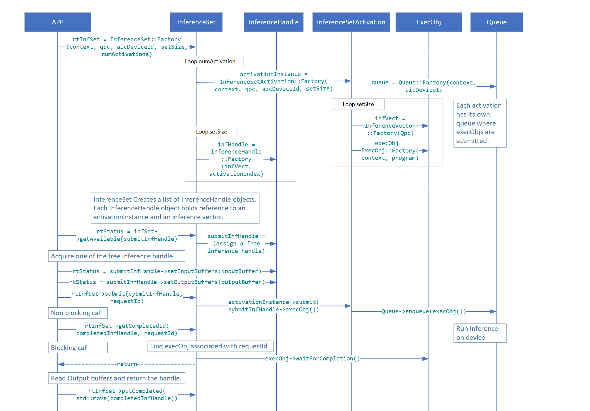

The following document describes Qualcomm AIC 100 User space Linux Runtime classes design and implementation.

## QPC Elements
-------------

### QPC
---------------

Class `Qpc` is a main *QPC* API class type that provides functionality to allocate a QPC from a filename or buffer, and also provides API to query information related to the loaded `QPC`.

Class `Qpc` has 2 *Factory* functions to create a `std::shared_ptr<>` of `Qpc`. There are couple of ways to create `QPC` object.

The class is non-copyable, nor movable.

1. Creating from buffer and size.
2. Creating from a given filename (base-path plus filename).

If `Factory` instance creation is successful, the functions will return an instance of `std::shared_ptr<>`, otherwise a proper exception will be thrown.

Important API in class type `Qpc` includes the following:

1. `getInfo()` - returns `QpcInfo`. See below for more info.
2. `getBufferMappings()` - returns a container of `BufferMappings`. Each `BufferMapping` instance in the container includes information on the buffers as obtained from `Qpc` file. Name, size, direction and index of buffers.
3. `getBufferMappingsDma` - Same return type as above (`getBufferMapping()`) but for DMA allocated buffers instead of user's heap allocated ones.
4. `getIoDescriptor()` - returns pointer to QData which is a buffer and length of the QPC buffer.
5. `get()` - returns a const pointer to QAicQpcObj - which is an opaque Data structure to Internal Program Container. Users have no visibility to the API of QAicQpcObj since it is Opaque in the C layer.
6. `buffer()` - returns the QPC buffer as a const pointer to uint8_t.
7. `size()` - returns the size of the QPC buffer.

### QpcFile
-----------------

Class `QpcFile` is encapsulating the QPC file basepath and filename as well as `DataBuffer<QData>` data member which holds the buffer of the QPC file.
`QpcFile` takes the base-path and the filename of the QPC, where `programqpc.bin` is a default filename provided in the constructor.
`QpcFile` is a non-movable, non-copyable type.

It has a `load()` function that will load the content of the QPC into  `DataBuffer<>` which holds `QData` buffer representation internally.

There are few APIs provided by the `QpcFile` class type.

1. `getBuffer()` - returns a `QData` buffer const reference.
2. `data()` - returns a `const uint8_t` pointer to buffer.
3. `size()` - returns the size of the loaded QPC file buffer.

### QpcInfo
-----------------

Struct `QpcInfo` is a simple struct type that aggregates a collection of `QpcProgramInfo` (also referred to as "program") and corresponding collection of `QpcConstantsInfo` (also referred to as "constants").

### QpcProgramInfo
-------------------

Struct `QpcProgramInfo` is a simple struct aggregating information related to the content of the loaded QPC.

For example:

1. BufferMappings, user allocated or *DMA*.
2. Name identifying a segment in `QPC` file.
3. Number of cores requires to run the program.
4. Program Index in the QPC.
5. Size of the program
6. Batch size.
7. Number of Semaphores, number of MC(MultiCast) IDs.
8. Total required memory to run the program.

### QpcConstantsInfo
---------------------

Struct `QpcConstantsInfo` defines the Constants info that are obtained from the QPC file.
It has the following attributes:

1. `name`
2. `index`
3. `size`

## BufferMappings
---------------

Vector `BufferMappings` is a vector of `BufferMapping`.

`BufferMappings` is created from QPC.

`BufferMappings` is used by API to store the Input/Output buffer information that is also used to create `inferenceVector`.

### BufferMapping
-------------------

Struct `BufferMapping` is a simple struct type that describes the information of a buffer.

Struct `BufferMapping` has two constructors:

1. Creating by providing all of the data members.
2. Default constructor that creates an uninitialized `BufferMapping` instance.

Struct `BufferMapping` has following structure data members:

1. `bufferName` - string name identifying the buffer.
2. `index` - an unsigned int that represent the index in an array of buffers.
3. `ioType` - define the direction of a buffer from user's perspective. An input buffer is from user to device. An output buffer is from device to user.
4. `size` - buffer size in bytes.
5. `isPartialBufferAllowed` - `Partial buffer` is a feature that allows buffer to have actual size that is smaller than what is specified in IO descriptor. `isPartialBufferAllowed` is set by IO descriptor. By setting `isPartialBufferAllowed` true, this buffer takes user buffer that is smaller than what is specified by `size`.
6. `dataType` - define the format of buffer. The types of format is defined in struct `QAicBufferDataTypeEnum`

### QAicBufferDataTypeEnum
----------------------------

Struct `QAicBufferDataTypeEnum` is a simple struct type that defines the data type of the `BufferMapping`.

Struct `QAicBufferDataTypeEnum` defines following data types:

1. `BUFFER_DATA_TYPE_FLOAT` - 32-bit float type (float)
2. `BUFFER_DATA_TYPE_FLOAT16` - 16-bit float type (half, fp16)
3. `BUFFER_DATA_TYPE_INT8Q` - 8-bit quantized type (int8_t)
4. `BUFFER_DATA_TYPE_UINT8Q` - unsigned 8-bit quantized type (uint8_t)
5. `BUFFER_DATA_TYPE_INT16Q` - 16-bit quantized type (int16_t)
6. `BUFFER_DATA_TYPE_INT32Q` - 32-bit quantized type (int32_t)
7. `BUFFER_DATA_TYPE_INT32I` - 32-bit index type (int32_t)
8. `BUFFER_DATA_TYPE_INT64I` - 64-bit index type (int64_t)
9. `BUFFER_DATA_TYPE_INT8` - 8-bit type (int8_t)
10. `BUFFER_DATA_TYPE_INVAL` - invalid type

## Context Elements
-----------------

### Context
-------------------

There are various Linux Runtime core components like `qpc`, `program`, `execObj`, and `queue` etc. which are needed to run inference and enhance performance/usability.
Class `Context` is a primary class which helps to link all LRT core components. `Context` object should be created first. Application creates a context to obtain access to other API functions, the context is passed in other API calls.
The caller can also register for logging and error callbacks. A context ID is passed to the error handler to uniquely identify the `Context` object.

Class `Context` has a *Factory* functions to create a `std::shared_ptr<>` of `Context`.

Context object is created from context properties, list of devices used by this context, logging callback function, specific user data to be included in log callback, an error handler to call in case of critical errors and specific user data to be included in error handler callback.
If logging callback and error handler are not provided then default `defaultLogger` and `defaultErrorHandler` will be used.

If `Factory` instance creation is successful, the functions will return an instance of `std::shared_ptr<>`, otherwise a proper exception will be thrown.

Important API in class type `Context` includes the following:

1. `findDevice()` - returns a suitable device for the network and check selected device has enough resources.
2. `setLogLevel()` - set new logging level to get logging information while running the program. See below for more details about `QLogLevel`.
3. `getLogLevel()` - returns current logging level for given `Context`.
4. `get()` -  returns a const pointer to `QAicContext`. Users have no visibility to the API of `QAicContext` since it is Opaque in the C layer.
5. `getId()` - returns an unsigned int that represent id of the `Context`. This id will be returned in error reports to refer a specific created context.
6. `objName()` - returns `const std::string` which is name of the object. For context object name is `Context`.
7. `objNameCstr()`- returns a pointer to an array that contains a null-terminated sequence of char representing the name of an object.

### QLogLevel
----------------

There are diffrent type of logging level to see different kind of logs.

1. `QL_DEBUG` : set to this level to see debug logs
2. `QL_INFO` : set to this level to see informative logs
3. `QL_WARN` : set to this level to see warning logs
4. `QL_ERROR` : set to this level to see error logs

`LogCallback` - It is a logging callback lambda function.

`ErrorHandler` - It is an error handler lambda function to call in case of critical errors.

## Profiling Elements
------------------

For overview of profiling feature refer to [Profiling Support in Runtime](features.md/#profiling-support-in-runtime).

### ProfilingHandle
---------------------

`ProfilingHandle` provides interface to use num-iter based profiling. Refer to [Num-iter based profiling](features.md/#num-iter-based-profiling) for more details on num-iter based profiling feature.

A `ProfilingHandle` object should be created using the `Factory` method. User needs to specify the `Program` that should be profiled, number of samples to collect, callback to call to deliver report, and type of profiling output expected.

???+ note 
    Profiling type parameter has a default value set to *Latency type*.

Important API in class type `ProfilingHandle` includes the following:

1. `start()` - Start profiling. After the API call, profiling data from all the inferences for specified `Program` will be collected till either user calls `stop()` or number of requested samples have been collected.
2. `stop()` Stop profiling. Stops profiling even if the num-samples requirement has not been met. This API calls triggers a callback to the user specified callback with profiling report of all collected samples.

???+ note
    If `stop()` is called without any inferences being complete for the specified `Program`, callback will not get triggered.

### StreamProfilingHandle
---------------------------------

ProfilingHandle provides interface to use duration based profiling. Refer to [Duration based profiling](features.md/#duration-based-profiling) for more details on duration based profiling feature.

A `StreamProfilingHandle` object should be created using the `Factory` method. User needs to specify the sampling rate, reporting rate, callback to call to deliver report and profiling output format expected. User may optionally specify a name for the handle, and regEx to auto add/remove programs.

??? note
    Profiling type is specified using *ProfilingProperties* field. *ProfilingProperties* has a default param *nullptr* which results in profiling type to be *Latency type*.

Important API in class type `StreamProfilingHandle` includes the following:

1. `start()` - Start profiling. After the API call, user should expect a callback at every *reporting rate* boundary containing information of profiling inferences during that duration.

    ??? note
        User will get callback even if there are no samples collected.

2. `stop()` Stop profiling. A final report will be delivered to user when the profiling is stopped with the profiling data of samples collected from last report till the point `stop()` is called.
3. `addProgram()` - Add a program to list of program being profiled.

    ??? note
        Adding program when profiling is active can cause spurious report callback or a delayed report callback.

4. `removeProgram()` - Remove a program from list of program being profiled.

    ??? note
        Removing program when profiling is active can cause spurious report callback or a delayed report callback.

5. `flushReports()` - After profiling is stopped using `stop()` API, user should make sure that all the reports on the queue of the profiling infrastructure are delivered to user as callback before application exit. `flushReports()` API only returns after there are no more reports left to be delivered to the user, thus ensuring a clean application exit.

## Inferencing Elements
--------------------

### QBuffer
-------------------

`QBuffer` is a struct that contains pointer to the buffer and its size. It can have Input or output buffer address from heap or DMA memory. `handle`, `offset` and `type` are considered only when type is QBUFFER_TYPE_DMABUF or QBUFFER_TYPE_PMEM. It has following Members:

1. `size` - Total size of memory pointed by buf pointer or handle.
2. `buf` - Buffer Pointer, must be valid in case of heap buffer.
3. `handle` - Buffer Handle, must be valid in case of DMA (or PMEM) buffer.
4. `offset` - Offset within handle.
5. `type` - Type of the buffer heap, DMA or PMEM.

### InferenceVector
----------------------

`InferenceVector` contains a vector of `QBuffer`. Vector of `QBuffer` is a vector containing both input and output buffers.
User can create `InferenceVector` from multiple sources like files from disk or create `QBuffer` with data available with the user and set them in `InferenceVector` with `setBuffers()` API of this class.
The input buffer will be used for inference and result of inference will be stored in output buffer.
User needs to keep reference of InferenceVector until inference is complete and user can read output buffers from inference vector after completion of inference.

`InferenceVector` APIs

- `getVector()`: Returns a vector of `QBuffer`. Vector contains both input and output buffers. `QBuffer` is a struct that contains pointer to the buffer and its size.
                User can call this after the inference is completed to read output buffers.
- `setBuffers()`: Sets input and output buffers of this `InferenceVector`
- `Factory()`: Instantiates InferenceVector

### InferenceHandle
-----------------------

`InferenceHandle` contains `InferenceVector` and id given at the time of submission of inference. `InferenceHandle` cannot be created directly by the user, user can get an
available `InferenceHandle` by calling `getAvailable()` API of `InferenceSet`.
`InferenceHandle` is a container that has data needed for inference stored in `InferenceVector`. Number of `InferenceHandle` objects created depends on the set_size and
num_activations parameters passed during instantiation of `InferenceSet`. Number of `InferenceHandle` and number of `ExecObj` created will be the same.

#### LifeCycle of `InferenceHandle`

- `InferenceHandle` objects are created when `InferenceSet` is instantiated and all objects are moved to availableList vector from which user can retrieve it by calling `getAvailable()` API of `InferenceSet`
- When user calls `getAvailable()` if availableList vector has an `InferenceHandle`, it is popped out from the availableList and returned to user, otherwise this call is blocked until the user puts the used `InferenceHandle` using `putCompleted()` API
- User sets buffers in the InferenceHandle it got using `setBuffers()` API
- User submits InferenceHandle using `submit()` API of `InferenceSet`
- To get the completed `InferenceHandle` user can call `getCompleted()` or `getCompletedId()` and extract/read the output of inference from `InferenceHandle`
- After processing the output of inference, user needs to call `putCompleted()` API of `InferenceSet` to put completed `InferenceHandle` back to availableList vector otherwise `getAvailable()` call will be blocked

### InferenceSet
--------------

`InferenceSet` is a C++ class that is used to submit inference. It abstracts out lower level classes like Queue, Program and ExecObj and provides an easier way
of handling multiple activations in a single group to submit inference.

List of APIs of `InferenceSet`

- `submit()`: Submit an inference through `InferenceVector`. The submission will be blocked until an `InferenceHandle` is available
- `submit()`: Submit an inference through `InferenceHandle`
- `getCompleted()`: Returns a completed `InferenceHandle` object. User can access output of the inference using this `InferenceHandle` object by calling `getBuffers()` method
- `getCompletedId()`: Returns a completed `InferenceHandle` object with specified ID
- `putCompleted()`: Move a completed InferenceHandle back into the availableList vector
- `getAvailable()`: Returns an available `InferenceHandle` object from availableList
- `waitForCompletion()`: Wait for all inferences submitted to be completed on all activations
- `Factory()`: Instantiates InferenceSet

#### NumActivations and SetSize
--------------------------------

`NumActivations` and `SetSize` are arguments of `InferenceSet::Factory` API.

- `NumActivations`: `InferenceSet` creates this many numbers of network instances inside device. User can decide `NumActivations` based on number of cores required to run his network and number of available cores.
- `SetSize`: For each network instance, user application can simultaneously enqueue this many numbers of input/output buffers to run inferences. Recommended value is between 2 to 10. User should find an optimal value to achieve desired throughput (inferences/sec) and latency.

<figure markdown>
  
  <figcaption>Activations and SetSize</figcaption>
</figure>

#### Inference Flow
------------------------

Inference flow using `InferenceSet` would be as follows:

1. Instantiate `InferenceSet` using the Factory method
2. Acquire one of the available `InferenceHandle`.
3. Set Input and Output buffers in that `InferenceHandle`.
4. Submit `InferenceHandle` to `InferenceSet` to run inference in device.
5. Call `getCompletedId` API to wait for Inference to complete. Inference results are available in Output buffers, once this API returns.
6. Once application reads output data, `putCompleted` must be called to return the `InferenceHandle` back to available List of handles.

<figure markdown>
  
  <figcaption>Inference Flow</figcaption>
</figure>

### InferenceSetProperties
-----------------------

`InferenceSetProperties` defines properties to be consumed by `InferenceSet`

List of members of `InferenceSetProperties`

* `programProperties`: User can set different program properties which will be consumed internally by `Program` object. Notable programProperties are:
    * `SubmitRetryTimeoutMs`: After submission of inference, runtime waits for this milliseconds timeout period, if inference is not complete in this timeout period, error is returned
    * `SubmitNumRetries`: Number of times submission should be retried when the above timeout occurs
    * `devMapping`: devMapping specifies the physical devices to be used by the program and is valid only for the network's that need multiple devices to run
* `queueProperties`: User can set queue properties which will be consumed internally by `Queue` object. Notable queueProperties are:
    * `numThreadsPerQueue`: Number of threads spawned to process elements in the queue. Default 4
* `name`: Defines name of the InferenceSet Object
* `id`: Defines id of the InferenceSet Object

