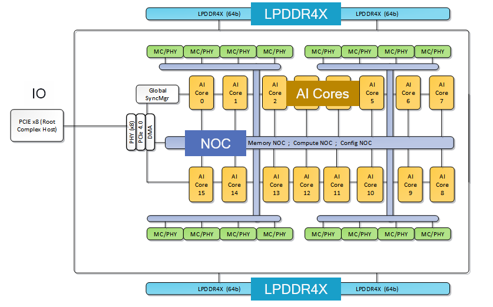
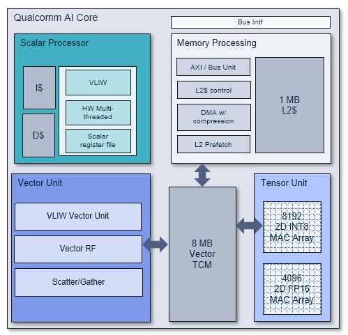

# Architecture 

## Cloud AI Platforms
Cloud AI Platforms/cards contain one or more Cloud AI 100 SoCs per card and are designed to operate at a specific TDP. The cards interface to the host via PCIe and to the BMC via SMBus/I2C. The table below provides the key hardware specs across the available SKUs. 

The Cloud AI 100 Ultra SKU has 4 AI 100 SoCs and a PCIe switch on the card. The interface to the host is through the PCIe switch via a PCIe gen4 x16 interface. The PCIe switch connects to the 4 AI 100 SoCs via a PCIe Gen4 x 8 interface.      

The Cloud AI 100 Standard and Pro SKUs have 1 AI 100 SoC on the card interfacing to the host via a PCIe Gen4 x 8 interface. 

| Accelerator SKU    | AI 100 Standard | AI 100 Pro | AI 100 Ultra |
| ------------------ | ---------- | ---------- | ------------ |
| AI 100 SoC Count   | 1          | 1          | 4            |
| DDR Capacity       | 16 GB      | 32 GB      | 128 GB       |
| DDR BW             | 137 GB/s   | 137 GB/s   | 548 GB/s     |
| On-chip SRAM       | 126 MB     | 144 MB     | 576 MB       |
| FP16               | 110 TFLOPs | 125 TFLOPs | 290 TFLOPs   |
| Int8               | 325 TOPs   | 375 TOPs   | 870 TOPs     |
| Connection to host via PCIe | Gen4 x8    | Gen4 x8    | Gen4 x16     |
| TDP                | 75 W       | 75 W       | 150 W        |
| Formfactor         | PCIe HHHL  | PCIe HHHL  | PCIe FH3/4L  |

## Cloud AI 100 SoC
Cloud AI100 SOC’s multi-core architecture, shown in figure below, is purpose-built for deep learning inference in the Cloud. 

The SOC is composed of 16 seventh-generation AI cores delivering 400+ Int8 TOPs and 200+ FP16 TOPs of compute performance, with 144 MB of on-chip memory for data storage. 

The on-chip memory sub-system is connected to an external LPDDR4X memory subsystem, comprising of 4 channels of 64b width(4 x 64b), providing 136 GB/s of memory bandwidth and up to 32 GB of memory capacity. 

The SoC also provides 8 lanes of PCIe Gen4 IO interfaces (PCIe-gen4 x 8) to connect to the host CPU complex and other peripherals. 

The AI cores and all internal subsystems are connected by three advanced NoCs that deliver 186 GB/s of data bandwidth and support multicast and AI core synchronization. The Compute NoC connects the AI cores and PCIe, the Memory NoC connects the AI cores to the DDR memory, and the Configuration NoC is used for boot and hardware configuration. 

The SoC is also equipped with a sophisticated power management system, optimizing both transient and peak power consumption. The SOC also implements thermal detection and control. 

The SOC implements several cloud-readiness security features, including ECC, secure boot and DDR memory zero-out on reset.

## AI Core 

The seventh-generation AI Core, leveraging over a decade of Qualcomm AI research, is shown in Figure below. The AI Core implements the architecture principle of separation-of-concerns, with three types of compute units for tensor, vector and scalar operations. 

 

The tensor unit implements two 2D MAC arrays—8K for 8b integer, and 4K for 16b floating point, with 125+ instructions conducive for linear algebra, providing throughput of 8192/4096 MAC operations per clock for 8/16b integer/floating point operations respectively.  

The vector unit implements over 700+ rich instructions for AI, content verification, and image processing supporting 8/16b integer and 16/32b precision floating point, providing throughput of 512/256 MAC operations per clock for 8/16b integer/floating point operations respectively. 

The scalar processor is a 4-way VLIW (very large instruction word) machine supporting six hardware threads, each with a local scalar register file, instruction and data caches, and support for 8/16b integer and 16/32b floating point operations—a rich instruction set of over 1800 instructions that provide flexibility in compute operations. 

An 8 MB Vector Tightly Coupled Memory (VTCM) provides scratch-pad data storage for both the vector unit as well as the tensor unit. The 1 MB L2 cache in the core is shared by all three compute units (scalar, vector, and tensor), and it implements hardware for the intelligent prefetching of data and for advanced DMA operations. 

