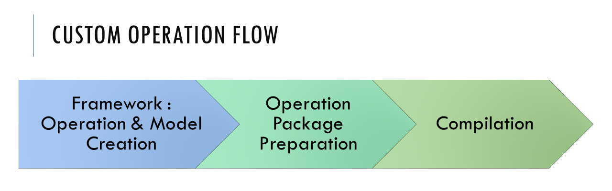
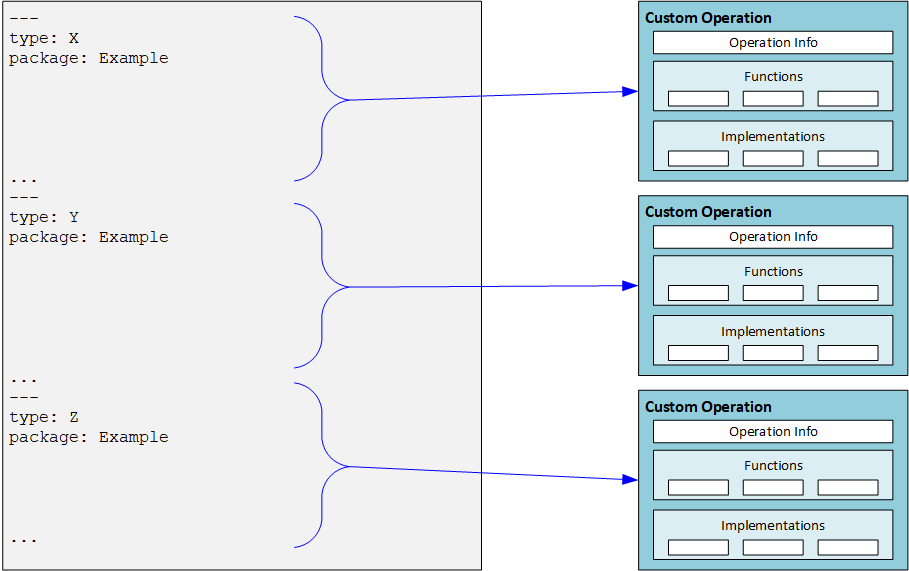

# Custom Operations (C++)

Custom operation allows users to add an operation into the graph, which is unknown to Cloud AI (aka QAic) Compiler. For example, a certain graph is not part of the operation set supported for the various models that the compiler knows to load and compile.  As will be described later in the page, with custom operations, users can *register* a new operation prior to loading/defining the graph, and then use this new operation in the new graph created. QAic Compiler will use the registration information to create a Graph which can be compiled.


As an example, ONNX node definition supports **Domains**. A user can create an ONNX model file which has nodes that come from the non-default domain, register these nodes definition in QAic Compiler.

## Custom Operations workflow

There are three high-level stages to create and work with a custom operation.



The first stage is to create the custom operation in one of the machine learning frameworks (such as pyTorch, TensorFlow, Caffe2, and so on). After creating this operation, it is added to a machine learning model and the model is trained. The resulted model trained is stored for inference -
either as ONNX file, Torchscript, TensorFlow savedmodel, or else. For each framework/trained-model, the way to specify a custom operation is a bit different, and as such the way QAic Compiler knows to identify the custom operation varies. Current version supports Custom Operations for ONNX Models. More details on it below.

The second stage is to prepare a package for the custom operation/s, which contains:

- The information needed for QAic Compiler to integrate the operations in the ML graph.
- Implementations to be used when compiling the graph to a binary. The content of this stage is explained in details on next sections.

The third stage is compilation. In order to compile a model that has the custom operation inside, the operation package needs to be registered first. After successful registration, the model can be loaded and compiled using **qaic-exec**.


## Custom Operation package

The custom operations package is prepared by the developer, and contains all files needed to register operations within the compiler. Custom operations package is tagged with a version number to ensure that users custom op package is compatible with the installed Apps SDK.

As described in previous section, the developer created a custom operation in a machine learning framework, and used it to train a model, and export a model with this custom op. The files in the custom operations package are used by the QAic Compiler to compile that model into a binary.

The drawing below shows the content of a package, and the next sections describe each component in details.


Briefly:

- The configuration file describes the version number, custom operations and related files, and is used by the QAic Compiler to bootstrap the package, registering its content within the compiler.

- Custom Op Function files (`Foo1OpFunc.so`, `Foo2OpFunc.so`) contain utility functions used by the compiler during compilation of the model.

- Implementation files contain the implementations of the operations for different compilation targets. Also, per operation it is possible to provide multiple implementations (selected by the `selection` function - see below).

Although the custom op package can be written as described in the next sections, it is recommended to use the utility script provided here - */opt/qti-aic/tools/custom-op/gen_custom_op_package.py* to generate skeleton structure of the above described custom op package. Script takes in a ONNX or Tensorflow model and generates package for each custom operation present in the input model. For more details run:

```
python3 /opt/qti-aic/tools/custom-op/gen_custom_op_package.py --help
```

After the skeleton code is generated for custom ops, user needs to write the necesary functionality that is specific to custom op, like the the kernel, verification, selection, shape inference function as described in the next sections.

### Modeling a custom operation

To better understand the content of the package, this section briefly discusses what is needed to model any machine learning operation, so that it can be placed in a graph and compiled. The folloiwng drawing shows modeling of one operation.


**Operation Info** block represents the modeling of the operation itself as a *black box* which needs to be connected inside a graph. In order to do that, need to provide basic information on the operation (name, type), as well as describing the inputs, outputs and parameters of the operation.


Any operation in a machine learning graph (not just custom operations) can be modeled by defining its set of inputs, outputs and parameters. The inputs and outputs are tensors. Inputs come from the operations before this one, and outputs are the tensors created by the operation, and provided to the operation/s that come afterwards. For the inputs and outputs, the developer needs to specify the maximal rank supported by the operation. The actual values per dimension will be populated by the compiler during graph creation Parameters are the constant values provided to the operation as part of the configuration: for example, kernel size, alpha value, and so on. Parameters can be scalar (single value) or a vector of values.

In addition to the Operation Info, the modeling of the operation includes a collection of utility functions and implementations.

**Utility functions** help the compiler during the compilation. The developer is required to implement the following functions.

- Verification function: receives a set of inputs, outputs and parameters, populated with actual values that the operation is going to work on. The function should validate that the values are correct and the operation can support this combination.

- Shape inference function: receives a set of inputs and parameters, populated with actual values that the operation is going to work on. The function is doing shape inference of the outputs: for example, it returns what will be the tensor size on each dimension.

- Selection function: receives a set of inputs, outputs and parameters, populated with actual values that the operation is going to work on. In addition it receives the compilation target (AIC or Interpreter). The function returns a string containing the name of the adequate implementation to use for this configuration. More details on that below.

### Configuration File

The configuration file is part of the custom operation package provided by the developer. There is a single configuration file which provides the required information for all operations in package. The file is YAML formatted. Below is an example of a configuration file for a single operation.


Configuration file contains a `version` number which indicates the custom op package version. It is used by the compiler to verify compatibility of custom op pakage and the installed Apps SDK.

Operations are described in `CustomOps` section. Each operation section has the following:

- Operation Info, defining the operation `name`, `type`, `inputs`, `outputs` and `params`.

  - For each input / output, the relevant fields are the `name` and `maxDims` (maximal rank of the tensor)

  - For input, there is also optional constant field, which can be true/false, to indicate if it is a constant.

  - For each param, the relevant fields are `name`, `datatype` (bool/float/int), `scalar` (true/false).

  - If param `scalar` field is `false`, meaning this is an array (1d vector), and then need to provide `size`.

  - Optionally, user can request for scratch memory which can be used to store and load intermediate computations inside the kernel.

- Location of the custom operation functions

- Implementations

The information provided per implementation is:

- target `Backend`.

- `type`: used by the backend during selection process (see explanation next).

- `impl`: location of the implementation file.

- `config` (optional): additional information on this implementation, to be used by the backend.

- `compilerArgs` (optional): hexagon-clang compiler options specific to the AIC backend implementation. This can be used to specify additional include directories, compile time MACROS, and so on. User is responsible for passing valid compilation options using this field.

The configuration file can provide the information for multiple operations. in this case, each operation is defined in a separated YAML section. Below is an example for how such configuration file would look like.



### Custom Operation Functions

The developer is required to provide a shared library which has three functions: Verification, Shape inference, and selection. The path to the shared library, as well as the library name, is specified in `functionsLibrary` field of the configuration file.

The API of these functions is C, and defined in *CustomOpFunctions.h*. The types used are defined in *CustomOpTypes.h*.

#### Verification Function

The verification function is used by the compiler at graph construction stage, to validate that the custom operation implementation supports the combination of inputs, outputs, and parameters.

```
{C++}
   bool customOpVerify(CustomOpIOTensor *inputs, int32_t numInputs,
                       CustomOpIOTensor *outputs, int32_t numOutputs,
                       CustomOpParam *params, int32_t numParams)
```

#### Shape Inference Function

The shape inference function is used by the compiler at graph construction stage to receive the output dimensions expected by the custom operation.

In some models, specifying the output dimensions is optional. As such, the compiler has no way to known what will be the output dimensions of a custom operation (for internal known operations, it has shape inference functions).

The function receives the input dimensions and parameters, and is expected to fill in the correct output dimensions.

```
{C++}
   bool customOpInferShape(CustomOpIOTensor *outputs, const int32_t numOutputs,
                           const CustomOpIOTensor *inputs, const int32_t numInputs,
                           const CustomOpParam *params, const int32_t numParams)
```


#### Selection Function

By design, the Custom Op functionality allows user to provide multiple implementations suitable for different configurations.

For example, provide implementation for float vs one for integer, provide specialized implementation for specific parameter value, and so on.

The developer implements this function to return the adequate *flavor* of custom op implementation based on the node configuration (inputs, outputs, parameters) The returned string represents the flavor. Used by the Backend Op repository to select the proper implementation based on configuration info (see details on config info).

```
{C++}
   const char \*customOpSelectImpl(CustomOpIOTensor *inputs, int32_t numInputs,
                                   CustomOpIOTensor *outputs, int32_t numOutputs,
                                   CustomOpParam *params, int32_t numParams,
                                   const char *backend)
```

### Custom Operation Implementations

The developer is required to provide suitable implementations for the compilation targets (Interpreter, AIC) and correctly register them in the configuration file.

This section describes the implementations signatures and relation with the configuration file. The SDK comes with custom op examples which show how such implementations look like, and how do they get build

#### Interpreter Implementation

The interpreter implementation is provided to the compiler as a shared library (or collection of shared libraries). Each shared library can contain multiple versions (flavors) of implementations of the operation, refered onwards as *kernels*. A kernel is selected at model compilation time by the selection function. The developer is responsible for compilation of these shared libraries. As the interface is C, the shared libraries can be compiled by various compilers (GCC, CLANG, and so on). In addition, as these shared libraries are running on the Host CPU, the developer can open files, dump results, use stdout/stderr for printing debug messages, and so on. This makes the Interpreter implementation a very effective way for debugging the operation functionality as part of model execution.

The signature of the kernel (implementation) is generic, and fits any custom operation. It contains array of input tensors, array of output tensors, array of parameters and a pointer to custom op context.

```
{C++}
   typedef void (*customOpInterpreterKernel_t)(
                  CustomOpIOTensor *inputs, int32_t numInputs,
                  CustomOpIOTensor *outputs, int32_t numOutputs,
                  CustomOpParam *params, int32_t numParams,
                  CustomOpContext *ctx)
```

- The signature is defined in */opt/qti-aic/dev/inc/CustomOpInterpreterInterface.h*

- The relevant types defined in */opt/qti-aic/dev/inc/CustomOpTypes.h*

- CustomOpContext is defined in */opt/qti-aic/dev/inc/CustomOpContext.h*

Note that the order of inputs, outputs and parameters has to match the order defined in the configuration file. During the model compilation, the compiler is organizing the inputs, outputs and params passed to the kernel based on that order.

When creating an implementation, the developer needs to create a kernel (or multiple kernels) which has the signature as above and compile it into a shared library. For example:

```
{C++} 
   void customFoo (CustomOpIOTensor *inputs, int32_t numInputs,
                   CustomOpIOTensor *outputs, int32_t numOutputs,
                   CustomOpParam *params, int32_t numParams,
                   CustomOpContext *ctx) {
   // Foo implementation is here
   }
```

The next section explains how the mapping between library / kernel name and compile-time selection is happening.

##### Configuration information and implementations

The Compiler uses the information in the *implementations* section of the configuration file, together with the developers provided selection function, to allocate the proper implementation/kernel and use it. When the target is interpreter, and the compiler encounters a custom operation, it does the following:

- Calls the selection function.

- Based on returned string, looks for the specific implementation in the *implementations* section, by trying to make the `type` field of each.

- Once found, opens the shared library which appears under `impl` field.

- Next, tries to get a function pointer (using `dlsym()`), using the name specified in type.

  

As such, developers needs to make sure that the kernel names in the code/shared-library match the string appears in the type field.

#### AIC Implementation

The AIC implementation is provided as a C/C++ file. Just like in the case of interpreter target, the developer can provide a file (or multiple files) with multiple kernels (implementations) of the custom operation. The AIC compilation target API is similar to the Interpreter API, except for an additional thread identifier, `threadId`, passed to it.

```
{C++}
   typedef void (*customOpAICKernel_t)(
                  const CustomOpIOTensor *inputs, const int32_t numInputs,
                  const CustomOpIOTensor *outputs, const int32_t numOutputs,
                  const CustomOpParam *params, const int32_t numParams,
                  const CustomOpContext *ctx, const int32_t threadID)
```

**threadID**: Developer can use up to 4 threads available on the AI Core. When the compiler generates the code, it will call the implementation 4 times, one time from each thread, passing to it the current threadID. This allows the compiler to maximize performance during compilation by taking full advantage of the HW. AIC implementation signature is defined in */opt/qti-aic/dev/inc/CustomOpAICInterface.h*.

##### Configuration information and AIC implementations

Similarly to the Interpreter target, when compiling to AIC target the Compiler uses the information in the *implementations* section of the configuration file, together with the developers provided selection function, to allocate the proper implementation/kernel and use it.

- Calls the selection function.

- Based on returned string, looks for the specific implementation in the *implementations* section, by trying to make the `type` field of each.

- Once found, looks for the C/C++ file in `impl` field.

- Next, tries to find a kernel using the name specified in `type`.

  

#### Writing tiled custom ops

Custom operations, by default, are configured to compile and run on one NSP. Custom ops can be configured to run in a tiled manner so that computation, along with inputs and outputs, can be split and distributed across multiple NSPs. Computing on tiled inputs and outputs helps boost performance as computation is split to execute in parallel on multiple NSPs with reduced memory footprint. Steps that should be followed to tile an operation are outlined below.

- Specify tilability of each output of the CustomOp. This is done by configuring fields of `TileConfig` datastructure accessible in `customOpSetTileConfig` function. This step describes two things:

- axis along which an output can be sliced to form tiles, and

- alignment requirement for each axis that should be considered before slicing an output to form a tile. See */opt/qti-aic/dev/inc/CutomOpTileCon8fig.h* for details.

- Provide the mapping of each output tile to its corresponding input tiles using `customOpMapTiles` function. Compiler uses each outputs `TileConfig` information to determine its tile size. The tiled outputs are made available in the `customOpMapTiles` function so that user can provide a mapping of output tiles to corresponding input tiles. For example, if compiler splits each output of a custom op into N tiles then `customOpMapTiles` will be invoked N times, once per output tile.

If the parameters configured by the user in `customOpSetTileConfig` and `customOpMapTiles` are valid then compiler will tile the custom operation, else the op will not be tiled.

**Note**: NSP cores on the AIC hardware do not have a shared memory. So, when an op is tiled, it is important to make sure that all the necessary dependency on inputs to compute a tiled output is mapped accurately in `customOpMapTiles` function.

#### Requesting scratch memory

Custom operations may require scratch memory to store and load intermediate computations within the kernel. User can request for such scratch memory in the configuration file under *Operation Info* section by specifying the `name` and `size` of the required buffer(s) as follows:

```
scratchBuffers: 
  - name: scratchBuf1 
    size: 1024  # size in bytes.
  - name: scratchBuf2 
    size: 2048  # size in bytes.
```

- Scratch buffers, allocated by the compiler, exist throughout the lifespan of custom op function call, but content is not preserved between calls.

- Compiler makes an effort to allocate these buffers in the device VTCM. However, its allocation in the VTCM is not gauranteed.

- Scratch buffers are accessible only within custom op implementation through the `CustomOpContext*`, which is available to every implementation.

- Scratch buffers remain untiled even when the custom op is tiled and the scratch buffer size requested by the user is available to each tiled custom op.

```
{C++} 
   float *buf1 = (float *)customOpContext->scratchBuffers[0].buf;
   int *buf2 = (int *)customOpContext->scratchBuffers[1].buf;
   int buf1Size = customOpContext->scratchBuffers[0].size;
   int buf2Size = customOpContext->scratchBuffers[1].size;
```

#### Memory configuration for the AIC backend

VTCM, DDR and CacheableDDR memory locations are available on the device. `memoryConfig` in the yaml configuration file can be used to specify a memory placement preference for each input, output and scratch buffer associated with custom op so that compiler can prioritize buffer placement:

```
- implementation 
  - backend: AIC 
      type: funcName
      impl: fileName.cpp
      memoryConfig:
        #DDR/VTCM/CacheableDDR: [<comma separated list of in/out/scratch names>]
        DDR: [inName1, outName2]
        CacheableDDR: [inName2]
        VTCM: [scratchBufName1]
        requiredFor: [inName2, scratchBufName1]
```

Three preference lists, `VTCM`, `DDR` and `CacheableDDR`, as shown above, are available. If an input, output, or scratch buffer is listed under `VTCM` list, compiler will make an effort to place the listed buffer in the devices VTCM location. However, the placement in VTCM is not guaranteed by the compiler. Same holds true for the entries in the rn whenever the user preferred memory configuration is not satisfied during model compilation.

If placement of a particular buffer in the specified memory location is a stringent requirement then user can indicate it to the compiler using `requiredFor` list. If compiler fails to allocate a buffer that is listed in `requiredFor` list as per the preference, then model compilation will fail with an error message.

Altering the default memory configuration may change overall performance of the model as the memory locations are also used by the compiler for other ops in the model. General guideline for better performance is that VTCM is efficient for vector memory accesses, `CacheableDDR` is efficient for scalar memory accesses, and DDR access is relatively slower.

#### Synchronize threads on the AIC backend

Custom op kernels on the AIC backend can take advantage of 4 threads running on the NSP. User can synchronize all threads, if needed, using sync function pointer from the CustomOpContext. Usage is shown below:

```
customOpContext->syncThread(threadId);
```

Execution will wait for all threads to reach `syncThread` before proceeding.

#### Logging messages on AIC backend

AIC backend makes logging available through printf style macros `AIC_PRINT_*`, defined in *CustomOpLog.h*. This allows runtime logging on AIC target. 64 bit values require wrapping the argument with `AIC_LOG64` macros.

```
AIC_PRINT_INFO(ctx, "decimal num: %d; unsigned num: %u; C-string: %s;",
                     -1, 0xFF, "myCustomOp");
AIC_PRINT_INFO(ctx, "int64_t HEX num: 0x" AIC_LOG64X_FMT, AIC_LOG64_DATA(0x1122334455667788));
AIC_PRINT_INFO(ctx, "fp32 num: %f", 3.141590f);
```

Qmonitor service must be running on host for logs to be collected automatically. This requires to issue a one-time command on host to start Qmonitor:

```
systemd-run --unit=qmonitor-proxy /opt/qti-aic/tools/qaic-monitor-grpc-server
```

Different log message types are available: `AIC_PRINT_DEBUG`, `AIC_PRINT_INFO`, `AIC_PRINT_WARN`, `AIC_PRINT_ERROR`, and `AIC_PRINT_FATAL`, each corresponding to decreasing level of verbosity. Compiler option, `AIC_CUSTOMOP_LOG_COMPILE_LEVEL`, controls verbosity level which can be set to: `AIC_CUSTOMOP_LOG_LEVEL_FATAL`, `AIC_CUSTOMOP_LOG_LEVEL_ERROR`, `AIC_CUSTOMOP_LOG_LEVEL_WARN`, `AIC_CUSTOMOP_LOG_LEVEL_INFO` (default), or `AIC_CUSTOMOP_LOG_LEVEL_DEBUG`. All message types above given verbosity level are filtered out. `AIC_CUSTOMOP_LOG_COMPILE_LEVEL` can be overriden through the `compilerArgs` field on the custom op configuration *yaml* file.

```
implementations: 
   - backend: AIC 
     compilerArgs: -DAIC_CUSTOMOP_LOG_COMPILE_LEVEL=AIC_CUSTOMOP_LOG_LEVEL_ERROR
```

Logs are collected under */var/log/qti-aic/QID\_\** folders, with each AIC device having its own folder. A maximum of ten format specifiers can be added to a single format string when using `AIC_PRINT*()` with AIC backend. `AIC_PRINT_*` macros will map to print when a custom op is compiled for backends other than AIC.

Log verbosity level may also be configured at run time using *qaic-log* tool with `-c n` and `-s NNNetwork` flags.

```
/opt/qti-aic/tools/qaic-log -l <log_level> -c n -s NNNetwork
```

where `<log-level>` is first letter of log level, that is any of `f/e/w/i(default)/d`. For more details run `qaic-log -h`.

#### Datatype support

Custom ops support various data types for tensors and parameters as listed in `CustomOpDataType`. The datatype of input and output tensors of custom op (`CustomOpIOtensor`) can be one of the following types: `float`, `float16_ty` (AIC backend only), and `int8_t`, depending on the compilation options chosen by the user. `CustomOpTensor` will be of `float` type when model is compiled with float precision. Similarly, when model is compiled with `-convert-to-fp16` flag or using a quantization profile, tensors will be of `float16_ty` or `int8_t` type, respectively. Using different datatypes for tensors is currently limited. `int8_t`, `int16_t`, `int32_t`, and `int64_t` can also be used to represent index types. Tensors will not be quantized when index types are specified in the input model, irrespective of the model compilation options chosen.

When model is quantized using a quantization profile `CustomOpIOTensor_s` are quantized using a scale and offset. User can dequantize input and output `_CustomOpIOTensor` data using the `scale` and `offset` as follows: `dequant(x) = (x - offset) * scale`, where `scale` and `offset` are accessible from `CustomOpContext` using following APIs:

```
{C++}
   float getInputScale(const CustomOpContext *ctx, const int32_t inputIdx); 
   int32_t getInputOffset(const CustomOpContext *ctx, const int32_t inputIdx); 
   float getOutputScale(const CustomOpContext *ctx, const int32_t outputIdx); 
   int32_t getOutputOffset(const CustomOpContext *ctx, const int32_t outputIdx);
```

Note that other software components, like AIMET or PGQ profiler, may represent quantization parameters differently, but that does not affect how custom ops represent scale and offset.

#### Capabilities and limitations

The custom operation code can use any basic C/C++ functionality, including control code, loops, etc. In addition, the code can use HVX intrinsic for utilizing the embedded vector units. See next section for details. The code is limited to run on a single AI Core of the overall number of available cores. This limitation may be lifted on future releases.

The developer should be aware of the following limitations when creating an AIC implementation:

- Typical OS services do not exists on the HW. Code cannot use STDIO to write logs, attempt to open files or create new threads.

- Dynamic Memory allocation is not supported. Only static memory allocation is allowed within the implementation. Avoid using 1\) malloc/new, 2\) STD data types (like `std::vector` which requires dynamic allocation), 3) defining arrays with size not known at compile time (like `array[argument #6]`).

#### Qualcomm Hexagon HVX documentation

When writing code to run on AIC, the developer can use HVX intrinsic to utilize the internal vector units of the AI Core.

For documentation on HVX intrinsic, please go to Qualcomm Developer Network website, Hexagon SDK SW page: https://developer.qualcomm.com/software/hexagon-dsp-sdk/tools and download the document named *Qualcomm Hexagon V66 HVX Programmers Reference Manual*.

## Compilation

As explained in **Compiler Tools**, qaic-exec is a command-line sample application, provided in the Apps SDK both as code and as prebuilt binary. It supports compiling and running a model.

For supporting custom operations, a new command-line option was added to qaic-exec.

```
-register-custom-op=<config-file>           Register custom op using this configuration file
                                            Specify multiple times to register multiple configs
```

Here is an example for running qaic-exec with a model which has custom operations, and providing a configuration file.

```
/opt/qti-aic/exec/qaic-exec -m=./mlp_custom.onnx -register-custom-op=./CustomReluConfig.yaml 
-aic-hw -aic-hw-version=2.0 -input-list-file=input.list -write-output-dir=./ 
-write-output-start-iter=1 -write-output-num-samples=1
```

## Examples 
End-to-end examples of custom operations is available in the APPS SDK at `/opt/qti-aic/examples/apps/custom-op/`. 