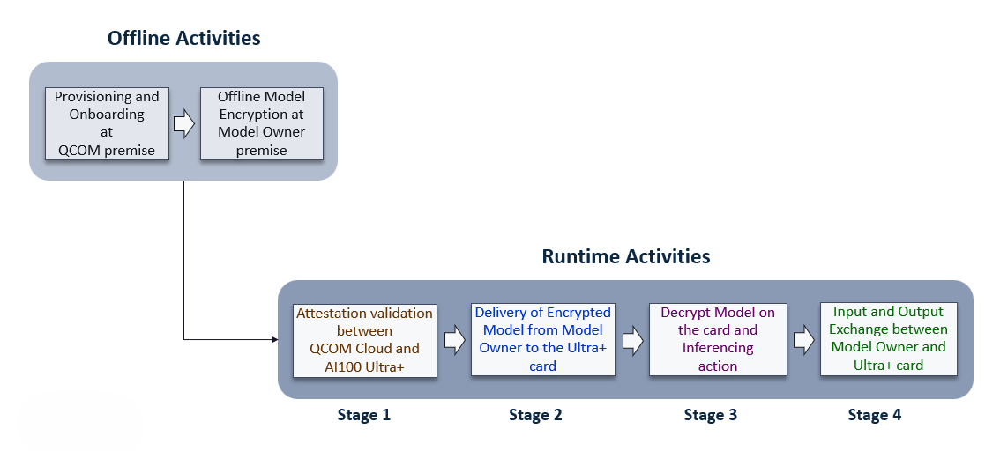
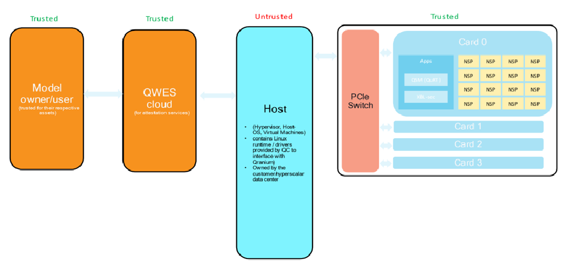
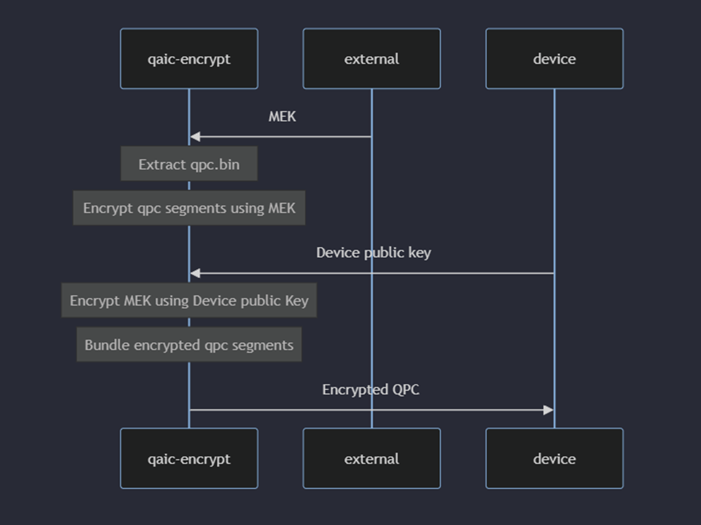

# Model IP

Model IP tools and scripts help establish model confidentiality and integrity by encrypting AI models on the customer premises, send them to the device and then decrypted in the device memory before we run Inferences. 

## Encryption/decryption of QPCs

### High level view of end-to-end implementation Phase, Activities and Stages


### Trust Architecture


Here

- Model Owner/User, QWES Cloud, AIC100 card are all trusted.
- Host machine on which LRT + KMD are running is un-trusted.

Note:

- Generate MEK, Encrypt QPC using MEK, Device Attestation (Generate session public key), all needs to be done on Trusted machine and not on the host system which is running LRT + KMD.
- The qaic-encrypt and attestation tools are released as part of the Apps SDK.

### High level view of sequence of operations to generate final encrypted QPC


## Steps to generate encrypted QPC

### 1. Prerequisites
- Apps and Platform SDK >= 1.17,
- python3.8,
- protobuf==4.21.12,
- grpcio==1.54.3

#### Perform SOC Reset
Required before encrypting and running new model.

Example:	
```
sudo su 
echo 1 > /sys/bus/mhi/devices/mhi<MHI ID>/soc_reset
```
Identify the MHI ID associated with the QID.
```
sudo /opt/qti-aic/tools/qaic-util -q | grep -e MHI -e QID
```
#### Start the grpc server
Start the grpc server in background, `qaic-remote-proxy` service should be running in the host for remote attestation to work.
```
systemd-run --unit=qaic-remote-proxy /opt/qti-aic/tools/qaic-remote-session-server
```
Note:
To stop background service when not required use below command,
```
systemctl stop qaic-remote-proxy
```

### 2. Generate MEK (Model Encryption Key)
Model owner/customer will use their algorithm to generate MEK key from random byte stream, which must be a 128-bit (16 byte) AES key. Store the MEK key in .dat file (example: MEK.dat).

Below are the steps with pseudo script used to illustrate the flow,

Note: Remove if any old .dat, .bin files are present.
```
rm -rf *.dat *.bin temp
```
Steps to generate MEK key:
- Run the generate MEK key script: <br>
  This a pseudo script, which will be replaced by Model owner/customer.
```
python3 mek_gen.py
```
Above script generates key in `hexadecimal form`.

- Store the MEK key in .dat file:
```
mekHex=`<hexadecimal form generated above>`
echo -n "$mekHex" | xxd -r -p > MEK.dat
```
### 3. Encrypt qpc using above generated MEK
At this stage we encrypt relevant qpc segments using MEK key and the tool used here is `qaic-encrypt encrypt-model`.

Note:
Resulting encryption is not tied to User Session.
```
qaic-encrypt encrypt-model --qpc [path to programqpc.bin] --mek [model encryption key] --output-dir [output directory]
```

Example:
```
/opt/qti-aic/tools/qaic-encrypt encrypt-model --qpc /opt/qti-aic/test-data/aic100/v2/1nsp/1nsp-quant-resnet50/programqpc.bin --mek MEK.dat --output-dir ./encryptqpc/
```

Usage:
```
./qaic-encrypt encrypt-model --help
```
```
Usage: qaic-encrypt encrypt-model [OPTIONS] --qpc <FILE> --mek <FILE> --output-dir <DIR>
```
Options:

      --qpc <FILE>           Path to QPC file
      --mek <FILE>           Path to MEK file
      --output-dir <DIR>     Output Directory
      --pub-keys <FILES>...  Device Public Keys
      --help                 Print help

### 4. Device attestation (generate session key):
Here session key is `Public Key` genereated by device and sent to user in Attesation Report. First one should create a session and generate session public key by passing the host ip and device id(s) (for which public key needs to be generated) to the `QAicRemoteAttestationClient.py` script.

Below is a reference script, which uses host ip and device id to generate the session public key using attestation script `QAicRemoteAttestationClient.py`.

##### Start of the script
```
remoteHostIP=<host-ip-address>
deviceId=0
ATTESTTATION_PYTHON_SCRIPT=/opt/qti-aic/tools/qaic-encrypt/QAicRemoteAttestationClient.py

#Python venv to Grpc python client
if [ -n "$(python3.8 --version)" ] 2>/dev/null; then
  echo 'python 3.8 is installed'
  python3.8 -m venv "./.py3-venv"
else
  echo 'Please install Python 3.8'
  exit 1
fi

VENV_PYTHON3="./.py3-venv/bin/python3"
$VENV_PYTHON3 -m pip install protobuf==4.21.12 grpcio==1.54.3$VENV_PYTHON3 

cat > request.dat << EOF
anycontent
EOF

#Get public key from device
$VENV_PYTHON3 ${ATTESTTATION_PYTHON_SCRIPT} --ip ${remoteHostIP} -d ${deviceId} -i request.dat -o pub.dat
rm -f request.dat

echo "Public key received from device"
echo "-------------------------------------------"
hexdump -C pub.dat 
echo "-------------------------------------------"
```
##### End of the script
This will create and store session public key in the `pub.dat` file.

Usage:
```
python3.8 ./QAicRemoteAttestationClient.py --help
```
```
usage: QAicRemoteAttestationClient.py [-h] [--ip IP] [--port PORT] [--device DEVICE] [--print_json] [--attestation_request ATTESTATION_REQUEST]
                                      [--attestation_report ATTESTATION_REPORT]
```

```
optional arguments:
  --ip IP               IP Address of QAic Remote host (default localhost)
  --port PORT           QAic Remote GRPC Port (default 62473)
  --device DEVICE, -d DEVICE
                        Qranium device ID
  --print_json, -j      Print Protobuf messages in json format
  --attestation_request ATTESTATION_REQUEST, -i ATTESTATION_REQUEST
                        Input file path containing attestation request
  --attestation_report ATTESTATION_REPORT, -o ATTESTATION_REPORT
                        Output file path to store attestation report (default report.dat)
-h, --help            show this help message and exit
```
Note: qaic-remote-session-server should be running in the host, where aic100 devices are connected.

### 5. Generate fully encrypted QPC
The `qaic-encrypt` will take input as `previously encrypted qpc segments`, `model encryption key (MEK)` and `session public keys` to generate fully encrypted QPC.
```
qaic-encrypt encrypt-with-session-keys --input-dir [path containing previously encrypted qpc segments] --mek [model encryption key] --pub-keys [session public keys]
```

Example:
```
/opt/qti-aic/tools/qaic-encrypt encrypt-with-session-keys --input-dir ./encryptqpc/ --mek MEK.dat --pub-keys pub.dat
```
Usage:
```
./qaic-encrypt encrypt-with-session-keys -h
```
```
Usage: qaic-encrypt encrypt-with-session-keys [OPTIONS] --input-dir <DIR> --mek <FILE>
```
Options:

      --input-dir <DIR>      Path containing previously encrypted QPC Segments
      --mek <FILE>
      --pub-keys <FILES>...  Device Public Keys
      --help                 Print help

## Usecases
### 1. Session becomes invalid (example: Device Reset)
Above we went through sections ```Generated MEK -- > Encrypted relevant QPC segments --> Did device attestation to generate session public key then -- > Generated fully encrypted QPC``` In case the user session becomes invalid (for eg: during a device Reset, then one can follow below steps

1. Generate new session public key (Refer to the above section 3 `Device attestation` on how to generate session public key).
 
2. Using `qaic-encrypt wrap-mek` option one can wrap MEK with the new session public key.

	```
	qaic-encrypt wrap-mek --mek [path to mek] --pub-keys [path to session public keys] --output-dir [store wrapped MEK(s)]
 	```
	Example:
  	```
	qaic-encrypt wrap-mek --mek MEK.dat --pub-keys pub.dat --output-dir ./wrappedMEK
  	```

	Note: The output folder will have `wrapped MEK` and `config.json` with MEK related to Device number.

	Usage:
	```
	./qaic-encrypt wrap-mek --help
	```
	```
	Usage: qaic-encrypt wrap-mek [OPTIONS] --mek <FILE> --output-dir <DIR>
	```
 	
	Options:
	```
      		--mek <FILE>           Path to MEK file
      		--pub-keys <FILES>...  Device Public Keys
      		--output-dir <DIR>     Output directory to store wrapped MEK(s)
      		--help                 Print help
	```
3. To generate fully encrypted QPC tied to current user session, one can use `qaic-encrypt replace-mek` which swaps out the previous MEK inside QPC(s) sequentially.
	```
	qaic-encrypt replace-mek --encrypted-qpc [path to fully encrypted qpc] --wrapped-meks [path to wrapped-meks] --output-dir [New encrypted qpc]
	```
	Example:
	```
	qaic-encrypt replace-mek --encrypted-qpc ./encryptqpc --wrapped-meks ./wrappedMEK/ --output-dir ./newEncryptedQPC
	```

	Usage:
	```
	./qaic-encrypt replace-mek –help
	```
	```
	Usage: qaic-encrypt replace-mek [OPTIONS] --encrypted-qpc <FILE> --output-dir <DIR>
	```

	Options:
	```
	--encrypted-qpc <FILE>
		Path to QPC file
	--wrapped-meks <DIRS>...
        	Dir Path to Wrapped MEK file(s)
		Must contain MEK.encrypt, MEK.nonce and MEK.pub
		`wrap-mek` subcommand can generate wrapped MEK from device public key
		NOTE: For MQ QPC mdp_meta_info segment sequence will be used to map wrapped MEKs with inner QPCs.
 	--output-dir <DIR>
		Output directory to store new programqpc
  	--help
	```

### 2. Single command to generate fully encrypted QPC
This gives convenience to the user to get fully encrypted QPC in one single command. The `qaic-encrypt encrypt-model ` will take input as `qpc`, `model encryption key (MEK)` and `session public keys` to generate fully encrypted QPC.

Steps for single command to generate fully encrypted QPC.
- Model owner/customer will generate MEK and Session public key.
  Refer to the previous sections on `Generate MEK (Model Encryption Key) ` and `Device attestation`.
- Run ` qaic-encrypt encrypt-model` to generate fully encrypted QPC.
```
qaic-encrypt encrypt-model --qpc [path to programqpc.bin] --mek [model encryption key] --output-dir [output directory] --pub-keys [session public keys]
```
Example:
```
/opt/qti-aic/tools/qaic-encrypt encrypt-model --qpc /opt/qti-aic/test-data/aic100/v2/1nsp/1nsp-quant-resnet50/programqpc.bin --mek MEK.dat --output-dir ./encryptqpc --pub-keys pub.dat
```

### 3. Multi Device Partitioning (MDP) Example
This section walks through steps showing what the flow look like incase of "MDP", here in this example we are assuming 4 devices.

#### 1. Generate MEK:
Follow above section `1) Generate MEK (Model Encryption Key)` to generate MEK.

#### 2. Device attestation:
Follow above section `Device attestation (generate session key)` to generate `public key` for each device (device Id=0,1,2,3). Run the script 4 times using the same MEK generated in step1 and pass the respective device ID. Store the public key as `pub0.dat`,`pub1.dat`,`pub2.dat` and `pub3.dat`.

#### 3. Single command to generate fully encrypted QPC:
Here, we will use single command to generate fully encrypted QPC, by passing above generated `MEK` and `public keys`
```
qaic-encrypt encrypt-model --qpc [path to programqpc.bin] --mek [model encryption key] --output-dir [output directory] --pub-keys [session public keys]
```
Example:
```
/opt/qti-aic/tools/qaic-encrypt encrypt-model --qpc /opt/qti-aic/test-data/aic100/v2/1nsp/1nsp-quant-resnet50/programqpc.bin --mek MEK.dat --output-dir ./encryptqpc --pub-keys pub0.dat pub1.dat pub2.dat pub3.dat
```

## Side effects
- Increased QPC load times
- Since decryption time is more, for big models one need to increase the default timeout values before execution.
	Below are the commands to increase the default timeout values,
 	```
	echo 2400 > /sys/module/qaic/parameters/control_resp_timeout_s
 	```
  	```
	echo 600000 > /sys/module/qaic/parameters/mhi_timeout_ms
 	```

## Limitations
- Slow decryption in initial release
