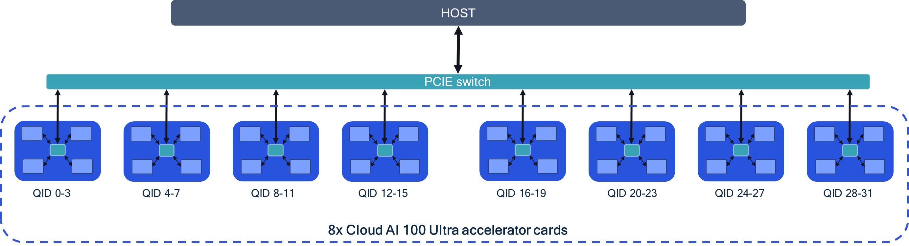
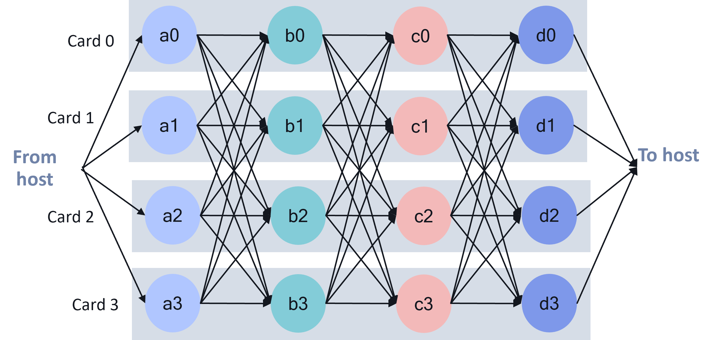

# Model Sharding 

Cloud AI SDK enables model sharding which provides the benefits of running larger models and improve throughput/latency/batch-size support across SoCs/Cards connected to the same host. Topologies supported are with or without a PCIe switch. Cards connected to a PCIe switch with peer-to-peer communication enabled provide the best performance. 

## Use Cases 
There are 2 primary use cases of model sharding via tensor slicing. 

- Execute models that do not fit in the memory footprint of a single SoC. 
- Optimize performance (latency/throughput) for models that can fit within a single SoC but still benefit from tensor-slicing.  

## Architecture 
For tensor slicing to achieve the best performance (latency/throughput), the server architecture in particular, accelerator card inter-connect performance is critical. The image below shows 8 *AI 100 Ultra accelerator cards* connected via a PCIe switch to the host. There are two approaches regarding card-to-card communication.  

- P2P communication between the cards through a PCIe switch. This architecture provides the best performance. 
- Multi-device through host: Card to card communication happens through the host. This approach will have inferior performance compared to P2P.  

This sample configuration allows model sharding via tensor slicing across 8 cards (typically used for > 15B parameter models).     



### Tensor Slicing
Model operations are split across muliple SoCs (maximum across 16 SoCs in P2P config). The image provides a sample graph execution that is tensor sliced across 4 AI 100 accelerator cards. As seen from the image, there is a lot of inter-card traffic across models layers. Inter-card data bandwidth available plays a critical role in the performance. Hence, the need to enable P2P inter-card communication via PCIe switch. 
The AI 100 Ultra card has a PCIe switch between the 4 SoCs on the card. In a server with many AI 100 accelerators the PCIe hierarchy plays a critical role in the performance.  





## Platform setup 

### Pre-requisites 

- Host should be able to support large BAR sizes. Each AI 100 accelerator card requires 2+ GB of BAR space per SoC.  
- BAR region 4 for *every* AI 100 SoC is 2G (**size=2G** as shown below).  
    ```
    lspci -s <PCIe address of AI 100 SoC> -vv | grep "Region 4"
    Region 4: Memory at xyz (64-bit, prefetchable) [size=2G]

    ```
    If the region 4 for every SoC is not 2G, contact your System Integrator.

### Card configuration 

1. Disable PCIe Switch ACS to enable P2P communication between PCIe ports. See instructions [here](https://github.com/quic/cloud-ai-sdk/tree/1.17/utils/multi-device). 

2. Enable multi-device partitioning on all the SoCs. 
    Download enable_mdp.json from [here](https://github.com/quic/cloud-ai-sdk/tree/1.17/utils/multi-device). 
    ```
    systemd-run --unit=qmonitor-proxy /opt/qti-aic/tools/qaic-monitor-grpc-server
    /opt/qti-aic/tools/qaic-monitor-json -i enable_mdp.json​ 
    ```

    Reset all the SoCs in the server.  
    ```
    sudo /opt/qti-aic/tools/qaic-util -s
    ```
3. Verify that multi-device partitioning (MDP) feature is enabled for **all** devices.

    ```
    /opt/qti-aic/tools/qaic-util -q | grep MDP

    ```
    `MDP+` indicates that multi-device feature is enabled on the device. 

## Compilation 
Model partitioning across multiple devices is done by the compiler. The user is required to specify the number of SoCs/devices and the connectivity between the devices. Here a few examples of the device partition config files based on the connectivity and number of devices. The device partition config file is passed to the compiler `qaic-exec` CLI. 

Example 1: Model, tensor sliced across 4 SoCs with P2P communication between the SoCs. 
```
mdp_4soc_p2p.json 

{
    "connections": [
        {
            "devices": [0,1,2,3],
            "type": "p2p"
        }
    ],
    "partitions": [
        {
            "name": "Partition0",
            "devices": [
                {
                    "deviceId": 0,
                    "numCores": 16
                },
                {
                    "deviceId": 1,
                    "numCores": 16
                },
                {
                    "deviceId": 2,
                    "numCores": 16
                },
                {
                    "deviceId": 3,
                    "numCores": 16
                }
            ]
        }
    ]
}

```

Example 2: Model, tensor sliced across 2 SoCs with communication through the host between the SoCs. If no `connections` are defined, the conectivity is assumed to be through the host

```
mdp_2soc_host.json 

{
    "partitions": [
        {
            "name": "Partition0",
            "devices": [
                {
                    "deviceId": 0,
                    "numCores": 16
                },
                {
                    "deviceId": 1,
                    "numCores": 16
                }
            ]
        }
    ]
}

```

To compile the model with the tensor sliced configurations, pass the device paritioning config file to `qaic-exec` using `mdp-load-partition-config` flag as shown below. 

<pre>
/opt/qti-aic/exec/qaic-exec \
	-m=$model_path \
	-aic-hw \
	-aic-hw-version=2.0 \
	-network-specialization-config=specializations.json \
	-retained-state \
	-convert-to-fp16 \
	-aic-num-cores=${CORES} \
	-custom-IO-list-file=${model_name}/custom_io.yaml \
	-compile-only \
	-aic-binary-dir=qpc/${model_name}-${BS}bs-${PL}pl-${CL}cl-${CORES}c-${SOCS}soc-${MX} \
	<b>-mdp-load-partition-config=mdp.json</b>
</pre>

## Execution 
Refer to [Cloud-ai-sdk](https://github.com/quic/cloud-ai-sdk/tree/1.12/models/language_processing/decoder/LlamaForCausalLM#multi-soc-1) example for executing inference on multi-SoCs. 


## Recommendations

For very large models which are compiled for inter-SoC communication through the host, the host memory requirements can be large. If inference fails due to host or device resource exhaustion, try below options. 

- Increase the maximum number of memory mappings allowed for a process from the default value of 65k 
    ```
    sudo bash -c "sysctl -w 'vm.max_map_count=2048000'"
    ```
    Verify the new setting using 
    ```
    cat /proc/sys/vm/max_map_count
    ```

- Increase system memory (RAM) to 1TB and CPU count to 32 cores or higher. 
