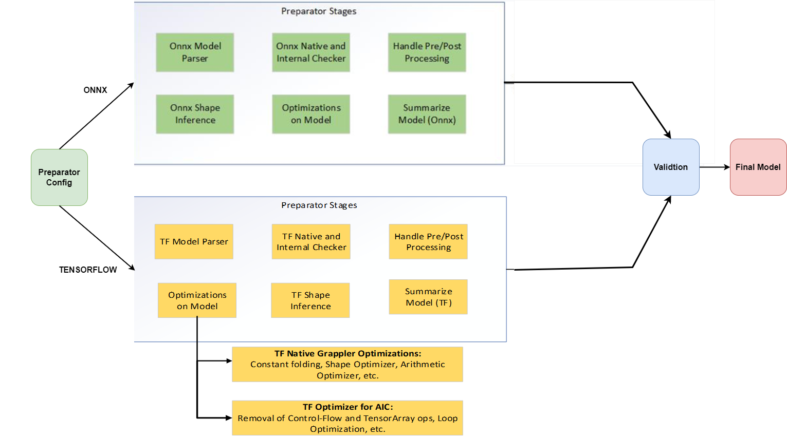
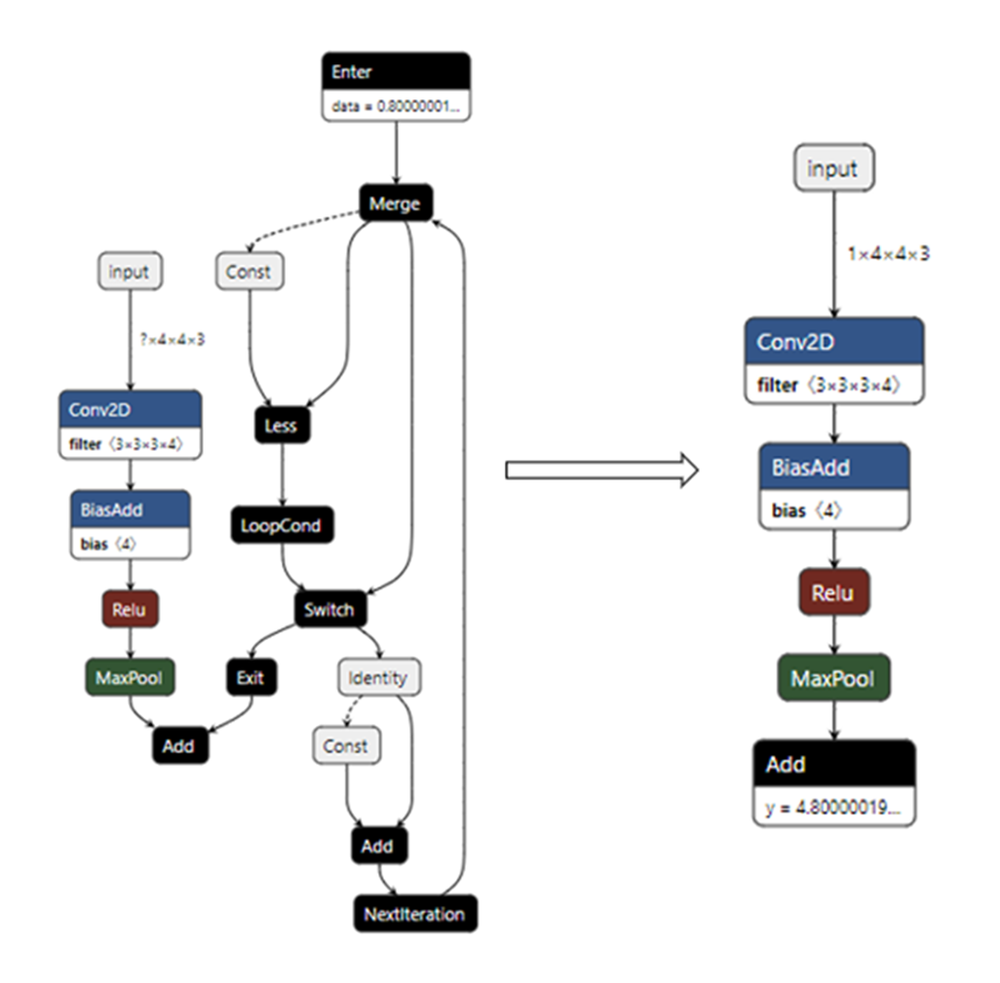

# Introduction to the Model Preparator Tool

The QAic Model Preparator is an **optional** tool that automates generating Optimal AIC Friendly models for usage. It applies various optimizations and cleaning techniques for generation of the model. Developers can use this tool if the exported model fails compilation. 

The current version supports ONNX and TF models. The tool checks the model, applies shape inference, cleans the model, applies various optimization, handles the pre-processing/post-processing nodes in the graph, and generates models as per the given user configuration (YAML).

### Model Preparator Overview

Checkout the Model Export page on details on exporting the model from one framework to another framework, the most preferred and tested framework on MP is Onnx.

For detailed usage of the tool, refer to this [link](https://docs.qualcomm.com/bundle/publicresource/topics/80-PT790-993B/network-preparation.html#network-preparation_Introduction_modelprep)



usage: Sample Config Details are 
For Single model:

    MODEL: 
        INFO: 
            MODEL_TYPE: EFFICIENTDET
            INPUT_INFO: 
            - - input:0
              - - 1
                - 512
                - 512
                - 3
            DYNAMIC_INFO: 
            - - input:0
              - - batch_size
                - 512
                - 512
                - 3
            EXPORT_TYPE: ONNX
            OPSET: 13
            MODEL_PATH: efficientdet-d0.pb
            NAME: Sample Model
            DESCRIPTION: SSD MobileNet V1 Opset 10 Object Detection Model
            VALIDATE: False
            AIC_DEVICE_ID: 0
            WORKSPACE: WORKSPACE
            VERBOSE: INFO
            INPUT_LIST_FILE: None
            CUSTOM_OP_INFO_FILEPATH: None
        
    PRE_POST_HANDLE: 
        NMS_PARAMS: 
            MAX_OUTPUT_SIZE_PER_CLASS: 100
            MAX_TOTAL_SIZE: 100
            IOU_THRESHOLD: 0.65
            SCORE_THRESHOLD: 0.25
            CLIP_BOXES: False
            PAD_PER_CLASS: False
            
        PRE_PLUGIN: True
        TRANSFORMER_PACKED_MODEL: False
        COMPRESSED_MASK: False
        POST_PLUGIN: SMARTNMS
        ANCHOR_BIN_FILE: None
        
    ATTRIBUTES: None

Usage on Multi Model Config:

    MODELS: 
      MODEL: 
          INFO: 
              MODEL_TYPE: CLASSIFICATION
              INPUT_INFO: 
              - - model_1_input
                - - 1
                  - 100
              DYNAMIC_INFO: 
              - - model_1_input
                - - batch
                  - 100
              EXPORT_TYPE: ONNX
              OPSET: 13
              MODEL_PATH: model_1.onnx
              NAME: Model_1
              DESCRIPTION: Sample model-1
              VALIDATE: True
              AIC_DEVICE_ID: 0
              WORKSPACE: ./workspace
              VERBOSE: INFO
              INPUT_LIST_FILE: None
              CUSTOM_OP_INFO_FILEPATH: None
          
      PRE_POST_HANDLE: 
          NMS_PARAMS: 
              MAX_OUTPUT_SIZE_PER_CLASS: 100
              MAX_TOTAL_SIZE: 500
              IOU_THRESHOLD: 0.5
              SCORE_THRESHOLD: 0.01
              CLIP_BOXES: False
              PAD_PER_CLASS: False
              
          PRE_PLUGIN: True
          TRANSFORMER_PACKED_MODEL: False
          COMPRESSED_MASK: False
          POST_PLUGIN: NONE
          ANCHOR_BIN_FILE: None
          
      ATTRIBUTES: None
      
  
      MODEL: 
        INFO: 
            MODEL_TYPE: CLASSIFICATION
            INPUT_INFO: 
            - - model_2_input
              - - 1
                - 10
            DYNAMIC_INFO: 
            - - model_2_input
              - - batch
                - 10
            EXPORT_TYPE: ONNX
            OPSET: 13
            MODEL_PATH: model_2.onnx
            NAME: Model_2
            DESCRIPTION: Sample model-2
            VALIDATE: True
            AIC_DEVICE_ID: 0
            WORKSPACE: ./workspace
            VERBOSE: INFO
            INPUT_LIST_FILE: None
            CUSTOM_OP_INFO_FILEPATH: None
          
      PRE_POST_HANDLE: 
          NMS_PARAMS: 
              MAX_OUTPUT_SIZE_PER_CLASS: 100
              MAX_TOTAL_SIZE: 500
              IOU_THRESHOLD: 0.5
              SCORE_THRESHOLD: 0.01
              CLIP_BOXES: False
              PAD_PER_CLASS: False
              
          PRE_PLUGIN: True
          TRANSFORMER_PACKED_MODEL: False
          COMPRESSED_MASK: False
          POST_PLUGIN: NONE
          ANCHOR_BIN_FILE: None
          
      ATTRIBUTES: None
      
  
CHAINING_INFO: 
    EDGES: 
    - - Model_1::model_1_output
      - Model_2::model_2_input
      
    WORKSPACE: ./workspace_chaining/
    EXPORT_TYPE: ONNX
    OPSET: 13
    AIC_DEVICE_ID: 0
    

qaic-preparator options

Config Options:
  --config CONFIG  Path to config file
  --silent         Run in silent mode

For more details checkout the help menu in the tool: "*python3 qaic-model-preparator.py --help*" 
Tool location in the SDK: "*/opt/qti-aic/tools/qaic-pytools*"

### Sample details on Model Configuration Settings file
##### Model Preparator Configurations
* **MODEL** 
    * <b> DESCRIPTION </b>: Model Description
    * <b> MODEL_TYPE </b> : Provide the Model Category it belongs to
    * <b> MODEL_PATH </b> : Provide path to the downloaded original model file
    * <b> INPUT_INFO </b> : Provide Dictionary of Input names and its corresponding shapes.
    * <b> DYNAMIC </b> : Provide Dynamic Info to generate dynamic models
    * <b> EXPORT_TYPE </b> : ONNX or TENSORFLOW
    * <b> VALIDATE </b> : Validate the prepared model outputs with native framwork. (Ex: QAic FP16 vs OnnxRuntime FP32)
    * <b> WORKSPACE  </b> : Provide the workspace directory to save the log files and final prepared model.
* **PRE_POST_HANDLE**
    * <b> ANCHOR_BIN_FILE  </b> : Path to Anchor bin files or None.
    * <b> POST_PLUGIN </b> : None by Default, If Object Detection Models, Provide "Smart-nms" or "QDetect" to either generate split model or full model.
    * <b> PRE_PLUGIN  </b> : Handle pre plugin, This will be either keep/remove the pre processing from the graph.
    * <b> NMS_PARAMS  </b> : This fields are specific to Object Detection models, and are helpful while creating full model based on QDetect nodes.
        * <b> MAX_OUTPUT_SIZE_PER_CLASS  </b> : A scalar integer representing the maximum number of boxes to be selected by non-max suppression per class
        * <b> MAX_TOTAL_SIZE  </b> : A integer representing maximum number of boxes retained over all classes. Note that setting this value to a large number may result in OOM error depending on the system workload.
        * <b> IOU_THRESHOLD  </b> : A float representing the threshold for deciding whether boxes overlap too much with respect to IOU.
        * <b> SCORE_THRESHOLD  </b> : A float representing the threshold for deciding when to remove boxes based on score.
        * <b> CLIP_BOXES  </b> : If true, the coordinates of output nmsed boxes will be clipped to [0, 1]. If false, output the box coordinates as it is. Defaults to true.
        * <b> PAD_PER_CLASS  </b> : If false, the output nmsed boxes, scores and classes are padded/clipped to max_total_size.

### Optimizations Around Pre and Post Processing Handling in Preparator
* **PRE_PLUGIN**
    * The <b> PRE_PLUGIN </b> field in the config is a boolean flag indicating the application of pre-processing optimizations if any. For example: In most of the computer vision models from the TensorFlow network we have seen that the preprocessing and post processing is part of the model graph making it dynamic in nature.
    * Since we are working mostly on static models (due to AOT), this will cause issues in the model compilation. Making the PRE_PLUGIN *True* will help in handling such pre-processing in the model graph and making it AIC friendly.
    * The preprocessing which is part of the model is handled and details regarding the same is tapped onto the log files.
    * The TF Optimizer looks for control-flow operators inside the model and replaces them with the appropriate/relevant operators.Major Optimizations include:
    
        * Switch-Merge Optimizer:
             * This arises due to the “tf.while_loop()” and “tf.cond()” APIs. The “prediction” flag of the switch operator is evaluated, and the corresponding path is selected for the model. A switch operator whose prediction flag is not constant cannot be optimized.
         
        * Loop Unrolling:
            * This arises due to the “tf.while_loop()” APIs. The loop is unrolled to make a Directed Acyclic Graph (DAG) based on the number of loop iterations. It cannot be applied in cases where the number of loop iterations is not fixed or there is a nested loop.

        * TensorArray Optimizations:
            * This includes all tensor-array operators like (TensorArray, TensorArrayWrite, TensorArrayRead, TensorArrayGather, TensorArrayScatter, and so on). This optimization replaces tensor-array operators with relevant known and supported operators.
    * For most of the NLP models, we have tokenization encodings of the inputs which we do in the host and pass the tokenized inputs to the model.
    



* **POST_PLUGIN**
    * This field is mostly applicable to the Object Detection CV models, at QAic we have two options to run the ABP + NMS. *Smart-NMS* and *QDetect*.
    * SMART-NMS is a software application to help run the post processing part of the Object Detection (OD) models on host. Enabling this in the config will help add SMART-NMS to the model. Here we have intelligent way of identifying the post processing of the model if any and generating SMART-NMS specific model.
    * QDetect is a known custom operator from QAic to enabling running the post processing of the OD models on the device. Enabling this in the config, will help generate add QDetect to the model.
    * For NLP networks, the post-processing is decoding the tokens generated from model. Here we can use HuggingFace *generation* utils to do the post processing on the host.


## Tutorial: Converting and executing a YoloV5 model with QAic

The following tutorial will demonstrate the end to end usage of Model Preparator Tool and the QAic Execution. This process begins with a trained source framework model, which is converted and built into a optimization model using Model Preparator, which are then executed on a QAic backend.

The tutorial will use YoloV5 as the source framework model.

The sections of the tutorial are as follows:

- Tutorial Setup: Download the Original Model
- Model Conversion: Generate the Optimized Model using Model Preparator APIs
- Executing Example Model: Run the model on QAic Backend.
- Plot Model Outputs on Sample Image

### Tutorial Setup
The tutorial assumes general setup instructions have been followed at Setup.


```python
import os
cwd = os.getcwd()

# Steps to generate the models from ultralytics repo.
!rm -rf yolov5

# Clone the Ultralytics repo.
!git clone --branch v6.0 --depth 1 https://github.com/ultralytics/yolov5.git

# Install the requirements
%cd yolov5
!git checkout v6.0

!pip3 install seaborn
# Export the Original yolo models.
!python3 -W ignore export.py --weights ./yolov5s.pt --include onnx --opset 13

# Copy the original model to the relevant paths in sdk
!cp yolov5s.onnx /opt/qti-aic/tools/qaic-pytools
%cd ..
!rm -rf yolov5/
```

### Model Conversion
After the model assets have been acquired the model can be converted to optimized QAic model, and subsequently built for use by an application. In the below example we will be generating the optimized QDetect model as explained in the above pre/post processing section.


```python
# Path to the installed SDK apps tools
%cd /opt/qti-aic/tools/qaic-pytools

# Run the preparator plugin with the relevant config file
!python -W ignore qaic-model-preparator.py --config /opt/qti-aic/tools/qaic-pytools/model_configs/samples/preparator/public/yolov5_ultralytics_model_info_qdetect.yaml --silent

# More details on various configs can be found here: /opt/qti-aic/tools/qaic-pytools/model_configs/samples/preparator/public
```

### QAic Backend Execution
Compile the model binary using the *qaic-exec* and execute it using the *qaic-runner* with the following commands:


```python
!rm -rf yolo-binaries-qdetect

!/opt/qti-aic/exec/qaic-exec -m=/opt/qti-aic/tools/qaic-pytools/WORKSPACE/yolov5s_preparator_aic100.onnx \
-aic-hw -onnx-define-symbol=batch_size,1 -aic-binary-dir=yolo-binaries-qdetect -convert-to-fp16 -compile-only
```


```python
!/opt/qti-aic/exec/qaic-runner -t yolo-binaries-qdetect -a 1 -d 0 --time 15
```

### Plot Model Outputs on Sample Image

Once we have the performance numbers, we will setup some model artifacts based on sample real image, Pre-Process, convert it to *raw* generate model outputs based on *qaic-runner*. Then using the generated outputs, we will plot it on the input images and get the final bounding boxes.


```python
# Imports
import os
import time
import cv2
import numpy as np
import torch
from PIL import Image

def letterbox_image(image, size):
    iw, ih = image.size
    w, h = size
    scale = min(w / iw, h / ih)
    nw = int(iw * scale)
    nh = int(ih * scale)

    image = image.resize((nw, nh), Image.BICUBIC)
    new_image = Image.new("RGB", size, (128, 128, 128))
    pad_left = (w - nw) // 2
    pad_top = (h - nh) // 2
    new_image.paste(image, (pad_left, pad_top))
    return new_image, scale, pad_left, pad_top

def preprocessImg(image_path, input_h, input_w):
    
    image_src = Image.open(image_path)
    resized, scale, pad_left, pad_top = letterbox_image(image_src, (input_w, input_h))
    img_in = np.transpose(resized, (2, 0, 1)).astype(np.float32)  # HWC -> CHW
    img_in = np.expand_dims(img_in, axis=0)
    img_in /= 255.0
    return img_in, np.array(image_src, dtype=np.uint8), scale, pad_left, pad_top
```


```python
# Download the sample image and pre-process
!rm -rf *.jpg
!wget -c https://ultralytics.com/images/zidane.jpg
img_preproc, img_orig, scale, pad_left, pad_top = preprocessImg("zidane.jpg", 640, 640)
img_preproc.tofile("input.raw")
```


```python
# Generate the outputs
!/opt/qti-aic/exec/qaic-runner -t yolo-binaries-qdetect -i input.raw --write-output-dir yolo-output-qdetect -d 0
```


```python
# Model artifacts to post process and plot the outputs on the image
def scale_coords(
    coords, img_orig_h, img_orig_w, scale, pad_left, pad_top, xy_swap=True
):
    # Rescale coords (xyxy) from preprocessed img to original img resolution

    if xy_swap:
        coords[:, :, [0, 2]] -= pad_top  # y padding
        coords[:, :, [1, 3]] -= pad_left  # x padding
    else:
        coords[:, :, [0, 2]] -= pad_left  # x padding
        coords[:, :, [1, 3]] -= pad_top  # y padding
    coords[:, :, :4] /= scale

    # Clip bounding xyxy bounding boxes to image shape (height, width)
    if xy_swap:
        coords[:, :, 0] = coords[:, :, 0].clip(0, img_orig_h - 1)  # y1
        coords[:, :, 1] = coords[:, :, 1].clip(0, img_orig_w - 1)  # x1
        coords[:, :, 2] = coords[:, :, 2].clip(0, img_orig_h - 1)  # y2
        coords[:, :, 3] = coords[:, :, 3].clip(0, img_orig_w - 1)  # x2
    else:
        coords[:, :, 0] = coords[:, :, 0].clip(0, img_orig_w - 1)  # x1
        coords[:, :, 1] = coords[:, :, 1].clip(0, img_orig_h - 1)  # y1
        coords[:, :, 2] = coords[:, :, 2].clip(0, img_orig_w - 1)  # x2
        coords[:, :, 3] = coords[:, :, 3].clip(0, img_orig_h - 1)  # y2
    return coords


class_names = [
    "person",
    "bicycle",
    "car",
    "motorcycle",
    "airplane",
    "bus",
    "train",
    "truck",
    "boat",
    "traffic light",
    "fire hydrant",
    "stop sign",
    "parking meter",
    "bench",
    "bird",
    "cat",
    "dog",
    "horse",
    "sheep",
    "cow",
    "elephant",
    "bear",
    "zebra",
    "giraffe",
    "backpack",
    "umbrella",
    "handbag",
    "tie",
    "suitcase",
    "frisbee",
    "skis",
    "snowboard",
    "sports ball",
    "kite",
    "baseball bat",
    "baseball glove",
    "skateboard",
    "surfboard",
    "tennis racket",
    "bottle",
    "wine glass",
    "cup",
    "fork",
    "knife",
    "spoon",
    "bowl",
    "banana",
    "apple",
    "sandwich",
    "orange",
    "broccoli",
    "carrot",
    "hot dog",
    "pizza",
    "donut",
    "cake",
    "chair",
    "couch",
    "potted plant",
    "bed",
    "dining table",
    "toilet",
    "tv",
    "laptop",
    "mouse",
    "remote",
    "keyboard",
    "cell phone",
    "microwave",
    "oven",
    "toaster",
    "sink",
    "refrigerator",
    "book",
    "clock",
    "vase",
    "scissors",
    "teddy bear",
    "hair drier",
    "toothbrush",
]


def drawBoxes(
    detections,
    img_orig,
    scale=1.0,
    pad_left=0,
    pad_top=0,
    xy_swap=True,
    filter_score=0.2,
    line_thickness=None,
    text_bg_alpha=0.0,
):
    detection_boxes = detections[0]  # [1, N, 4]
    detection_scores = detections[1]  # [1, N]
    detection_classes = detections[2]  # [1, N]
    num_detections = detections[3]  # [1]

    img_orig_h, img_orig_w = img_orig.shape[:2]

    detection_boxes = scale_coords(
        detection_boxes, img_orig_h, img_orig_w, scale, pad_left, pad_top, xy_swap
    )

    tl = line_thickness or round(0.002 * (img_orig_w + img_orig_h) / 2) + 1

    assert (
        detection_boxes.shape[0] == 1
    ), "Currently plotting for single batch size only."
    for i in range(num_detections[0]):
        box = detection_boxes[0][i]
        score = detection_scores[0][i]
        cls = detection_classes[0][i]
        if score < filter_score:
            continue
        if xy_swap:
            y1, x1, y2, x2 = map(int, box)
        else:
            x1, y1, x2, y2 = map(int, box)
        np.random.seed(int(cls) + 2020)
        color = [np.random.randint(0, 255), 0, np.random.randint(0, 255)]
        cv2.rectangle(
            img_orig,
            (x1, y1),
            (x2, y2),
            color,
            thickness=max(int((img_orig_h + img_orig_w) / 600), 1),
            lineType=cv2.LINE_AA,
        )
        label = "%s %.2f" % (class_names[int(cls)], score)
        t_size = cv2.getTextSize(label, 0, fontScale=tl / 3, thickness=1)[0]
        c2 = x1 + t_size[0] + 3, y1 - t_size[1] - 5
        if text_bg_alpha == 0.0:
            cv2.rectangle(img_orig, (x1 - 1, y1), c2, color, cv2.FILLED, cv2.LINE_AA)
        else:
            alphaReserve = text_bg_alpha
            BChannel, GChannel, RChannel = color
            xMin, yMin = int(x1 - 1), int(y1 - t_size[1] - 3)
            xMax, yMax = int(x1 + t_size[0]), int(y1)
            img_orig[yMin:yMax, xMin:xMax, 0] = img_orig[
                yMin:yMax, xMin:xMax, 0
            ] * alphaReserve + BChannel * (1 - alphaReserve)
            img_orig[yMin:yMax, xMin:xMax, 1] = img_orig[
                yMin:yMax, xMin:xMax, 1
            ] * alphaReserve + GChannel * (1 - alphaReserve)
            img_orig[yMin:yMax, xMin:xMax, 2] = img_orig[
                yMin:yMax, xMin:xMax, 2
            ] * alphaReserve + RChannel * (1 - alphaReserve)
        cv2.putText(
            img_orig,
            label,
            (x1 + 3, y1 - 4),
            0,
            tl / 3,
            [255, 255, 255],
            thickness=1,
            lineType=cv2.LINE_AA,
        )
        print(
            f"X1:{x1}, Y1:{y1}, X2:{x2}, Y2:{y2}, Score:{score:.4f}, Cls_id:{class_names[int(cls)]}"
        )

    return img_orig

```


```python
boxes = np.fromfile("yolo-output-qdetect/detection_boxes-activation-0-inf-0.bin", dtype="float32").reshape(1, 100, 4)
scores = np.fromfile("yolo-output-qdetect/detection_scores-activation-0-inf-0.bin", dtype="float32").reshape(1, 100)
classes = np.fromfile("yolo-output-qdetect/detection_classes-activation-0-inf-0.bin", dtype="int32").reshape(1, 100)
detections = np.fromfile("yolo-output-qdetect/num_detections-activation-0-inf-0.bin", dtype="int32").reshape(1)

decoded_output = [boxes, scores, classes, detections]
image_src = Image.open("zidane.jpg")
img_orig = np.array(image_src, dtype=np.uint8)
img_orig_plotted = drawBoxes(decoded_output, img_orig, scale, pad_left, pad_top, True)
img_orig_plotted = cv2.cvtColor(img_orig_plotted, cv2.COLOR_RGB2BGR)
cv2.imwrite("output_qdetect.jpg", img_orig_plotted)
```


```python
# Plot the outputs on the image
import matplotlib.pyplot as plt
from matplotlib.pyplot import figure

img = np.array(Image.open("output_qdetect.jpg"))
fig, ax = plt.subplots(figsize=(15, 15))
ax.imshow(img)
```

For more examples on various models, Checkout our notebooks in SDK.
Location to notebooks in SDK: `/opt/qti-aic/tools/qaic-pytools/docs/preparator/examples/notebooks`


