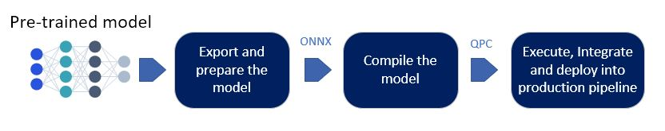
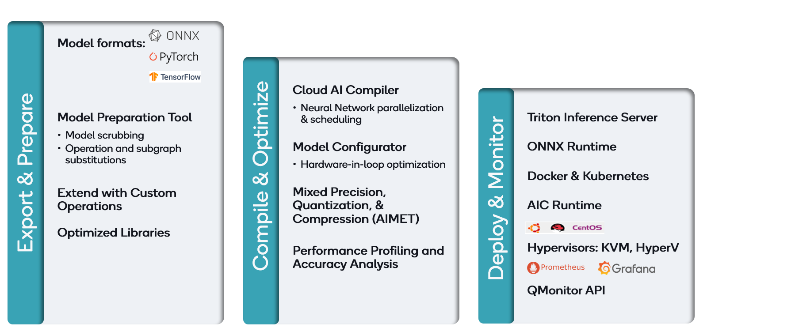

# Inference workflow on Cloud AI 

Developers can deploy a pre-trained model for inference on any Cloud AI platform using three easy steps:

1. Export the model in ONNX format and prepare the model 
2. Compile the model to generate a QPC (Qaic Program Container)
3. Execute, integrate and deploy into production pipeline

Cloud AI SDK provides tools for each of the steps as shown below. 

## Export and prepare the Model 
Exporting and preparing the pre-trained model as explained in this section is a requirement to extract the best performance and accuracy. Exporting the model in ONNX format is strongly recommended due to operator support. The ONNX file is then passed through a few checks (for model accuracy and performance) before it can be compiled in the next step.   

## Compile the Model
Compilation of the prepared ONNX file generates a QPC which can be loaded and executed on Cloud AI devices. To get the best performance from the device based on user requirements of throughput and latency, compilation needs to be done with the right parameters. Tune the performance goes over how to derive the best parameters for compilation. 

## Execute, integrate and deploy in production pipeline
This section will go over the different ways (CLI, C++, Python etc) for developers to execute inferences on Cloud AI platforms and all the tools/utilities available to integrate into inference application and deploy in the production pipeline.  

