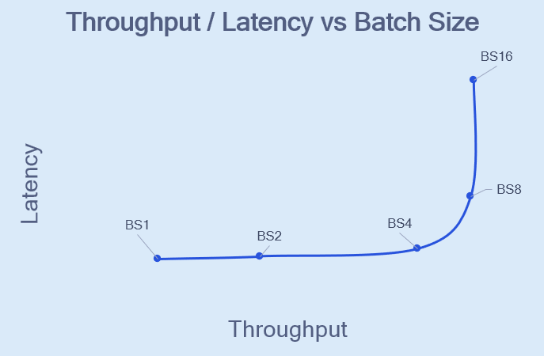
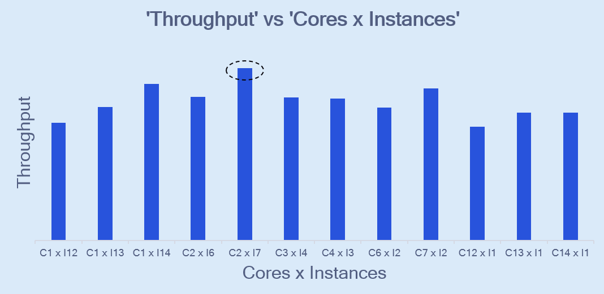

# Tune Performance 
Throughput (inferences per second) and latency (time per inference) tuning techniques for Cloud AI platforms are discussed in this section. 

## Key Performance Parameters 
Cores, Batch Size, Instances (a.k.a activations) and Set-size are the key performance parameters that need to be tuned to extract the best performance. 

- Cores and Batch Size are compile parameters.
- Instances and Set-size are runtime parameters.

### Core 
Cloud AI Platforms contain multiple AI cores depending on the SKU. Each AI core contains one or more scalar, vector and tensor engines which provide a rich instruction set to accelerate ML operations. A model can be compiled for one or more AI cores.   

### Instance (a.k.a activation)
Instance refers to the compiled binary of a model executing inferences on a set of AI cores. Let's say bert-large was compiled for 2 AI cores and the Cloud AI device has 14 AI cores. Each instance will run on 2 AI cores. Up to 7 instances (on 14 AI cores) can be executed in parallel.  

### Batch Size 
Batch size refers to the number of input elements inferred by an instance. 

### Set-size 
Set-size denotes the number of inferences that can be queued up on the host per activation. Set-size helps hide host side overhead by pipelining inferences. Models that require large input/output data to be transferred (from/to host and device) or some pre-processing/post-processing on the host can see throughput increases with increasing set-size up to a certain value beyond which the device utilization cannot be improved. 

### Instance and Batch size 
The product of number of instances and batch size provides the total input samples that can be inferred in parallel on a single Cloud AI device. 

### Cores and Instances 
The product of 'number of instances' and 'number of AI cores used per instance' cannot exceed the total number of AI cores available on the Cloud AI platform/card.

## Optimizing for Best Throughput / Least Latency
[Model Configurator](https://docs.qualcomm.com/bundle/publicresource/topics/80-PT790-993B/network-perform-tuning.html#network-perform-tuning_qaic-model-configurator) is a hardware-in-loop test tool that runs through various configurations and identifies the best configuration for a model. Model configurator tool offers two workflows - highest throughput and least latency. 

Refer to the Performance-Tuning [Tutorial #1 - CV](https://github.com/quic/cloud-ai-sdk/blob/1.10/tutorials/Computer-Vision/Perfomance-Tuning-Beginner) and [Tutorial #2 - NLP](https://github.com/quic/cloud-ai-sdk/tree/1.10/tutorials/NLP/Performance-Tuning-Beginner) for step by step walkthrough for performance tuning. 

Refer to Performance tuning tutorial for the workflow for optimizing for best throughput and least latency. 

For least latency configuration, batch-size should be set to 1. Set-size of 1 provides the least latency. 

Higher set-sizes may improve throughput significantly for a slight increase in latency for models that require some host side pre-processing (eg. CV models).  

## General Performance Tuning Observations 

Now that we have covered the [key performance tuning parameters ](#key-performance-parameters), there are some general observations that would help developers compile models for best performance. 

### Throughput and Latency vs Batch-size 
For an instance on a fixed number of cores, increasing the batch size (BS) from 1 will typically improve throughput. Increasing beyond the optimal BS will cause the performance to drop. 

### Throughput vs Cores and Instances 

Based on the total number of AI cores available on the device, a few combinations of cores and instances exist and some of these combinations provide better performance that others. 

Lets use the Standard SKU of Cloud AI 100 with 14 AI cores to illustrate this. Throughput for different combinations of cores and instances are shown in the figure below. The Batch-size is fixed. For example: C1 x I12 represents the model compiled on 1 core and 12 instances deployed on 12 cores. 

