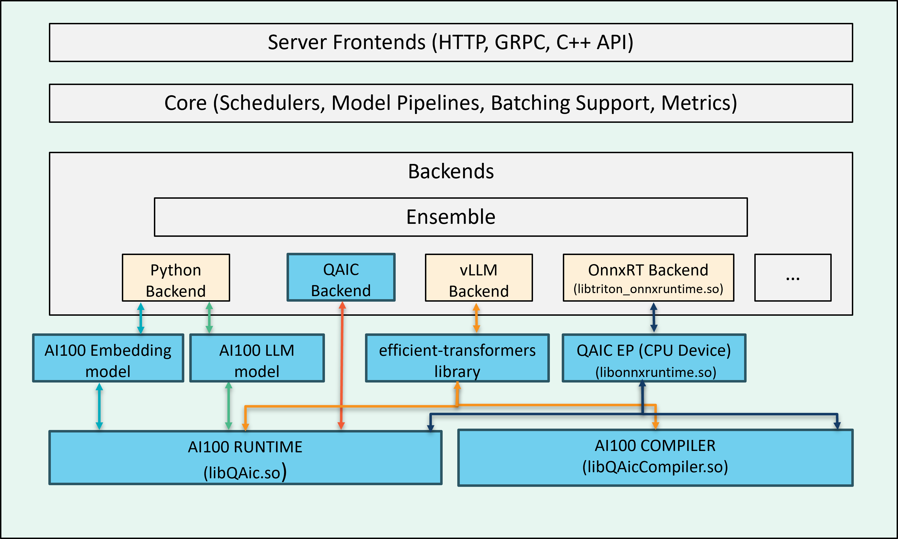
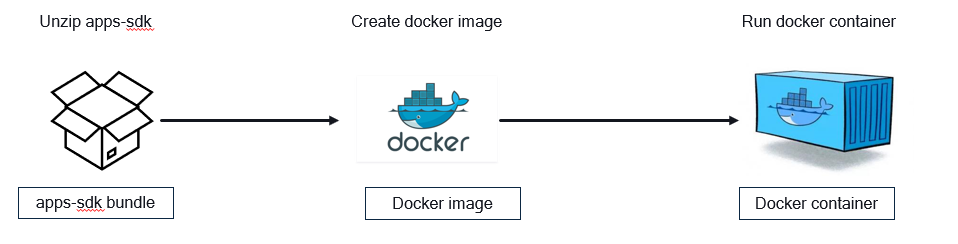
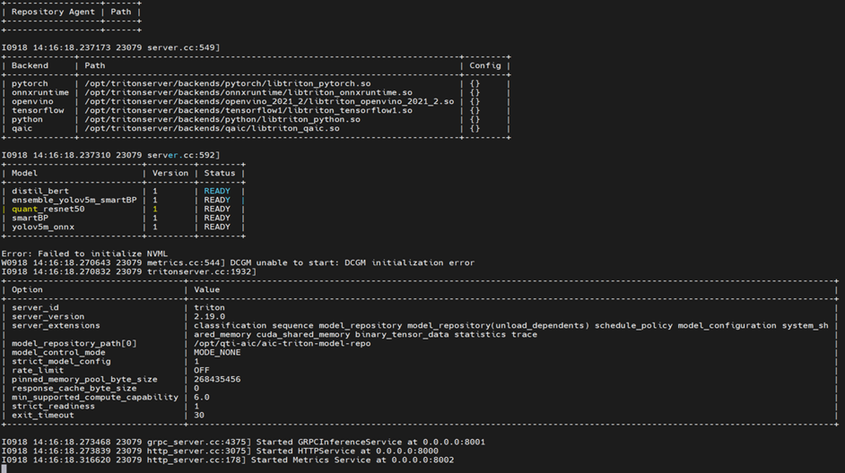

# Triton Inference Server

Triton Inference Server 2.48.0 (r24.07) is an open source inference serving software that
streamlines AI inferencing. 

Cloud AI SDK enables multiple backends for inference execution workflow.  These backends, once
used on a host with AI 100 cards, will detect the AI 100 cards during initialization
and route the inferencing call (requested to Triton server) to the hardware.

- onnxruntime_onnx (v1.18.1) as platform with QAic EP(execution provider) for deploying ONNX graphs.
- QAic as a customized C++ backend for deploying compiled binaries optimized for AIC.
- Python backends for LLMs and embedding models also support AIC execution.
- vLLM backend also supports AIC execution.

 


## Creating an AI 100 backend enabled Triton Docker image using AI 100 development kits

In order to add customized backends (to process inferencing on AI 100 hardware) into a vanilla Triton server image,
we need to run a few scripts by passing sdk_path as parameters.
`build_image.py` script will generate a Docker image as output. This script is a part of Cloud AI Apps SDK contents and can be run after unzipping it.




```bash

sample> cd </path/to/apps-sdk>/common/tools/docker-build

sample> python3 build_image.py --tag 1.18-triton --log_level 2 --user_specification_file </path/to/apps-sdk>/common/tools/docker-build/sample_user_specs/user_image_spec_triton_model_repo.json --apps-sdk /apps/sdk/path.zip --platform-sdk /platform/sdk/path.zip
```
The above command may take 15-20 minutes to complete and generate Triton Docker image in local Docker repository.

```bash

sample> docker image ls
REPOSITORY                                                                                                                                  TAG                 IMAGE ID       CREATED         SIZE
qaic-x86_64-triton-py38-release-qaic_platform-qaic_apps-qaic_python-pybase-pytools-vllm-onnxruntime-triton-triton_model_repo               1.18-triton          a0968cf3711b   3 days ago      27.3GB


```
Docker can be launched using docker `run` command passing the desired image name.
Please note the shared memory argument `--shm-size` for supporting ensembles and python backends.

```bash

sample> docker run -it --rm --privileged --shm-size=4g --ipc=host --net=host <triton-docker-image-name>:<tag> /bin/bash

sample> docker ps
CONTAINER ID   IMAGE                                                                                                                              COMMAND                  CREATED      STATUS      PORTS     NAMES
b88d5eb98187   qaic-x86_64-triton-py38-release-qaic_platform-qaic_apps-qaic_python-pybase-pytools-vllm-onnxruntime-triton-triton_model_repo      "/opt/tritonserver/n…"   2 days ago   Up 2 days             thirsty_beaver

```

## Creating a model repository and configuration file

The model configuration file specifies the execution properties of a model.
It indicates input/output structure, backend, batchsize, parameters, etc.  User needs to follow Triton's [model repository](https://github.com/triton-inference-server/server/blob/main/docs/user_guide/model_repository.md) and [model configuration](https://github.com/triton-inference-server/server/blob/main/docs/user_guide/model_configuration.md) rules while defining a config file.

### Model configuration - onnxruntime
For onnxruntime configuration, platform should be set to `onnxruntime_onnx`.
The `use_qaic` parameter should be passed and set to true.
#### AI 100 specific parameters
Parameters are user-provided key-value pairs which Triton will pass to backend runtime environment as variables and can be used in the backend processing logic.

- config : path for configuration file containing compiler options.
- device_id : id of AI 100 device on which inference is targeted. (not mandatory as the server auto picks the available device)
- use_qaic : flag to indicate to use qaic execution provider.
- share_session : flag to enable the use of single session of runtime object across model instances.

sample example of a `config.pbtxt`

```
name: "resnet_onnx"
platform: "onnxruntime_onnx"
max_batch_size : 16
default_model_filename : "aic100/model.onnx"
input [
  {
    name: "data"
    data_type: TYPE_FP32
    dims: [3, 224, 224 ]
  }
]
output [
  {
    name: "resnetv18_dense0_fwd"
    data_type: TYPE_FP32
    dims: [1000]
  }
]
parameters [
  {
    key: "config"
    value: { string_value: "1/aic100/resnet.yaml" }
  },
  {
    key: "device_id"
    value: { string_value: "0" }
  },
  {
    key: "use_qaic"
    value: { string_value: "true" }
  },
  {
    key: "share_session"
    value: { string_value: "true" }
  }
]
instance_group [
  {
    count: 2
    kind: KIND_MODEL
  }
]

```
### Model configuration - qaic backend
For qaic backend configuration, the `backend` parameter should be set to `qaic`.

#### AI 100 specific parameters
Parameters are user-provided key-value pairs which Triton will pass to backend runtime environment as variables and can be used in processing logic of backend.

Parameters are user-provided key-value pairs which Triton will pass to backend runtime environment as variables and can be used in processing logic of backend.

- qpc_path : path for compiled binary of model.(programqpc.bin) (if not provided the server searches for QPC in the model folder)
- device_id : id of AI 100 device on which inference is targeted. device is set 0 (not mandatory as the server auto picks the available device)
- set_size : size of inference queue for runtime,default is set to 20
- no_of_activations : flag to enable multiple activations of a model’s network,default is set to 1

sample example of a `config.pbtxt`

```
name: "yolov5m_qaic"
backend: "qaic"
max_batch_size : 4
default_model_filename : "aic100/model.onnx"
input [
  {
    name: "images"
    data_type: TYPE_FP32
    dims: [3, 640, 640 ]
  }
]
output [
  {
    name: "feature_map_1"
    data_type: TYPE_FP32
    dims: [3, 80, 80, 85]
  },
  {
    name: "feature_map_2"
    data_type: TYPE_FP32
    dims: [3, 40, 40, 85]
  },
  {
    name: "feature_map_3"
    data_type: TYPE_FP32
    dims: [3, 20, 20, 85]
  }
]
parameters [
  {
    key: "qpc_path"
    value: { string_value: "/path/to/qpc" }
  },
  {
    key: "device_id"
    value: { string_value: "0" }
  }
]
instance_group [
  {
    count: 2
    kind: KIND_MODEL
  }
]
```
### Triton Config generation tool
Model configuration file `config.pbtxt` is required for each model to run on the Triton server. The `triton_config_generator.py` tool helps to generate a minimal model configuration file if the `programqpc.bin` or `model.onnx` file is provided. The script can be found in "/opt/qti-aic/integrations/triton/release-artifacts/config-generation-script" path inside the container.

The script takes three arguments:

-	--model_repository: Model repository for which config.pbtxt needs to be generated (QAic backend)
-	--all: Generate config.pbtxt for ONNX (used with --model-repository)
-	--model_path: QAic model or ONNX model file path for which model folder needs to be generated.

The `model_repository` argument can be passed, and the script goes through the models and generates `config.pbtxt` for models that do not contain config (the --all option needs to be passed if config needs to be generated for ONNX models) or model path can be provided to generate model folder structure with `config.pbtxt` using random model names.

## Launching Triton server inside container
To launch Triton server, execute the `tritonserver` binary within Triton Docker with the model repository path.

```bash
/opt/tritonserver/bin/tritonserver --model-repository=</path/to/repository>
```



# Triton Python backend for LLMs
- LLM serving through Triton is enabled using `triton-qaic-backend-python`
- It supports execution of QPC binaries for Causal models, KV Cache models of LlamaForCausalLM, AutoModelForCausalLM categories.
- It supports two modes of server to client response - batch, decoupled (stream). In batch response mode, all of the generated tokens are cached and composed as a single response at the end of decode stage. In decoupled (stream) response mode, each generated token is sent to client as a separate response.
- Currently we include sample configurations for Mistral and Starcoder models.
- Sample client scripts are provided to test kv, causal models in stream-response, batch-response transaction modes.
## Instructions to launch LLM models on Triton server
### Launch Triton server container
```bash
docker run -it --shm-size=4g --rm --privileged --net=host -v /path/to/custom/models/:/path/to/custom/models/ <triton-docker-image-name>:<tag> bash
```
- qefficient virtual environment comprises compatible packages for compilation/execution of a wide range of LLMs. Activate this environment within the container.
```bash
. /opt/qeff-env/bin/activate
```

### Generating a model repository

#### Sample models

Model Folder  | Model Type | Response Type 
--- |--- |---
starcoder_15b | Causal | Batch 
starcoder_decoupled | Causal | Decoupled (Stream) 
mistral_7b | KV cache | Batch 
mistral_decoupled | KV cache | Decoupled (Stream) 

- Pass in the QPC to `generate_llm_model_repo.py` script available at **/opt/qti-aic/integrations/triton/release-artifacts/llm-models/** within Triton container.
```bash
python generate_llm_model_repo.py --model_name mistral_7b --aic_binary_dir <path/to/qpc> --python_backend_dir /opt/qti-aic/integrations/triton/backends/qaic/qaic_backend_python/
```
#### Custom models
- `generate_llm_model_repo.py` script uses a template to auto-generate config for custom models. Configure required parameters such as `use_kv_cache`, `model_name`, decoupled transaction policy through command line options to the script. Choosing `model_type` will configure `use_kv_cache` parameter. If not provided, it will be determined by loading QPC object which may take several minutes for large models. This creates a model folder for <custom_model> in  **/opt/qti-aic/integrations/triton/release-artifacts/llm-models/llm_model_dir**
```bash
python generate_llm_model_repo.py --model_name <custom_model> \
                                  --aic_binary_dir <path/to/qpc> \
                                  --hf_model_name \
                                  --model_type <causal/kv_cache> \
                                  --decoupled
```

### Launch tritonserver and load models
- Pre-requisite: Users need to get access for necessary models from Hugging Face and login with Hugging Face token using **'huggingface-cli login`** before launching the server.
- Launch the Triton server with **llm_model_dir**.
```bash
/opt/tritonserver/bin/tritonserver --model-repository=<path/to/llm_model_dir>
```

### Running the client
#### Launch client container
```bash
docker run -it --rm -v /path/to/unzipped/apps-sdk/integrations/triton/release-artifacts/llm-models/:/llm-models --net=host nvcr.io/nvidia/tritonserver:22.12-py3-sdk bash
```
- Once the server has started you can run example Triton client (client_example_kv.py/client_example_causal.py) provided to submit inference requests to loaded models.
- Decoupled model transaction policy is supported only over gRPC protocol. Therefore, decoupled models (stream response) use gRPC clients whereas batch response mode uses HTTP client as a sample.
```bash

# mistral_decoupled
python /llm-models/tests/stream-response/client_example_kv.py --prompt "My name is"
 
# mistral_decoupled (QPC compiled for batch_size=2)
python /llm-models/tests/stream-response/client_example_kv.py --prompt "My name is|Maroon bells"
 
# mistral_7b
python /llm-models/tests/batch-response/client_example_kv.py --prompt "My name is"
 
# starcoder_decoupled
python /llm-models/tests/stream-response/client_example_causal.py --prompt "Write a python program to print hello world"
 
# starcoder_15b
python /llm-models/tests/batch-response/client_example_causal.py --prompt "Write a python program to print hello world"
```

Note: For batch-response tests, the default network timeout in `client_example_kv.py`, `client_example_causal.py` is configured as 10 min (600 sec), 100 min (6000 sec) respectively.

```
# User can also use generate API to do inferencing from Triton client container
curl -X POST localhost:8000/v2/models/mistral_7b/generate -d '{"prompt": "My name is","id": "42"}'
```

# Triton Python backend for Embedding models

- Triton qaic python backend for embedding models supports execution of qpc for BERT style models. For list of supported models refer to - [cloud-ai-sdk/models/language_processing/encoder/README.md at quic/cloud-ai-sdk · GitHub](https://github.com/quic/cloud-ai-sdk/blob/1.17/models/language_processing/encoder/lut_nlp_models.csv)
- We use compiled binary generated by qaic-exec for serving embedding models through triton python backend.
- We include sample client scripts for models with sentence embeddings as outputs

## Instructions to launch embedding models on Triton server
### Launch Triton server container
```bash
docker run -it --shm-size=4g --rm --privileged --net=host -v /path/to/workspace/:/path/to/workspace/ <triton-docker-image-name>:<tag> bash
```
### Generating a model repository
- `generate_embedding_model_repo.py` script will be available at location - /opt/qti-aic/integrations/triton/release-artifacts/embedding-models/
- This script uses a template to auto-generate config for custom models. Configure required parameters such as model_name, aic_binary_dir, hf_model_name through command line options to generate_embedding_model_repo.py script.
- A model folder, identified by model_name provided, will be created in required format under embedding_model_dir at /opt/qti-aic/integrations/triton/release-artifacts/embedding-models/ 
config.pbtxt
``` bash
python generate_embedding_model_repo.py -h
 
usage: generate_embedding_model_repo.py [-h] --model_name MODEL_NAME --aic_binary_dir AIC_BINARY_DIR
                                        [--python_backend_dir PYTHON_BACKEND_DIR] --hf_model_name
                                        HF_MODEL_NAME [--max_prompt_length MAX_PROMPT_LENGTH]
                                        [--max_batch_size MAX_BATCH_SIZE] [--num_instances NUM_INSTANCES]
 
options:
  -h, --help            show this help message and exit
  --model_name MODEL_NAME
                        Name of the model to generate model repo(bert-base-cased)
  --aic_binary_dir AIC_BINARY_DIR
                        Path to QPC(programqpc.bin) directory
  --python_backend_dir PYTHON_BACKEND_DIR
                        Path to Qaic Python Backend Directory for Embedding models
  --hf_model_name HF_MODEL_NAME
                        Name of the model as identified on huggingface(google-bert/bert-base-cased)
  --max_prompt_length MAX_PROMPT_LENGTH
                        Set maximum prompt length that tokenizer should support
  --max_batch_size MAX_BATCH_SIZE
                        Set maximum number of samples that should be allowed to process at same time.
                        Configure as a value less than or equal to batch size of compiled binary
  --num_instances NUM_INSTANCES
                        Set instance count. Each instance uses 1 activation on AI100 device. Max
                        supported instance count is limited by NSP available.
 Optional: Copy the model folder to /path/to/workspace, mapped to host path, to reuse the generated model repo for future runs.
```

### Launch tritonserver and load models
- Pre-requisite: Users may need to get access for necessary models from huggingface and login with huggingface token using 'huggingface-cli login` before launching the server.
- Launch the triton server with embedding_model_dir.  
```bash
/opt/tritonserver/bin/tritonserver --model-repository=<path/to/embedding_model_dir>
```
### Running the client
#### Launch client container
```bash
docker run -it --rm -v /path/to/unzipped/apps-sdk/common/integrations/triton/release-artifacts/embedding-models/tests:/embedding-models/tests --net=host nvcr.io/nvidia/tritonserver:24.07-py3-sdk bash
```
##### Run client examples
- Once the server has started you can use the example triton client tests (http_client_example.py, grpc_client_example.py, http_api_example.py) provided to inference with models loaded.
``` bash
# httpclient example with bert-base-cased model loaded on server
python /embedding-models/tests/http_client_example.py --prompt "Earthquakes in this region are uncommon but not unexpected. It’s likely people near the epicenter are going to feel aftershocks for this earthquake in the magnitude 2-3 range, and there’s a small chance there can be an earthquake as large or larger, following an earthquake like this, Paul Earle, a seismologist at the USGS Earthquake Hazards Program told reporters. In terms of our operations, this is a routine earthquake. Immediately we knew this would be of high interest and important to people who don’t feel earthquakes a lot." --model_name bert-base-cased
 
# qpc compiled for batch_size>=2
python /embedding-models/tests/http_client_example.py --prompt "Earthquakes in this region are uncommon but not unexpected. It’s likely people near the epicenter are going to feel aftershocks for this earthquake in the magnitude 2-3 range, and there’s a small chance there can be an earthquake as large or larger, following an earthquake like this, Paul Earle, a seismologist at the USGS Earthquake Hazards Program told reporters. In terms of our operations, this is a routine earthquake. Immediately we knew this would be of high interest and important to people who don’t feel earthquakes a lot.|Earthquakes in this region are uncommon but not unexpected. It’s likely people near the epicenter are going to feel aftershocks for this earthquake in the magnitude 2-3 range, and there’s a small chance there can be an earthquake as large or larger, following an earthquake like this, Paul Earle, a seismologist at the USGS Earthquake Hazards Program told reporters. In terms of our operations, this is a routine earthquake. Immediately we knew this would be of high interest and important to people who don’t feel earthquakes a lot." --model_name bert-base-cased

# http api example with bert-base-cased model loaded on server
python /embedding-models/tests/http_api_example.py --prompt 'Earthquakes in this region are uncommon but not unexpected. It’s likely people near the epicenter are going to feel aftershocks for this earthquake in the magnitude 2-3 range, and there’s a small chance there can be an earthquake as large or larger, following an earthquake like this, Paul Earle, a seismologist at the USGS Earthquake Hazards Program told reporters. In terms of our operations, this is a routine earthquake. Immediately we knew this would be of high interest and important to people who don’t feel earthquakes a lot.' -m bert-base-cased -u http://localhost:8000/v2/models/bert-base-cased/infer
```
##### Benchmarking
Use GitHub - triton-inference-server/perf_analyzer for benchmarking
```bash
# perf analyzer example with bert-base-cased model
# binary compiled for batch size=8, cores=2
# num_instances/instance count set to 7 in config.pbtxt.

perf_analyzer -m bert-base-cased --string-data 'Earthquakes in this region are uncommon but not unexpected. It’s likely people near the epicenter are going to feel aftershocks for this earthquake in the magnitude 2-3 range, and there’s a small chance there can be an earthquake as large or larger, following an earthquake like this, Paul Earle, a seismologist at the USGS Earthquake Hazards Program told reporters. In terms of our operations, this is a routine earthquake. Immediately we knew this would be of high interest and important to people who don’t feel earthquakes a lot.' -b 8 --shape prompt:1 -p 10000 --concurrency 7:35:7
```
# vLLM Backend for Triton
- vLLM (0.6.0) backend for Triton is a python based backend designed to run [supported models](https://github.com/quic/efficient-transformers/blob/release/v1.18/docs/source/validate.md) on the vLLM AsyncEngine.

## Instructions to launch vLLM models
- Sample model repository for TinyLlama model is generated at `"/opt/qti-aic/aic-triton-model-repositories/vllm_model"` while building Triton docker with triton_model_repo application using [Docker](../../Installation/Docker/Docker.md). You can use this as is or change the model by changing model value in model.json
- model.json represents a key-value dictionary that is fed to the vLLM's AsyncEngine. Please modify the model.json as per need.
- model.json sample parameters.
```bash
{
    "model": "model_name",
    "device_group": [0,1,2,3,4], # device_id for execution
    "max_num_seqs": <decode_bsz>, # Decode batch size
    "max_model_len": <ctx_len>, # Max Context length
    "max_seq_len_to_capture": <seq_len>, # Sequence length
    "quantization": "mxfp6", # Quantization
    "kv_cache_dtype": "mxint8", # KV cache compression
    "device": "qaic"
}
```
- Sample [config.pbtxt](https://github.com/triton-inference-server/vllm_backend/blob/r24.07/samples/model_repository/vllm_model/config.pbtxt) 
- Activate the vllm virtual environment before launching the triton server 
```bash 
source /opt/vllm-env/bin/activate 
```

```
# Configure number of cores as per NSP availibility
export VLLM_QAIC_NUM_CORES=16
```
- Launch the triton server 
```bash
 /opt/tritonserver/bin/tritonserver --model-repository=/opt/qti-aic/aic-triton-model-repositories/vllm_model 
 ```
- The Triton server takes a few minutes(depends on the model) to download and compile the model.
- Sample [Client](https://github.com/triton-inference-server/vllm_backend/blob/r24.07/samples/client.py) script is available in the sample model repository (built as part of the Triton container using qaic-docker) "/opt/qti-aic/aic-triton-model-repositories/vllm_model/vllm_model".
- The sample client script (client.py) can be used to interface with the Triton/vLLM inference server, and can be executed from the Triton client environment.
- User can also use generate API to do inferencing from Triton client container 
```bash
 curl -X POST localhost:8000/v2/models/vllm_model/generate -d '{"text_input": "My name is","parameters":{"stream":false, "temperature": 0, "max_tokens":1000}}'
 ```

# Supported Features

- Model Ensemble(Qaic Backend, onnxruntime)
- Dynamic Batching(Qaic Backend, onnxruntime)
- Auto device-picker
- Support for auto complete configuration
- LLM support for LlamaForCausalLM, AutoModelForCausalLM categories.
- [vLLM](../../Installation/vLLM/vLLM.md) (0.6.0) support for AIC execution.
- [Generate Extension](https://docs.nvidia.com/deeplearning/triton-inference-server/user-guide/docs/protocol/extension_generate.html)


# Examples
Triton example applications are released as part of the Cloud AI Apps SDK. Inside the Triton Docker container the sample model repositories are available at "/opt/qti-aic/aic-triton-model-repositories/"
- `--model-repository` option can be used to launch the models.
 
### Stable diffusion
1) To generate a Stable Diffusion model repository inside a Triton container:

   - Make sure you have access to gated repository [Stable Diffusion](https://huggingface.co/benjamin-paine/stable-diffusion-v1-5)
   - huggingface-cli login can be done before you run the script or, `--auth_token` option can be passed while running the script eg: `python generate_SD_repo.py --auth_token=<hf_token>`
   - Run the `generate_SD_repo.py` script. The script is located at "/opt/qti-aic/integrations/triton/release-artifacts/stable-diffusion-ensemble", which will create a ensemble-stable-diffuison model repo
 
3) Start the Triton server "/opt/tritonserver/bin/tritonserver --model-repository=/path/to/ensemble-stable-diffusion"
 
4) Triton server takes about 2 minutes to start on the first go as it needs to compile QPC.
 
5) Use client_example.py for testing purpose.


