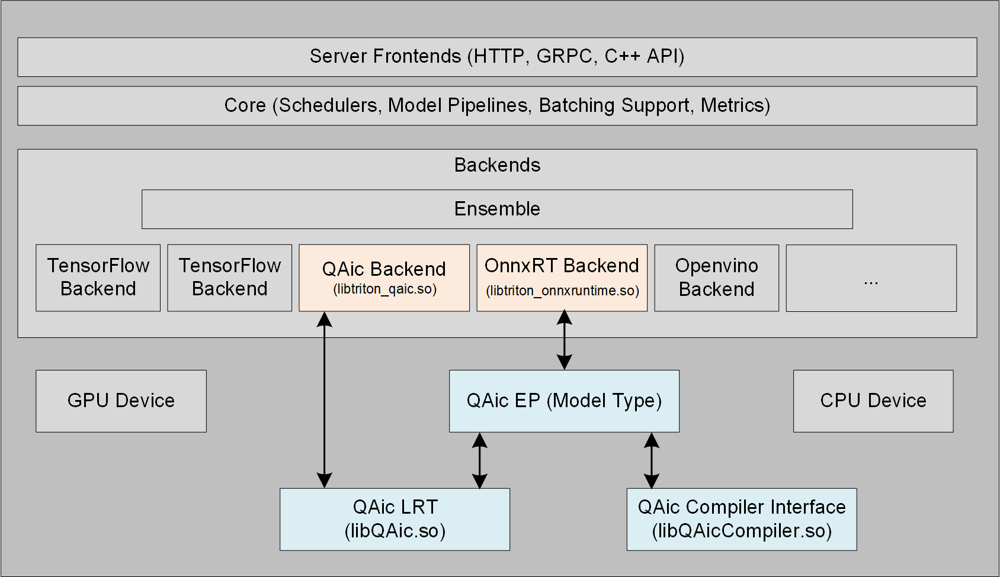

# Triton Inference Server

Triton Inference Server is an open source inference serving software that
streamlines AI inferencing. 

AIC100 SDK enables two backends for inference execution workflow.  These backends, once
used on a host with AIC100 cards, will detect the AIC100 cards during initialization
and route the inferencing call (requested to Triton server) to the hardware.

- onnxruntime_onnx as platform with QAic EP(execution provider)
- QAic as a customized C++ backend

 


## Creating a AIC100 backend enabled Triton docker image using AIC100 development kits

In order to add a customized backends (to process inferencing on AIC100 hardware) into a Vanilla Triton server image,
we need to run few scripts by passing sdk_path as parameters.
"docker-build.sh" script will generate a docker image as output.This script is a part of apps-sdk contents and can be run after unzipping it.


```bash

sample> cd </path/to/app-sdk>/tools/docker-build

sample> python3 build_image.py --tag 1.11.0.46-triton --log_level 2 --user_specification_file /opt/qti-aic/tools/docker-build-gen2/sample_user_specs/user_image_spec_triton_model_repo.json --apps-sdk /apps/sdk/path --platform-sdk /platform/sdk/path
 
```
The above command may take 15-20 minutes to complete and generate incremental images for Triton docker image in local docker repository.

```bash

sample> docker image ls
REPOSITORY                                                                                                                      TAG                 IMAGE ID       CREATED         SIZE
qaic-x86_64-triton-release-py38-qaic_platform-qaic_apps-pybase-onnxruntime-triton-pytools-triton_model_repo               1.11.0.46-triton          a0968cf3711b   3 months ago    28.2GB
qaic-x86_64-triton-release-py38-qaic_platform-qaic_apps-pybase-onnxruntime-triton-pytools                                 1.11.0.46-triton          038dc80fd8e4   3 months ago    27.1GB
qaic-x86_64-triton-release-py38-qaic_platform-qaic_apps-pybase-onnxruntime-triton                                         1.11.0.46-triton          760fb9dc5314   3 months ago    24GB
qaic-x86_64-triton-release-py38-qaic_platform-qaic_apps-pybase-onnxruntime                                                1.11.0.46-triton          a47266156b7f   3 months ago    23.9GB
qaic-x86_64-triton-release-py38-qaic_platform-qaic_apps-pybase                                                            1.11.0.46-triton          d620a1bdb6b6   3 months ago    20.1GB
qaic-x86_64-triton-release-py38-qaic_platform-qaic_apps                                                                   1.11.0.46-triton          8c87eb44f2db   3 months ago    15.3GB
qaic-x86_64-triton-release-py38-qaic_platform                                                                             1.11.0.46-triton          e3ba2ce282c1   3 months ago    14.7GB
qaic-x86_64-triton-release-py38                                                                                           1.11.0.46-triton          73b225d7e358   3 months ago    14.2GB
qaic-x86_64-triton-release                                                                                                1.11.0.46-triton          914fa376e865   3 months ago    14.1GB
qaic-x86_64-triton                                                                                                        1.11.0.46-triton          2090680d4d59   3 months ago    14.1GB

```
Docker can be launched using docker "run" command passing the desired image name.
Please note that a shared memory argument(--shm-size) to pass for supporting ensembles and python backends.

```bash

sample> docker run -it --rm --privileged --shm-size=4g --ipc=host --net=host <triton-docker-image-name> /bin/bash

sample> docker ps
CONTAINER ID   IMAGE                                                                                                            COMMAND                  CREATED      STATUS      PORTS     NAMES
b88d5eb98187   qaic-x86_64-triton-release-py38-qaic_platform-qaic_apps-pybase-onnxruntime-triton-pytools-triton_model_repo      "/opt/tritonserver/n…"   2 days ago   Up 2 days             thirsty_beaver

```

## Creating a model repository and configuration file

The model configuration file specifies the execution properties of a model.
It indicates input/output structure, backend, batchsize, parameters, etc.  User needs to follow Triton's [model repository](https://github.com/triton-inference-server/server/blob/main/docs/user_guide/model_repository.md) and [model configuration](https://github.com/triton-inference-server/server/blob/main/docs/user_guide/model_configuration.md) rules while defining a config file.

### Model configuration - onnxruntime
For onnxruntime configuration, platform should be set to "onnxruntime_onnx".
The "use_qaic" parameter should be passed and set to true.
#### AIC100 specific parameters
Parameters are user-provided key-value pairs which Triton will pass to backend runtime environment as variables and can be used in the backend processing logic.

- config : path for configuration file containing compiler options.
- device_id : id of AIC100 device on which inference is targeted. (not mandatory as the server auto picks the available device)
- use_qaic : flag to indicate to use qaic execution provider.
- share_session : flag to enable the use of single session of runtime object across model instances.

sample example of a config.pbtxt

```
name: "resnet_onnx"
platform: "onnxruntime_onnx"
max_batch_size : 16
default_model_filename : "aic100/model.onnx"
input [
  {
    name: "data"
    data_type: TYPE_FP32
    dims: [3, 224, 224 ]
  }
]
output [
  {
    name: "resnetv18_dense0_fwd"
    data_type: TYPE_FP32
    dims: [1000]
  }
]
parameters [
  {
    key: "config"
    value: { string_value: "1/aic100/resnet.yaml" }
  },
  {
    key: "device_id"
    value: { string_value: "0" }
  },
  {
    key: "use_qaic"
    value: { string_value: "true" }
  },
  {
    key: "share_session"
    value: { string_value: "true" }
  }
]
instance_group [
  {
    count: 2
    kind: KIND_MODEL
  }
]

```
### Model configuration - qaic backend
For qaic backend configuration, the "backend" parameter should be set to "qaic".

#### AIC100 specific parameters
Parameters are user-provided key-value pairs which Triton will pass to backend runtime environment as variables and can be used in processing logic of backend.

Parameters are user-provided key-value pairs which Triton will pass to backend runtime environment as variables and can be used in processing logic of backend.

- qpc_path : path for compiled binary of model.(programqpc.bin) (if not provided the server searches for qpc in the model folder)
- device_id : id of AIC100 device on which inference is targeted. device is set 0 (not mandatory as the server auto picks the available device)
- set_size : size of inference queue for runtime,default is set to 20
- no_of_activations : flag to enable multiple activations of a model’s network,default is set to 1

sample example of a config.pbtxt

```
name: "yolov5m_qaic"
backend: "qaic"
max_batch_size : 4
default_model_filename : "aic100/model.onnx"
input [
  {
    name: "images"
    data_type: TYPE_FP32
    dims: [3, 640, 640 ]
  }
]
output [
  {
    name: "feature_map_1"
    data_type: TYPE_FP32
    dims: [3, 80, 80, 85]
  },
  {
    name: "feature_map_2"
    data_type: TYPE_FP32
    dims: [3, 40, 40, 85]
  },
  {
    name: "feature_map_3"
    data_type: TYPE_FP32
    dims: [3, 20, 20, 85]
  }
]
parameters [
  {
    key: "qpc_path"
    value: { string_value: "/path/to/qpc" }
  },
  {
    key: "device_id"
    value: { string_value: "0" }
  }
]
instance_group [
  {
    count: 2
    kind: KIND_MODEL
  }
]
```

## Launching Triton server inside container
To launch Triton server, execute the tritonserver binary within Triton docker with the model repository path.

```bash
/opt/tritonserver/bin/tritonserver --model-repository=</path/to/repository>
```


## Supported Features

- Model Ensemble
- Dynamic Batching
- Auto device-picker
- Support for ARM64
- Support for auto complete configuration

### Triton Config_generation tool
Model configuration file (config.pbtxt) is required for each model to run on the triton server. The triton_config_generator.py tool helps to generate a minimal model configuration file if the programqpc.bin or model.onnx file is provided. The script can be found in /opt/qti-aic/integrations/triton/release-artifacts/config-generation-script path inside the container.

The script takes in three arguments:
-	--model_repository: Model repository for which config.pbtxt needs to be generated (QAic backend)
-	--all: Generate config.pbtxt for Onnx (used with --model-repository)
-	--model_path: QAic model or Onnx model file path for which model folder needs to be generated.

The model_repository argument can be passed, and the script goes through the models and generates config.pbtxt for models that do not contain config (the --all option needs to be passed if config needs to be generated for Onnx models) or model path can be provided to generate model folder structure with config.pbtxt using random model names.

## Examples
Triton example applications are released as part of the Apps SDK. Inside the triton docker container the sample model repositories are available at "/opt/qti-aic/aic-triton-model-repositories/"
- Resnet101 and yolov5 models are available at "/opt/qti-aic/aic-triton-model-repositories/daisy-chained-ensembles"
- `--model-repository` option can be used to launch the models.
 
### Stable diffusion
1) If we built the docker with triton model repo application then the stable diffusion model repo is available at this path: "/opt/qti-aic/aic-triton-model-repositories/ensemble-stable-diffusion".
 
2) To generate a model repo inside a triton container:
   - Run the generate_SD_repo.py script. The script is located at "/opt/qti-aic/integrations/triton/release-artifacts/stable-diffusion-ensemble", which will create a ensemble-stable-diffuison model repo
 
3) Start the triton server "/opt/tritonserver/bin/tritonserver --model-repository=/path/to/ensemble-stable-diffusion" <br>
   Example: "/opt/tritonserver/bin/tritonserver --model-repository=/opt/qti-aic/aic-triton-model-repositories/ensemble-stable-diffusion"
 
4) Triton server takes about 2 minutes to start on the first go as it needs to compile qpc.
 
5) Run the client_example.py from the same container for testing purpose or client_example.py can also be copied to Triton client container and executed from there.


