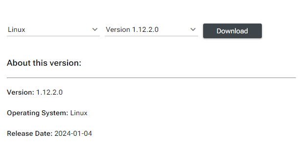

# Installation - Cloud AI SDK

## Download Instructions
Version 1.12 onwards, Platform and Apps SDK can only be downloaded from [Qualcomm Package Manager](https://qpm.qualcomm.com/). 

1. login to [Qualcomm Package Manager](https://qpm.qualcomm.com/). First time users need to register for a Qualcomm ID. 
2. Click on **Tools** 
3. In the Filter pane on the left, **check Linux** and **uncheck Windows**. <br> In the search box, type **Cloud AI**.<br> Click on **Qualcomm® Cloud AI Products** to reveal the SDKs available. 
4. For Platform SDK, click **Qualcomm® Cloud AI Platform SDK**. <br>For Apps SDK, click **Qualcomm® Cloud AI Apps SDK**. 
5. Two drop down lists are present, one for the OS and one for the version of the SDK. Select **Linux** and **SDK Version** from the drop down lists. 

6. Click the **Download** button to download the SDK.

## Platform SDK 

- The downloaded Platform SDK file is named **aic_platform.Core.`<majorversion.minorversion.patchversion.buildversion>`.Linux-AnyCPU.zip**. <br>For example: aic_platform.Core.1.12.2.0.Linux-AnyCPU.zip. 
- On the host machine, log in as root or use `sudo` to have the right permissions to complete installation 
- Copy the Platform SDK downloaded from the Qualcomm Portal to the host machine:
    - For networked x86-64 or ARM64 host:
        - Use scp, rsync, or samba to copy the Platform SDK zip file to the host machine
        - Log in to the host machine (ssh or local terminal)
        - Unzip the downloaded zip file to a working directory
        - `cd` to the working directory
    - For ARM64 hosts that support Google Android Debug Bridge (ADB):
        ```
        - adb push <Platform SDK zip file> /data
        - adb shell
        - cd /data
        - Unzip the downloaded zip file to a working directory
        - cd to the working directory
        ```
- unzip the downloaded file. 
  
???+ info 
      The Platform SDK contains collaterals for x86-rpm, x86-deb, aarch64-rpm and aarch64-deb. Confirm the architecture and linux package format that works for your setup.    
  
  The Platform SDK (qaic-platform-sdk-`<major.minor.patch.build>`) is composed of the following tree structure. 
      ```
      ├── aarch64
      │   ├── deb
      │   │   ├── deb
      │   │   ├── deb-docker
      │   │   ├── deb-perf
      │   │   └── Workload
      │   ├── rpm
      │   │   ├── rpm
      │   │   ├── rpm-docker
      │   │   ├── rpm-perf
      │   │   └── Workload
      │   └── test_suite
      │       ├── pcietool
      │       └── powerstress
      ├── common
      │   ├── qaic-test-data
      │   └── sectools
      │       ├── bin
      │       ├── config
      │       ├── example
      │       ├── ext
      │       ├── plugin
      │       ├── resources
      │       └── sectools
      └── x86_64
          ├── deb
          │   ├── deb
          │   ├── deb-docker
          │   └── Workload
          ├── rpm
          │   ├── rpm
          │   ├── rpm-docker
          │   └── Workload
          └── test_suite
              ├── pcietool
              └── powerstress

      ```

  Uninstall existing Platform SDK

    ```bash
    cd <architecture>/<deb/rpm>
    sudo ./uninstall.sh
    sync
    ```  

  Run the install.sh script as root or with sudo to install with superuser permissions. Installation may take up to 30 mins depending on the number of Cloud AI cards in the server/VM. Cloud AI cards undergo resets several times during the installation. 
    ```bash
    cd <architecture>/<deb/rpm>
    # For Hybrid boot cards (PCIe CEM form factor cards), run 
    sudo ./install.sh --auto_upgrade_sbl --ecc enable
    # For VM on ESXi hypervisor, run 
    sudo ./install.sh --auto_upgrade_sbl --datapath_polling –-ecc enable

    # For Flashless boot cards, run 
    sudo ./install.sh –-ecc enable
    # For VM on ESXi hypervisor, run 
    sudo ./install.sh --datapath_polling –-ecc enable
    ```

  On successful installation of the platform SDK, the contents shown below are stored in /opt/qti-aic:
    ```
    dev  drivers  examples  exec  firmware  services  test-data  tools
    ```
  
  Check Platform SDK version using 
    ```
    cat /opt/qti-aic/versions/platform.xml
    ```
  Add user to the qaic group to allow command-line tools to run without sudo:
    ```
    sudo usermod -a -G qaic $USER
    ```


### Verify card operation 
  Refer to [Verify Card Operation](../Checklist/checklist.md#verify-card-operation)
  
## Apps SDK 
The Apps SDK is only available for x86-64 Linux-based hosts. For ARM64-based Qualcomm platforms, models are first compiled on x86 with the Apps SDK. The compiled binary (QPC) is transferred to the ARM64 host for loading and execution by the Platform SDK on Cloud AI hardware.

- The downloaded Apps SDK file is named **aic_apps.Core.`<majorversion.minorversion.patchversion.buildversion>`.Linux-AnyCPU.zip**. For example: aic_apps.Core.1.12.2.0.Linux-AnyCPU.zip. 
- Copy the SDK over to the linux x86 machine. 
- unzip the downloaded file. 
- The Apps SDK (qaic-apps-`<major.minor.patch.build version>`) is composed of the following tree structure.  

  ```
  ├── dev
  │   ├── hexagon_docker_scripts
  │   ├── hexagon_tools
  │   ├── inc
  │   ├── lib
  │   └── python
  ├── examples
  │   ├── apps
  │   └── scripts
  ├── exec
  ├── integrations
  │   ├── qaic_onnxrt
  │   └── triton
  ├── scripts
  │   ├── qaic-model-configurator
  │   └── qaic-prepare-model
  ├── tools
  │   ├── custom-ops
  │   ├── docker-build
  │   ├── graph-analysis-engine
  │   ├── opstats-profiling
  │   ├── package-generator
  │   ├── qaic-inference-optimizer
  │   ├── qaic-pytools
  │   ├── rcnn-exporter
  │   └── smart-nms
  └── versions
  ```

### Install Apps SDK 
  - Uninstall existing Apps SDK<br>
    ```sudo ./uninstall.sh```
  - Run the install.sh script as root or with sudo to install with root permissions.<br>
    ```sudo ./install.sh --enable-qaic-pytools ```
  - On successful installation of the Apps SDK, the contents are stored to the /opt/qti-aic path under the dev and exec directories:<br>
    ```dev exec integrations scripts```
  - Check the Apps SDK version with the following command <br>
    ```cat /opt/qti-aic/versions/apps.xml```
  - Apply chmod commands 
    
    ```
    sudo chmod a+x /opt/qti-aic/dev/hexagon_tools/bin/*
    sudo chmod a+x /opt/qti-aic/exec/*
    ```
  
 


