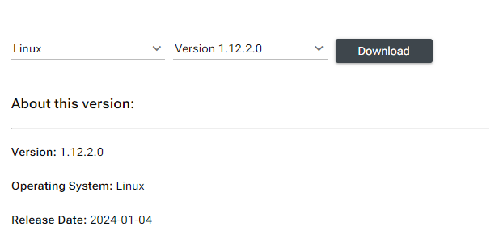

# Installation - Cloud AI SDK

## Download Instructions
Platform and Apps SDKs are available on [Qualcomm Package Manager](https://qpm.qualcomm.com/). 

1. login to [Qualcomm Package Manager](https://qpm.qualcomm.com/). First time users need to register for a Qualcomm ID. 
2. Click on **Tools** 
3. In the Filter pane on the left, **check Linux** and **uncheck Windows**. <br> In the search box, type **Cloud AI**.<br> Click on **Qualcomm® Cloud AI Products** to reveal the SDKs available. 
4. For Platform SDK, click **Qualcomm® Cloud AI Platform SDK**. <br>For Apps SDK, click **Qualcomm® Cloud AI Apps SDK**. 
5. Two drop down lists are present, one for the OS and one for the version of the SDK. Select **Linux** and **SDK Version** from the drop down lists. <br>

6. Click the **Download** button to download the SDK.

## Platform SDK 

- The downloaded Platform SDK file is named **aic_platform.Core.`<majorversion.minorversion.patchversion.buildversion>`.Linux-AnyCPU.zip**. <br>For example: aic_platform.Core.1.12.2.0.Linux-AnyCPU.zip. 
- On the host machine, log in as root or use `sudo` to have the right permissions to complete installation 
- Copy the Platform SDK downloaded from the Qualcomm Portal to the host machine:
    - For networked x86-64 or ARM64 host:
        - Use scp, rsync, or samba to copy the Platform SDK zip file to the host machine
        - Log in to the host machine (ssh or local terminal)
        - Unzip the downloaded zip file to a working directory
        - `cd` to the working directory
    - For ARM64 hosts that support Google Android Debug Bridge (ADB):
        ```bash
        adb push <Platform SDK zip file> /data
        adb shell
        cd /data
        Unzip the downloaded zip file to a working directory
        cd to the working directory
        ```
- unzip the downloaded file. 
  
???+ info 
      The Platform SDK contains collaterals for x86-rpm, x86-deb, aarch64-rpm and aarch64-deb. Confirm the architecture and linux package format that works for your setup.    
  
  The Platform SDK (qaic-platform-sdk-`<major.minor.patch.build>`) is composed of the following tree structure. 
      ```
      ├── aarch64
      │   ├── deb
      │   │   ├── deb
      │   │   ├── deb-docker
      │   │   ├── deb-perf
      │   │   └── Workload
      │   ├── rpm
      │   │   ├── rpm
      │   │   ├── rpm-docker
      │   │   ├── rpm-perf
      │   │   └── Workload
      │   └── test_suite
      │       ├── pcietool
      │       └── powerstress
      ├── common
      │   ├── qaic-test-data
      │   └── sectools
      └── x86_64
          ├── deb
          │   ├── deb
          │   ├── deb-docker
          │   └── Workload
          ├── rpm
          │   ├── rpm
          │   ├── rpm-docker
          │   └── Workload
          └── test_suite
              ├── pcietool
              └── powerstress
      ```

  Uninstall existing Platform SDK
  ```bash
  cd <architecture>/<deb|rpm>
  sudo ./uninstall.sh
  sync
  ```

  Run the install.sh script as root or with sudo to install with superuser permissions. Installation may take up to 30 mins depending on the number of Cloud AI cards in the server/VM. Cloud AI cards undergo resets several times during the installation. 

  Upgrading to SDK 1.18 is a 2-step process:

  1. In the first step we need to prepare each SoC to accept the 1.18 SBL bootloader firmware
  2. In the second step we upgrade to the 1.18 SBL bootloader firmware

  For Hybrid boot cards (PCIe CEM form factor cards), run:
    ```bash
    cd <architecture>/<deb/rpm>

    sudo ./install.sh --no_auto_upgrade_sbl    # For VM on ESXi hypervisor, also add the --datapath_polling option
    sudo ./install.sh --ecc enable

    # Allow server to initialize all devices
    sleep 10

    # List QIDs in the system
    sudo /opt/qti-aic/tools/qaic-util -q | grep -e QID

    # Update SoC, repeat for all QIDs in the system.
    sudo /opt/qti-aic/tools/qaic-firmware-updater -d <QID> -f 

    # Reset cards.
    sudo /opt/qti-aic/tools/qaic-util -s
    ```
    
 To check qmonitor service is active or inactive - use the below command
 
    ```
    sudo systemctl is-active qmonitor-proxy
    ```
    
In case you need to stop and start Qmonitor server, please use below commands.
```
sudo /opt/qti-aic/scripts/qaic-monitor-service.sh stop

sudo /opt/qti-aic/scripts/qaic-monitor-service.sh start
```

  For Flashless boot cards (less common), run:
  ```bash
  sudo ./install.sh –-ecc enable
  # For VM on ESXi hypervisor, run 
  sudo ./install.sh --datapath_polling –-ecc enable
  ```
    
  To enable mdp, disable acs, increase the mmap limit & ulimit value, use `--setup_mdp all` option.
  ```
  sudo ./install.sh --setup_mdp all
  ```

  On successful installation of the platform SDK, the contents shown below are stored in /opt/qti-aic:
  ```
  config  dev  examples  exec  firmware  lib  services  test-data  tools  versions
  ```
  
  Check Platform SDK version using 
  ```bash
  sudo /opt/qti-aic/tools/qaic-version-util --platform
  ```
  Add user to the qaic group to allow command-line tools to run without sudo:
  ```bash
    sudo usermod -a -G qaic $USER
  ```

### Verify card operation 
  Refer to [Verify Card Operation](../Checklist/checklist.md#verify-card-healthfunction)
  
## Apps SDK 
The Apps SDK is fully supported on the x86-64 Linux-based hosts, whereas ARM64-based hosts are supported with some limitations.

Limitations while using ARM64-based hosts:

-	No support on vLLM, Triton and pytools.
-	Only compilation and execution are supported.
-	Supports ubuntu 20.04

If there is a requirement to work outside the limitations of ARM64-based host support, then one can take the models on to x86-64 based host to work on it and then move to the ARM64 host for compilation and/or execution of workload on to Cloud AI hardware.

- The downloaded Apps SDK file is named **aic_apps.Core.`<majorversion.minorversion.patchversion.buildversion>`.Linux-AnyCPU.zip**. For example: aic_apps.Core.1.12.2.0.Linux-AnyCPU.zip. 
- Copy the SDK over to the linux host machine. 
- unzip the downloaded file.

???+ info 
      The Apps SDK contains collaterals for aarch64 and x86_64. Confirm the architecture and linux package format that works for your setup. 

- The Apps SDK (qaic-apps-`<major.minor.patch.build version>`) is composed of the following tree structure.   

```
├── aarch64
│	├── deb
│  	│	├── dev
│	│	│	├── hexagon_tools
│	│	│	└── lib
│  	│	├── exec
│  	│	|	├── qaic-exec
│  	│	|	└── qaic-opstats
│  	│	├── qaic-encrypt
│  	│	|	├── qaic_verify_attestation
│  	│	|	└── qwes_certs
│  	│	├── scripts
│  	│	|	└── qaic-model-configurator
│  	│	├── tools
│  	│	|	├── custom-ops
│  	│	|	└── smart-nms
│  	│	└── versions
├── common
│  	├── dev
│  	|	├── inc
│  	|	├── lib
│  	|	└── python
│  	├── examples
│  	|	├── apps
│  	|	└── scripts
│  	├── integrations
│  	|	├── kserve
│  	|	├── qaic_onnxrt
│  	|	├── triton
│  	|	└── vllm
│  	├── scripts
│  	|	└── qaic-prepare-model
│  	├── tools
│  	|	├── aic-manager
│  	|	├── docker-build
│  	|	├── graph-analysis-engine
│  	|	├── k8s-device-plugin
│  	|	├── opstats-profiling
│  	|	├── package-generator
│  	|	├── qaic-inference-optimizer
│  	|	├── qaic-pytools
│  	|	├── rcnn-exporter
│  	|	└── qaic-version-util
├── x86_64
│  	├── deb
│  	|	├── dev
│  	|	├── exec
│  	|	├── qaic-encrypt
│  	|	├── scripts
│  	|	├── tools
│  	|	└── versions
│  	├── rpm
│  	|	├── dev
│  	|	├── exec
│  	|	├── qaic-encrypt
│  	|	├── scripts
│  	|	├── tools
│  	|	└── versions
```

### Install Apps SDK 
  - Uninstall existing Apps SDK `bash cd <architecture>/<deb|rpm>` <br>
    ```sudo ./uninstall.sh```
  - Run the install.sh script as root or with sudo to install with root permissions.<br>
    ```sudo ./install.sh --enable-qaic-pytools ```<br>
    Note: For ARM64-based host, `pytools` are not supported, install command should be as below, <br>
    ```sudo ./install.sh ```
  - On successful installation of the Apps SDK, the contents are stored to the /opt/qti-aic path under the dev and exec directories:<br>
    ```dev exec integrations scripts```
  - Check the Apps SDK version with the following command <br>
    ```cat /opt/qti-aic/versions/apps.xml```
  - Apply chmod commands 
    
    ```
    sudo chmod a+x /opt/qti-aic/dev/hexagon_tools/bin/*
    sudo chmod a+x /opt/qti-aic/exec/*
    ```
  
 


