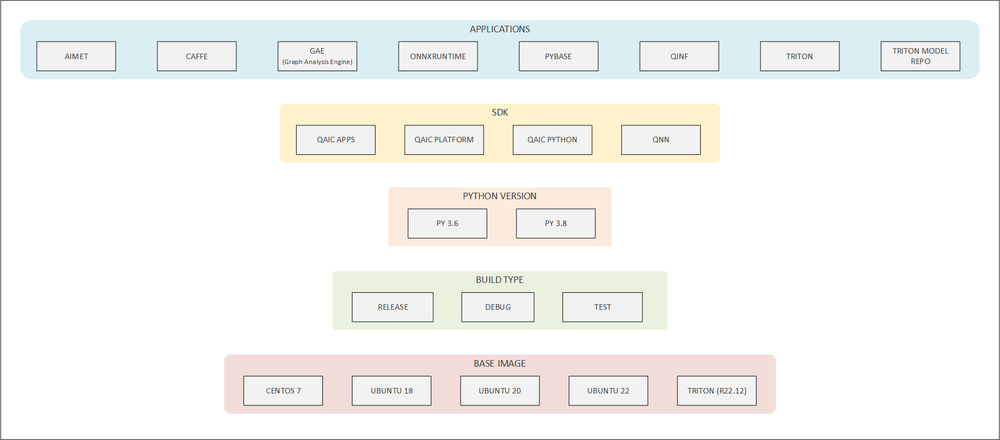

# Docker

Docker allows users to build, test, and deploy applications through software containers. Docker for Cloud AI 100 packages the Platform SDK, Apps SDK (x86-64 only), libraries, system tools, etc., which enables the user to navigate the inference workflow seamlessly. 

The Docker scripts are in the Apps SDK in the `tools/docker-build` folder. The scripts to build a QAic Docker image are composed of the following structure.
```
├── build_image.py
├── config
│   ├── applications
│   ├── base_image
│   ├── build_type
│   ├── python_version
│   └── sdk
├── image_schema.json
├── README.md
├── requirements.txt
└── sample_user_specs
```

## Setup and System Pre-requisistes
- Packages: python3.8, docker v23+ (https://docs.docker.com/engine/install/)
- Download Apps SDK and Platform SDK from Qualcomm site.
    - Docker containers require the Cloud AI device drivers to communicate with the devices. Install the Platform SDK on the host bare metal OS or VM.
    - Unzip Apps SDK and the build scripts are located under `/tools/docker-build/`
```bash
unzip qaic-apps-1.16.1.<>.zip
cd qaic-apps-1.16.1.<>/tools/docker-build/
```
- Install python modules listed in requirements.txt, preferably in a virtual environment
```bash
[user@localhost qaic-docker]$ python3.8 -m venv /venv_directory/qaic_docker_venv
[user@localhost qaic-docker]$ . /venv_directory/qaic_docker_venv/bin/activate
(qaic_docker_venv) [user@localhost qaic-docker]$ pip install -r requirements.txt
```

## Build Image 
QAic docker build script is used to create new docker image with Cloud AI 100 Apps SDK and Cloud AI 100 Platform SDK with the supported OS.

The command to build the docker image is:

```bash
python3 build_image.py [ --user_specification_file (Required) <user-specification-json-file-path> ] \
[ --mirror (Optional) <docker-registry-mirror-location> ] \
[ --apps_sdk (Optional) /qaic/apps/sdk/zip/path ] [ --platform_sdk (Optional) /qaic/platform/sdk/zip/path ] [ --qnn_sdk (Optional) ] \
[ --arch (Optional) <x86_64|aarch64> ] [ --external_dist_files (Optional) <file-path-1 file-path-2 ... file-path-n> ] \
[ --tag (Optional) <tag-for-the-created-image> ] [ --log_level (Optional) <log-level-numeric-value>] [ --no_cache (Optional) ]
```

The resulting docker image is named by the convention: qaic-\<arch>-<base_image>-<build_type>-<python_version>-<sdk_types>-\<applications>:\<tag> 

Description <br>
*user_specification_file*: specifies path to user specification json file <br>
*mirror*: specifies registry mirror location for base images in docker format (eg. host.domain/dir/) <br>
*arch*: Pick from x86_64, aarch64. Default is host arch. <br>
*tag*: specifies tag for the created image <br>
*apps_sdk*: specifies path to the zip file of apps sdk. Overrides if corresponding path is already mentioned in user_specification_file. <br>
*platform_sdk*: specifies path to the zip file of platform sdk. Overrides if corresponding path is already mentioned in user_specification_file. <br>
*qnn_sdk*: specifies path to the zip file of qnn sdk. Overrides if corresponding path is already mentioned in user_specification_file. <br>
*external_dist_files*: specify external files required in docker image build. Overrides any external_dist_files already mentioned in user_specification_file. <br>
*log_level*: specifies numeric value corresponding to log level (debug:1, info:2, warning:3, error:4, critical:5) <br>
*no_cache*: Do not use docker's internal layer cache (used for debug) <br>

For Example:
```bash
python3 build_image.py --user_specification_file ./sample_user_specs/user_image_spec_qaic.json --apps_sdk ~/qaic-apps-1.16.1.<>.zip \
--platform_sdk ~/qaic-platform-sdk-1.16.1.<>.zip --tag 1.16.1.<>
```

To check the docker image created with above script: <br>
```bash
$ docker images
REPOSITORY                                                            TAG            IMAGE ID       CREATED        SIZE
qaic-x86_64-ubuntu20-release-py38-qaic_platform-qaic_apps             1.16.1.<>      f784c37d7f18   2 hours ago    4.25GB
qaic-x86_64-ubuntu20-release-py38-qaic_platform				          1.16.1.<>      a4f8193202db   2 hours ago    3.64GB
qaic-x86_64-ubuntu20-release-py38                                     1.16.1.<>      78000059a5aa   2 hours ago    3.12GB
qaic-x86_64-ubuntu20-release                                          1.16.1.<>      cbdd424f4338   2 hours ago    3.1GB
qaic-x86_64-ubuntu20                                                  1.16.1.<>      a38215c10e0b   2 hours ago    3.1GB
```

### Supported Operating Systems
Docker container for Cloud AI 100 supports different operating system distributions. Below is the list of supported operating systems.

#### Operating Systems

| **Operating systems**          | **Comment**                         |
| ------------------------------ | ----------------------------------- |
| Alma Linux 8                   | Compatible with RHEL 8              |
| Alma Linux 9                   | Compatible with RHEL 9              |
| Amazon Linux 2                 |                                     |
| Amazon Linux 2023              |                                     |
| CentOS Linux 7                 | Compatible with RHEL 7              |
| Red Hat Universal Base Image 8 |                                     | 
| Red Hat Universal Base Image 9 |                                     | 
| Ubuntu 18                      |                                     |
| Ubuntu 20                      |                                     |
| Ubuntu 22                      |                                     |
| Ubuntu 24                      |                                     |

## Features
- Incremental docker image build infrastructure optimizes disk usage and rebuilding time
- Flexibility to override specification options such as sdk paths, external dist files through cmd line options
- User provided image specification is resolved for dependencies and dumped as autocompleted_user_specification.json
- Supports multi-platform builds

#### Incremental build layers
The configurations are grouped as shown below to minimize the need for rebuild and to allow sharing layers.
This enables reduction of disk usage and allows faster rebuild.

 

#### Image specification
User provides a specification json that defines the items to build in each group and list external file dependecies
The build script auto-completes the configuration by resolving the dependencies for specified nodes.
Sample user specification files are present in sample_user_specs directory within Apps SDK directory - tools/docker-build/

Supported keys in json: 
	'build_type', 'applications', 'sdk', 'python_version', 'base_image', 'external_dist_files'

Applications - Optional, accepts a list of values.
SDK - Optional, accepts a dictionary of values (sdk type: file-path/boolean).
Python Version - Optional, accepts a single value.
Build Type - Required, accepts a single value.
Base Image - Required, accepts a single value.
External dist files - Optional, allows specifying external files required in docker image build. Accepts a list of values.

Example - 
``` json
{
    "applications": ["gae", "pytools", "aimet", "qinf", "pybase"],
    "sdk": {
        "qaic_apps": "/path/to/qaic-apps-1.16.1.<>.zip",
        "qaic_platform": "/path/to/qaic-platform-sdk-1.16.1.<>.zip"
    },
    "python_version": "py38",
    "base_image": "ubuntu20",
    "external_dist_files": ["/path/to/aimetpro-1.26.0-RC7.torch-gpu-release.tar.gz"]
}
```

Minimal user specification to build the same image
``` json
{
    "applications": ["gae", "aimet", "qinf"],
    "sdk": {
        "qaic_apps": "/path/to/qaic-apps-1.16.1.<>.zip",
        "qaic_platform": "/path/to/qaic-platform-sdk-1.16.1.<>.zip"
    },
    "external_dist_files": ["/path/to/aimetpro-1.26.0-RC7.torch-gpu-release.tar.gz"]
}
```
sdk, external_dist_files can be skipped here and provided through cmd line 

#### Overridable options in specification
SDK, external dist files configuration rely on file paths. These keys can be specified either through specification file or cmd line options.
cmd line specification takes precedence when specified through both.

#### Auto-completion of user provided specification
The docker image may constitute base image + layers from other groups specified in the figure above.
Resolution of dependencies is done top-down for the specified groups. 

Applications - Resolved as union of dependencies in same level. <br>
SDK - Resolved as union of dependencies from higher levels and same level. <br>
Python Version - Resolved as intersection of dependencies from higher levels of which preferred node is chosen. <br>
Build Type - Resolved as intersection of dependencies from higher levels of which preferred node is chosen. <br>
Base Image - Resolved as intersection of dependencies from higher levels of which preferred node is chosen. <br>

#### Multi-platform image build
Use the --arch command line option with the build command to configure building the image for the preferred
architecture (x86_64/aarch64).

## Launch container
#### Command
Below is example for launching an x86_64 ubuntu20 image with python3.8 environment, apps and platform sdk. 

Run the container and map 1 or more qaic devices. (Or any other directory mapping using the -v option)
```bash
# Passing 1 device
docker run -dit --name qaic-ubuntu-test --device=/dev/accel/accel0 qaic-x86_64-ubuntu20-release-py38-qaic_platform-qaic_apps:1.16.1.<>

# Passing 1 device and mapping a local folder
docker run -dit --name qaic-ubuntu-test -v /data/test:/data/test --device=/dev/accel/accel0 qaic-x86_64-ubuntu20-release-py38-qaic_platform-qaic_apps:1.16.1.<>
```

#### Architecture selection
When passing --arch option where the host architecture is not the same as the requested architecture, setup the host for docker multiarch using qemu.

Ubuntu Host
```bash
[user@localhost qaic-docker]$ sudo apt install qemu binfmt-support qemu-user-static
[user@localhost qaic-docker]$ docker run --rm --privileged multiarch/qemu-user-static --reset -p yes
# Check the setup
[user@localhost qaic-docker]$ docker run --rm -t --platform=linux/arm64 <image name> uname -m
```
The command above should give the architecture as aarch64

CentOS Host
```bash
[user@localhost qaic-docker]$ sudo yum install qemu qemu-kvm
[user@localhost qaic-docker]$ docker run --rm --privileged multiarch/qemu-user-static --reset -p yes
# Check the setup
[user@localhost qaic-docker]$ docker run --rm -t --platform=linux/arm64 <image name> uname -m
```
The command above should give the architecture as aarch64

## Run tests in container
- Connect to the container and run tests:
	- Run "docker ps" to get the container SHA
	- Run docker exec -it <SHA\> /bin/bash
	- Run "/opt/qti-aic/tools/qaic_util -q" and ensure that you can see your devices.
	- Run an inference with recorded data. Eg: "/opt/qti-aic/exec/qaic-runner -d 0 -t /opt/qti-aic/test-data/aic100/v2/1nsp/1nsp-quant-resnet50/"

- Activate the python enviornment and test Python HL API (valid if *qaic_python: "True"* specified in sdk group of user_specification_file while building docker image):
```bash
source /opt/qti-aic/dev/python/py_env/bin/activate
cd /opt/qti-aic/examples/apps/qaic-python-sdk/examples/resnet_example/
python resnet_example.py
```
