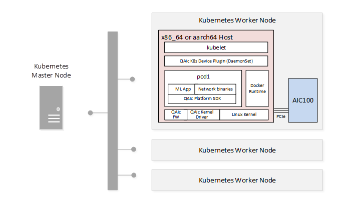

# Kubernetes
Machine learning applications built for the Cloud AI 100 accelerator can be containerized with Docker and deployed with Kubernetes. The following figure shows a sample Kubernetes deployment.

<figure markdown="span">
  
  <figcaption>Kubernetes Cluster</figcaption>
</figure>

## K8s device plugin 

The Cloud AI 100 k8s device plugin can be found at *qaic-apps-1.x.y.z/tools/k8s-device-plugin* in the Cloud AI 100 Apps SDK. The *qaic-k8s-device-plugin* is composed of the following tree structure. 

```
├── Apache_License
├── build_image.sh
├── deploy-qaic-single.yaml
├── docker
│   ├── aarch64
│   │   └── Dockerfile.ubuntu
│   └── x86_64
│       └── Dockerfile.ubuntu
├── examples
│   └── pod-example.yml
├── go.mod
├── Gopkg.toml
├── go.sum
├── main.go
├── multi_soc_checks.go
├── multi_soc_checks_test.go
├── Notice.txt
├── qaic-device-plugin.yml
├── qaic.go
├── README.md
├── server.go
├── server_test.go
├── topology.go
├── topology_test.go
└── watcher.go

```

Contents of the qaic-k8s-device-plugin package:

- QAic K8s Device Plugin
    - Sends the kubelet the list of AI 100 devices it manages.
    - Monitors AI 100 device health.
    - Handles AI 100 device allocation and cleanup.
- Qaic K8s Device Plugin Docker image build script
- Deployment scripts (YAML)
    - Device Plugin Deployment Script (deploys Qaic K8s Device Plugin as daemonset)
    - Sample AI 100 Workload Deployment Script
    
Prerequisites for deployment:

- Platform SDK installed on Kubernetes Worker Node
    - Required for QAic Linux kernel drivers and firmware images.
- QAic K8s Device Plugin Docker Image available through customer docker-hub or preloaded on Kubernetes Worker Node
- AI 100 Workload Docker Image available through customer docker-hub or preloaded on Kubernetes Worker Node
