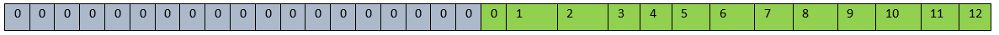

# Large Language Models (LLMs)

Large Language Models (LLMs) represent a significant advancement in artificial intelligence, particularly in the domain of natural language processing (NLP). These models, often based on transformer architectures, have revolutionized the way machines understand and generate human-like text.

LLMs understand context, syntactic structures, and semantic nuances within textual data.

The transformer architecture, introduced in the paper "Attention is All You Need" has become the foundation for many state-of-the-art language models. This paper discusses Encoder-Decoder architecture. However, many language models use Encoder only or Decoder only architectures as well.

In the following section, we will discuss the end-to-end workflow (from onboarding to execution of models) of **decoder architecture models**.

## Decoder-only Models

This architecture is particularly suitable for autoregressive tasks where sequence generation involves processing one token at a time, and contextual information from earlier tokens is crucial for predicting the next token. The inclusion of a kV cache enhances the efficiency of the decoding process, making it more computationally efficient.

Typically, the inputs to LLMs are:

- **input_ids** - These are sequences of numerical IDs that correspond to the tokens in the input text. Each token (word or subword) is mapped to unique numerical identifier based on the model's vocabulary.

- **Attention Masks** - For tasks like text generation or autoregressive language modeling, an attention mask is used to specify which positions in the input sequence should be attended to and which should be ignored. It helps the model focus on relevant information.

-   **Positional Encodings** - To provide information about the order or position of tokens in a sequence, positional encodings are added to the input embeddings. This is crucial for transformers since they don't inherently understand the order of the tokens.

-   **Additional Inputs (task-specific)** - Depending on the specific task, additional inputs may be required. For example:
    -  Language Translation - Paired sequences may be provided.
    -  Text Summarization - The input may be accompanied by special tokens indicating the summary target.

Commonly used blocks in a Decoder-only model are described below.

- **Embedding Layer** - The input sequence is initially transformed into numerical embeddings using an embedding layer. Each token in the input sequence is represented as a vector.
- **Positional Encoding** - To provide positional information to the model, positional encoding is added to the input embeddings.
- **Decoder Layer** - Key building blocks of a Decoder Layer are:
     -  Masked Self-Attention - The decoder processes the input sequence autoregressively, attending only to previous positions using masked self-attention. This ensures that each position attends only to positions before it.
     -  Feedforward Neural Network - Each decoder block contains a feedforward neural network to capture complex patterns and
        relationships in the data.
     -  Normalization and Residual Connections - Layer normalization and residual connections are applied to each sub-layer for training
        stability.
- **Stacked Decoder Layers** - Multiple decoder blocks are stacked to create a deep architecture. The depth contributes to the model's ability to capture dependencies and generate coherent sequences.
- **kV Cache Management** - Each of the Decoder layer generates keys ('k') and values ('V'). A cache mechanism is introduced to store and reuse previously computed 'k' and 'v'. This cache optimizes the efficiency of self-attention during autoregressive generation. The cache is updated at each decoding step, allowing the model to reuse information from earlier positions in the sequence.
- **Output Layer** - The final layer generates a probability distribution over the vocabulary for the next token in the sequence during training. During generation, the model predicts one token at a time and updates the KV cache.


## LLM execution on Cloud AI 100 Accelerators

To align with the autoregressive nature of the transformer based LLMs, processing is divided into two stages - Prefill and Decode. 

### Prefill Stage

The prefill stage is a one-time process that prepares the model's context for autoregressive generation. It involves encoding the input prompt/sequence and establishing the initial state of the model. During this stage, the input prompt up to the sequence length is processed and the KV Cache is stored in the on-board DDR of Cloud AI 100.

### Decode Stage 

The decoding stage is where the model generates the output sequence token by token. It operates in an autoregressive manner, where each token is predicted based on the context of the preceding tokens. As each token is generated, it is appended to the existing context, dynamically updating the input for subsequent predictions. This allows the model to consider its own generated output as part of the context.

The decoding stage is an iterative process that continues until a stopping criterion is met, such as reaching a maximum length or generating an end-of-sequence token. The following figure illustrates the prefill and decode stages.


### Network Specialization Overview

The ONNX model used in both Prefill stage and Decode stage is the same except for model input shapes. The model used in Prefill stage is compiled for a pre-defined prompt/sequence length while the model used in decode stage is always compiled for input length of one token, as only the last generated token is provided as input to the model.

Since the models used in Prefill stage and Decode stage are essentially the same, both the models can share the same weights during execution. Hence a feature called "Network Specialization" is used to pack both the ONNX files into a single QPC file while sharing the same weights. This minimizes the time required for switching between models and the memory requirements. The following figure illustrates network specialization.


## Steps to run the Model 

1.  Modify the model to make use of performance optimization features offered by Cloud AI 100.
2.  Generate the ONNX version of the modified model.
3.  Compile the modified model for Cloud AI 100 using the AIC SDK.
4.  Run inference on Cloud AI 100.

### Modify the Model - Overview

Cloud AI 100 offers various features to optimize LLM processing. Developers are required to modify the model accordingly for the best performance. The key features which would benefit from model changes are as follows:

- **Static Input Shapes** - Cloud AI 100 supports only static input shapes to make use of various efficiencies this approach offers. The open source LLM models generally support dynamic input shapes. So, these models need to be modified to support static input shapes.
- **KV Cache storage on on-board DDR** - Cloud AI 100 supports storing the KV Cache generated by the model on the on-board DDR memory. This avoids unnecessary KV cache movements between CPU and Cloud AI 100
- **Automatic Attention_mask generation** - The model can be modified to generate the attention_mask on Cloud AI 100 and store it in the on-board DDR of Cloud AI 100, thus removing the need to move attention_masks between CPU and Cloud AI 100 every iteration.

### Modify the Model - Detailed 
The [Cloud-AI-SDK GitHub repo](https://github.com/quic/cloud-ai-sdk/tree/1.12/models/language_processing/decoder) provides the modifications required and end-to-end recipes for several decoder based LLMs. 

#### Definitions

- **maximum_context_length** - This the maximum number of tokens supported by the model.
- **prompt_length** 
    - Prefill stage: This parameter represents the maximum length of the initial input or instruction that can be given to the model. This length must be fixed to support the static input shapes expected by Cloud AI 100. This is also referred to as **sequence length**
    - Decode stage: In this stage the prompt length is always one. This is because only the last generated token is provided as input for generating the next token. 
    **Generation length** = Maximum number of tokens generated = (maximum_context_length) - (prompt_length of Prefill stage). 
- no_of_heads: number of Attention heads in the Transformer model.
- hidden_size: Size of the hidden state of the Transformer model.
- vocabulary_size: Vocabulary size of the Transformer model.

#### Required Model Interface 
To use the features mentioned above, the interface of the model should be modified as follows:

**Model Inputs**

- input_ids (batch_size, prompt_length, int)
- position_ids (batch_size, prompt_length, int)
- attention_mask (batch_size, maximum_context_length, bool)
- past_key_values (batch_size, no_of_heads, maximum_context_length, hidden_size, float)
- cache_index (0, int)

**Model Outputs**

- logits (batch_size, 1, vocabulary_size, float)
- attention_mask_RetainedState (batch_size, maximum_context_length, bool)
- past_key_values_RetainedState (batch_size, no_of_heads, maximum_context_length, hidden_size, float)

#### Model Changes for Inputs

##### Input_Ids

- **Prefill stage** - The prompt needs to be of fixed shape. So, the input_ids to the model should be generated with padding. It is required to use left padded tokens during prefill stage.

    For example, if the model is compiled with a prompt length of 32 and is required to process the prompt "Qualcomm is a San Diego based Technology company." The tokenization may look like:

    
 

    So, left padding the input_ids shall look like the following:

    

 - **Decode stage** - The input to the model will be only one token which is the last generated token. So, the prompt_length is always 1.

##### past_key_values

Cloud AI 100 supports storing the KV Cache on the on-board DDR of Cloud AI 100. If a zero-size past_key_values input is passed to the model, the KV cache
will be picked from the on-board DDR of Cloud AI 100. This avoids data transfers of KV cache between CPU and Cloud AI 100.

Each layer of decoder in the network will have its own KV data. So, if a model has `n` layers of decoders, `n` pairs of key and value inputs will be created.

It is recommended to use a separate tensor for KV data of each layer to attain a better performance. So, the past_key_value input of the model shall look like this, (**past_value.1**, **past_key.1**),(**past_value.2**, **past_key.2**) ... (**past_value.n,past_key.n**)

##### cache_index

As the input sizes are fixed, the memory required for KV Cache of entire "maximum_context_length" is allocated during initialization. After each iteration, KV cache needs to be stored at the correct index, similar to a scatter operation. This is done with the help of "Cache_index" input.

Let's understand this with an example. Assuming the "prompt_length" is 32 and "maximum_context_length" is 256. This would create a memory pool with 256 memory slots sufficient to save 256 past key values during initialization.

- **Prefill stage** - Since the data is yet to be processed, the cache_index in prefill stage can be set to "0". After the prefill stage, the first 32 slots (size of prompt_length in example) of 256 slots (Size of maximum_context_length in example) are filled with the KV data of "input prompt".

- **Decode stage** - The KV data of only the newly generated token is stored in this stage. In the first iteration of Decode stage the cache_index will be 33 in the example. cache_index needs to be specifically passed as input only in the first iteration of Decoder stage. The cache_index is then incremented automatically by the compiler in case of zero size input. However, the flexibility to store the data at any valid index is given to the developer. Following is an example of GPT model where the code of the model is modified to copy the KV cache of the newly generated token at correct index:

    ``` 
    Transformers/src/transformers/models/gpt2/modeling_gpt2.py

    class GPT2Attention (nn.Module):
         if layer_past is not None:
             past_key = layer_past[0]
             past_value = layer_past[1]
    -        key = torch.cat((past_key, key), dim=-2)
    -        value = torch.cat((past_value, value), dim=-2)
    +        seq_length = key.shape[2]
    +        assert value.shape[2] == seq_length
    +        kv_indices = torch.arange(seq_length) + cache_index
    +        past_key[:, :, kv_indices] = key
    +        past_value[:, :, kv_indices] = value
    +        key = past_key
    +        value = past_value
    ```

The original code would "torch.cat" the key and value tensors to the existing tensor creating dynamic shaped tensors. So, this part of the code must be modified.

Key.shape[2] gives us the number of tokens processed in the current iteration. So for Prefill stage, Key.shape[2] would be maximum input prompt length, while in case of Decode stage, it would be 1. So the code change suggested above would store the newly generated key and values at the cache_index specified.

##### attention_mask

- **Prefill stage** - The Attention mask needs to be passed as usual.
- **Decode stage** - The Attention mask can be generated in the model based on cache_index and saved on the on-board DDR. This avoids the need to transfer attention_mask from host to Cloud AI 100 during every iteration. This reduces the memory bandwidth requirements. In order to use the  attention_mask stored on the on-board DDR, a zero-size input is fed to the model.

    Following is the code changes needed to generate attention_mask on Cloud AI 100 for decode stage:
    ``` 
    Transformers/src/transformers/models/gpt2/modeling_gpt2.py

    class GPT2Model(GPT2PreTrainedModel):
    +        if cache_index is not None:
    +            attention_mask[:, cache_index + seq_length - 1] = True
    +            attention_mask_retained = attention_mask
    ```

##### Position_ids

- **Prefill stage** - If the position IDs of the sentence "Qualcomm is a San Diego based Technology company." looks like this:

    
 
    If prompt_length is 32, the position IDs should be left padded. So, input `position_ids` tensor would look like the following:

    
  
    In the above tensor, the first 19 elements can be any number, as they would be discarded with the help of attention_mask.

- **Decode stage** - In case of the above example, the `position_ids` of first iteration would be 13, second iteration would be 14 and so on.

#### Model Changes for Outputs

The outputs that needs to be saved on device should end with suffix "_RetainedState". For example, in order to retrieve the "attention_mask" from on-board DDR, the output should have "_RetainedState" appended. So output will be "attention_mask_RetainedState"

- **Logits** Logits is the raw output of the model.
- **attention_mask_RetainedState** - The attention_mask generated will be stored on the on-board DDR
- **past_key_values_RetainedState** - The KV Cache generated by the model will be saved on the on-board DDR at the appropriate index using the "cache_index" input.

### Compile the Model

Following is a sample compile script using `qaic-exec`. Compilation uses the [Network Specialization](#network-specialization) and [Custom I/O](#custom-io) features. 
Two data precision formats - FP16 or MX6 (Shared Micro-exponents), are recommended. [MX6](https://arxiv.org/abs/2302.08007) enables smaller memory footprint by storing the model weights in MX6 (uses 6 bits vs 16 bits for FP16). MX6 will help developers run models on Cloud AI 100 SKUs in scenarios where FP16 exceeds the memory footprint and hence, cannot be used.  

    ``` 
    #!/bin/bash
    set -e
    if [ -z "$1" ]; then
      echo "Usage: $0 <model_name>"
      exit 1
    fi
    model_name="$1"
    prompt_len=$(grep seq_len specializations.json | head -n1 | grep -Eo '[[:digit:]]+')
    ctx_len=$(grep ctx_len specializations.json | head -n1 | grep -Eo '[[:digit:]]+')
    num_cores=16
    num_blocks=$(grep 'value.' ${model_name}/custom_io.yaml | tail -n1 | grep -Eo '[[:digit:]]+')
    # Create qpc directory
    mkdir -p qpc
    model_path="${model_name}/generatedModels/${model_name}_simplified.onnx"
    if [ ! -f "$model_path" ]; then
      model_path="${model_name}/generatedModels/${model_name}.onnx"
    fi
    
    # Compile the model
    /opt/qti-aic/exec/qaic-exec \
    -m=$model_path \
      -aic-hw \
      -aic-hw-version=2.0 \
      -network-specialization-config=specializations.json \
      -convert-to-fp16 \
      -retained-state=true \
      -aic-num-cores=${num_cores} \
      -custom-IO-list-file=${model_name}/custom_io.yaml \
      -compile-only \
      -aic-binary-dir=qpc/${model_name}-kv-${prompt_len}pl-${ctx_len}cl-${num_cores}c
    ```

#### Network Specialization 

Using the "Network Specialization" feature, the models used for Prefill and Decode stages can be packed into a single QPC and both models will be sharing the same weights. The input shapes for prefill and decode stages are defined in a .json file for enabling "Network Specialization" feature. Following is an example JSON file:

    ``` 
     "specializations": [
             {
                     "batch_size": "1",
                     "seq_len": "32",
                     "ctx_len": "128"
             },
             {
                     "batch_size": "1",
                     "seq_len": "1",
                     "ctx_len": "128"
             }
     ]
    }
    ```

#### Custom I/O

Custom I/O feature can be used to store the KV Cache in a precision needed by the model. For example, if the model is compiled for FP16 precision, The past_key_values can also be stored on on-board DDR in FP16 format. This would reduce the size of the KV cache and avoid unnecessary cast operations of the FP16 data to FP32.

The precision for each I/O can be configured in a .yaml file and passed as an input during compile time. An example of the custom_io.yaml file is shown below.

    ``` 
    # Model Inputs
     - IOName: past_key.0
       Precision: float16
     - IOName: past_value.0
       Precision: float16
     - IOName: past_key.1
       Precision: float16
     - IOName: past_value.1
       Precision: float16
    .
    .
    .
    .
     - IOName: past_key.26
       Precision: float16
     - IOName: past_value.26
       Precision: float16
     - IOName: past_key.27
       Precision: float16
     - IOName: past_value.27
       Precision: float16
    
    
    # Model Outputs
     - IOName: past_key.0_RetainedState
       Precision: float16
     - IOName: past_value.0_RetainedState
       Precision: float16
     - IOName: past_key.1_RetainedState
       Precision: float16
     - IOName: past_value.1_RetainedState
       Precision: float16
       .
       .
       .
     - IOName: past_key.26_RetainedState
       Precision: float16
     - IOName: past_value.26_RetainedState
       Precision: float16
     - IOName: past_key.27_RetainedState
       Precision: float16
     - IOName: past_value.27_RetainedState
       Precision: float16
    ```


### Inference

During inference, the prefill model is executed first and the KV cache is stored at appropriate index with left padding. The Decode stage is
then executed generating one token at a time and is stored with right padding. Refer to the [Cloud-AI-SDK GitHub repo](https://github.com/quic/cloud-ai-sdk/tree/1.12/models/language_processing/decoder) for LLM model recipes. 
