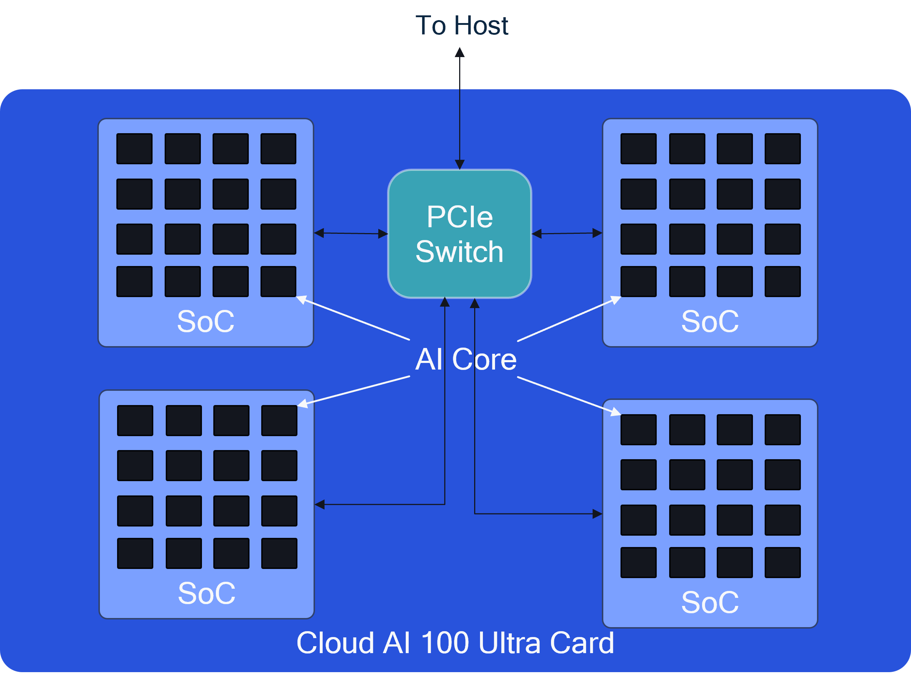

# Model Architecture Support

The Cloud AI 100 family of accelerators supports a comprehensive range of model architectures and use-cases. 

- [Transformer Encoders](https://github.com/quic/cloud-ai-sdk/tree/1.12/models/language_processing/encoder) 
- [Transformer Decoders](https://github.com/quic/cloud-ai-sdk/tree/1.12/models/language_processing/decoder)
- Tranformer Encoder - Decoder (coming soon)
- [Computer vision](https://github.com/quic/cloud-ai-sdk/tree/1.12/models/vision) - CNN, R-CNN, vision transformers  
- [Diffusion](https://github.com/quic/cloud-ai-sdk/tree/1.12/models/multimodal/text_to_image) 

Multiple [AI 100 SoCs](../Architecture/index.md) with dedicated DDR memory, stacked on a accelerator card (SKUs) and/or on the server can be used to run very large models.

## Model Architecture Fit Guidelines 

The architecture of the Cloud AI 100 accelerators is described [here](../Architecture/index.md#architecture). The image below provides a block diagram of the Cloud AI 100 Ultra card. The only change for the Std and Pro SKUs would be that the number of SoCs per card is 1 instead of 4. 

- AI core - This is the smallest compute unit on which a neural network can be executed. 
- SoC - This is the System-on-Chip that contains up to 16 AI cores. 
- Accelerator Card - This is a single width PCIe form-factor card that contains one or more SoCs. 

Cloud AI 100 accelerator architecture is flexible and provides knobs to tune for highest throughput or lowest latency or a balance of both. The table below describes the categories of models that are supported across SKUs. Based on the model size, batch size, input/output sizes and data types used for activations/weights, one or more cards may be required to execute the inference.   

| Model Family                     | Standard | Pro | Ultra | 
| -------------------------------- | -------- | --- | ----- |
| Transformer Encoders             | Yes       | Yes   | Yes     |
| Transformer Decoders             | Yes        | Yes   | Yes    |
| Transformer Encoder-Decoder      | Yes        | Yes   | Yes     |
| Computer Vision (CNN, R-CNN etc) | Yes        | Yes   | Yes     |
| Diffusion                        | Yes        | Yes   | Yes     |

Refer to [model recipes](https://github.com/quic/cloud-ai-sdk) in the `cloud-ai-sdk` repo for details on the number of cores used for all categories of models for highest throughput vs lowest latency. 

Models (2B parameters and below) are performant in a single SoC. 

For LLMs (7B parameters and above), the least latency is achieved in most cases through model sharding where the model is tensor-sliced and run across multiple SoCs (or cards). Refer to [Model sharding feature](../Features/model_sharding.md) for more information. 

Refer to [performance tuning overview](../Inference-Workflow/model-compilation/Tune-performance.md) for some more details on the knobs used to tune performance.   

