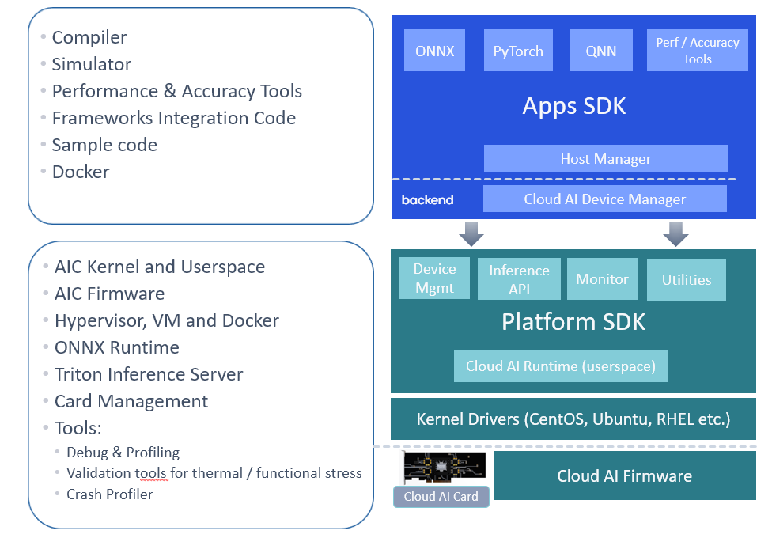

# User Guide

Cloud AI SDKs enable developers to optimize trained deep learning models for high-performance inference. The SDKs provide workflows to optimize the models for best performance,  provides runtime for execution and supports integration with ONNX Runtime and Triton Inference Server for deployment.

Cloud AI SDKs support

- High performance Generative AI, Natural Language Processing, and Computer Vision models
- Optimizing performance of the models per application requirements (throughput, accuracy and latency) through various quantization techniques
- Development of inference applications through support for multiple OS and Docker containers.  
- Deployment of inference applications at scale with support for [Triton](https://github.com/triton-inference-server/server) inference server

## Cloud AI SDKs
The Cloud AI SDK consists of the Application (Apps) SDK and Platform SDK.

The Application (Apps) SDK is used to convert models and prepare runtime binaries for Cloud AI platforms.  It contains model development tools, a sophisticated parallelizing graph compiler, performance and integration tools, and code samples. Apps SDK is supported on x86-64 Linux-based systems.

The Platform SDK provides driver support for Cloud AI accelerators, APIs and tools for executing and debugging model binaries, and tools for card health, monitoring and telemetry. Platform SDK consists of a kernel driver, userspace runtime with APIs and language bindings, and card firmware. Platform SDK is supported on x86-64 and ARM64 hosts.  

 

## Installation
The [installation guide](Installation/index.md) covers

- Platforms, operating systems and hypervisors supported and corresponding pre-requisites
- Cloud AI SDK (Platform and Apps SDK) installation
- Docker support

## Inference Workflow
[Inference workflow](Inference-Workflow/index.md) details the Cloud AI SDK workflow and tool support - from onboarding a pre-trained model to deployment on Cloud AI platforms. 

## Release Notes
[Cloud AI release notes](https://docs.qualcomm.com/bundle/80-PT790-1/resource/80-PT790-1.pdf) provide developers with new features, limitations and modifications in the Platform and Apps SDKs.   

## SDK Tools 
[SDK Tools](https://docs.qualcomm.com/bundle/publicresource/topics/80-PT790-993B) provides details on usage of the tools in the SDKs used in the Inference workflow as well as card management. 

## Tutorials
[Tutorials](https://github.com/quic/cloud-ai-sdk/tree/1.10/tutorials), in the form of Jupyter Notebooks walk the developer through the Cloud AI inference workflow as well as the tools used in the process. Tutorials are divided into CV and NLP to provide a better developer experience even though the inference workflows are quite similar. 

## Model Recipes
[Model recipes](https://github.com/quic/cloud-ai-sdk/tree/1.10/models) provide the developer the most performant and efficient way to run some of the popular models across categories. The recipe starts with the public model. The model is then exported to ONNX, some patches are applied if required, compiled and executed for best performance. Developers can use the recipe to integrate the compiled binary into their inference application.   

## Sample Code
[Sample code](https://github.com/quic/cloud-ai-sdk/tree/1.10/samples) helps developers get familiar with the usage of Python and C++ APIs for inferencing on Cloud AI platforms. 

## System Management 
[System Management](System-Management/system-management.md) details management for Cloud AI Platforms. 

## Architecture 
[Architecture](Architecture/index.md) provides insights into the architecture of Cloud AI SoC and AI compute cores. 

