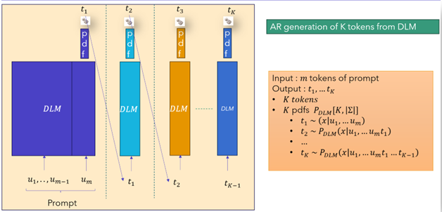
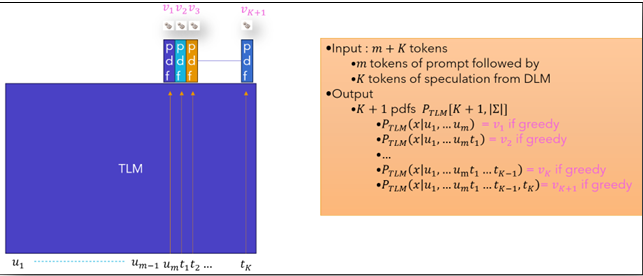
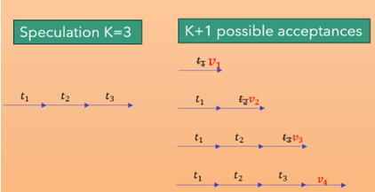
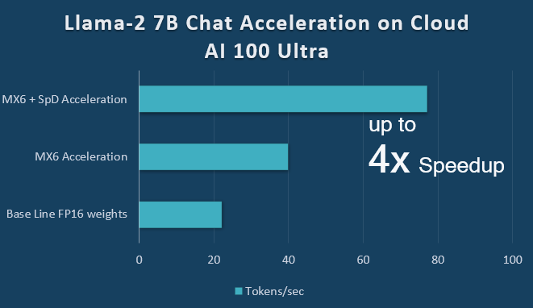
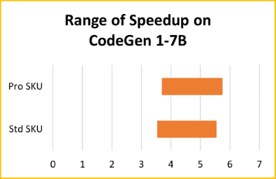
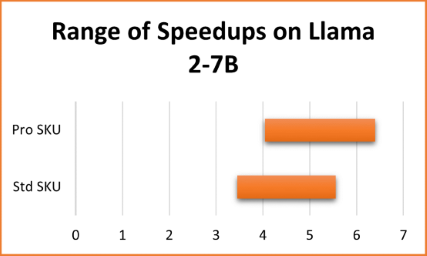

# Quadruple LLM Decoding Performance with Speculative Decoding (SpD) and Microscaling (MX) Formats  

Posted by Natarajan "Raj" Vaidhyanathan    
Co-written with Apoorva Gokhale

  
*Figure 1: Generation on Qualcomm Cloud AI 100 Ultra  
(left) Baseline with FP16 weights (center) Acceleration with MX6 (right) Acceleration with MX6 and SpD*  
*Note: Highlighted text in the right column indicate speculated tokens accepted.*

[Speculative Sampling](https://arxiv.org/abs/2302.01318) (SpS), also known as Speculative Decoding (SpD), 
and weight compression through 
[MXFP6 microscaling format](https://www.opencompute.org/documents/ocp-microscaling-formats-mx-v1-0-spec-final-pdf),
are two advanced techniques that significantly enhance large language
model (LLM) decoding speeds for LLM inference AI workloads. Both
techniques are available for LLM acceleration on Qualcomm Technologies' data center
AI accelerators. To achieve a significant inference performance speedup,
start exploring Qualcomm Cloud AI 100 instances available on [Amazon
AWS](https://aws.amazon.com/ec2/instance-types/dl2q/) EC2 and
[Cirrascale Cloud
Services](https://cirrascale.com/solutions-qualcomm-cloud-ai100.php).

This post explores the application of these advanced techniques on two
large language models, [CodeGen 1-7B](https://arxiv.org/abs/2203.13474)
and [Llama
2-7B-Chat-FT](https://ai.meta.com/research/publications/llama-2-open-foundation-and-fine-tuned-chat-models/),
showcasing the potential for accelerated AI processing and efficiency.
Join us as we unravel the details of this advancement and be sure to try
out the [speculative decoding](https://github.com/quic/cloud-ai-sdk/tree/1.12/models/language_processing/decoder/CodeGen-With-Speculative-Decoding) feature documentation in 
Qualcomm [Cloud AI Github](https://github.com/quic/cloud-ai-sdk/).

## Language Models (LMs) and Autoregressive Generation

This section introduces the basics of LLM decoding based on traditional autoregressive 
decoding and points out its inherent sequential nature of multi-token generation.
Text completion is the common task for LMs: Given a prompt of text, the
LMs generate plausible completions.
LMs process text in the granularity of atomic units of text called
*tokens*. Informally, tokens can be thought of as sub words in a word.
The set of tokens that a LM can process is referred to as its
*vocabulary* and denoted as $\Sigma$.
Language Models take a sequence of tokens as input and produce a
probability distribution function (pdf) over its vocabulary. Sampling
from this pdf gives one plausible token following the input. During
implementation, a pdf over $\Sigma$ is represented as a vector of length
$|\Sigma|$ with elements in $\lbrack 0,1\rbrack$ that sum up to one.

### Autoregressive (AR) Generation

Typically, we want to generate multiple following tokens, not just one.
Given a prompt of $m$ tokens $u_{1},\ldots,\ u_{m}$ generation of $n$
tokens $v_{1},\ldots,\ v_{n}$ requires $n$ invocations of the LM
(implemented as a decoder-only transformer model) as shown below:

    input = u1,...,um   # the prompt  
    
    for (i = 1; i <= n; i++):  
    
        // Invoke the LM with the current input  

        logits  = LM(input)   # logits is a vector of length |Sigma|

        P = top-k/top-p/softmax warp(logits)    # P is a pdf over vocabulary  

        v[i] = sample a token from the vocabulary pdf P  

        input = input & v[i]    # Append the generated token to the input  

    Output v[1],...,v[n] as a completion

*Figure 2: Outline of Autoregressive (AR) Generation*

Observe the following about the above completion generation process in Figure 2:

1. *Logits and Warping*: The LM produces a vocabulary-sized vector of
quantities called *logits*. Normalizing it via softmax gives a pdf
over $\Sigma$. Sampling from this pdf is generally referred to as
*multinomial sampling*.

    - Such a pdf can also be warped to redistribute the probability mass over a small subset of $\Sigma$.

    - A commonly used special form of multinomial sampling is *greedy* 
    sampling. This arises from top-1 warping. It will put all the 
    probability mass on the token with the highest logit value and 0 
    on others. Sampling from such a distribution will always result 
    in the token with the highest probability/logit value.

2. *Multiple Invocations*: LM is invoked $n\ $times each time -- once 
for each generated token. Each invocation makes use of all the
parameters of the model.

3. *Autoregressive*: The output of the LM is concatenated with the
input to the *same* LM in the following iteration.

4. *Causality:* It is not possible to generate $v_{i}$ without
    generating all the previous tokens making the generation as a serial
    process - the generation of $v_{i}$ and $v_{j}\ (i \neq j)$
    cannot be parallelized.

5. *Repeated calculation*: The LM invocations are independent, and
    there is no internal state maintained within the LM across
    invocations. This results in the same input being processed multiple
    times, generating the same set of Key-Value vectors. For example,
    the prompt itself is processed $n$ times and the generated token
    $v_{i}$ is processed $n - i$ times.

### Accelerating Autoregressive Generation by reducing the computation with KV Cache (KV\$) 

The common approach to avoid re-computation is to maintain internal
state in the LM referred to as Key-Value Cache (KV\$) between
invocations. Such a model, LM_with_KV\$, functions the same as the LM
described above with the following operational differences:

-   when invoked for the first time on the prompt
    $u_{1},\ldots,u_{m}$, it will create KV\$ and write the Key-Value vectors of $m$ prompt tokens to it.

-   when invoked for subsequent token generations:

    -   It takes as input only the single token generated in the
        previous iteration instead of the growing input of tokens.

    -   It calculates the Key-Query-Value vectors of the single input
        token and appends the Key-Values to the KV\$.

    -   It processes only the single token through all layers of the LM but
        calculates the causal attention of the single token with all the
        Key-Value vectors in KV\$.

The text completion with LM_with_KV\$() can be rewritten as follows:

    input = u1,...,um    #initialize with the prompt

    for (i = 1; i <= n; i++):

        logits = LM_with_KV$(input)    # Append to KV\$

        P = top-k/top-p/softmax warp(logits)    # P is a pdf over vocabulary

        v[i] = Sample a token from the vocabulary using the pdf P

        input = v[i]    # Single token that was just generated

    Output v[i],...,v[n] as a completion.

It is worth emphasizing that LM_with_KV\$() with appropriate KV\$
contents and LM() are the same function - both calculate the same
conditional probability distribution over the vocabulary that can be
used to predict the next token following $v_{i}.$

$LM\left( u_{1}..u_{m}, v_{1}\ldots v_{i} \right)\  \equiv LM\_ with\_ KV\$\ (v_{i}) \equiv P$(
. |$u_{1},\ u_{2},\ldots,\ u_{m},\ v_{1},\ldots v_{i})$

### Performance Profiles of LM Completion Generation

The execution phase of LM_with_KV\$() that takes a prompt as input and
generates the first token is called the *Prefill Phase.* The execution
phase that generates the subsequent tokens autoregressively, one token
at a time, is called the *Decode Phase*.

These phases have quite different performance profiles. The Prefill
Phase requires just one invocation of the LM, requiring the fetch of all
the parameters of the model once from the DRAM, and reuses it $m$ times
to process all the $m$ tokens in the prompt. With sufficiently large
value of $m$, the Prefill Phase is more compute constrained than
memory-bandwidth constrained.

On the other hand, the Decode Phase is more DRAM-bandwidth constrained
than computation constrained, because all the parameters of the model
need to be fetched to process just one input token. Further, utilization
of computational resources in the accelerator is quite low, as only one
token is processed at a time. In other words, the decode phase can
afford to do additional computation without impacting the latency.

To a first order approximation, the number of tokens that an LM can
generate during the decode phase can be calculated as
DRAM-Read-Bandwidth (bytes/sec) divided by the capacity of the model in
bytes.

## Speculative Decoding

It appears that the AR decoding cannot be parallelized because of its
causality-induced serial nature: The token $v_{i + 1}$ can only be
generated after the token $v_{i}$ has been generated. Let's observe how
SpD overcomes this hurdle.

SpD leverages the insight that it's faster to check whether a sequence
of $K ( > 1)$ tokens is a plausible continuation for a prompt rather than
generating such a K-token continuation - as the former just requires
one invocation of the LM. In SpD, the plausible completion is generated by another LM called
Draft Language Model (DLM) with lower capacity. In this context,
the original LM by contrast is referred to as Target LM (TLM).

To check whether $v_{1},\ldots,v_{K}$ is a plausible completion of
$u_{1}\ldots u_{m}$, we need to check the following $K$ conditions:  

 

- $v_{1},\ldots ,v_{i}$ is a plausible completion of $u_{1},\ldots ,u_{m}$ for $i = 1,..,K$  

 

Due to the parallelism inherent in checking the above K conditions, it
can be achieved with one invocation of LM while generating K tokens
requires K sequential invocations.

For the overall speculative decoding scheme to be faster, the following
parameters need to be chosen appropriately:

-   Relative capacity of DLM compared to the TLM needs be small enough
    to generate fast speculation autoregressively and large enough to
    generate plausible completion for the TLM.

-   The length of speculation $K$ needs to be small enough to ensure
    that both the single invocation of the TLM to check completion and
    the time for the DLM to generate do not become too expensive
    computationally.

More formally, given a prompt of $u_{1}\ldots u_{m}$ and a potential
completion $v_{1},\ldots ,v_{K}$, it is possible to efficiently
evaluate the following conditional pdfs:

 

- $P_{LM}(\ .\ |u_{1}\ldots u_{m})$

- $P_{LM}(\ .\ |u_{1}\ldots u_{m},\ v_{1})$

- $P_{LM}(\ .\ |u_{1}\ldots u_{m},\ v_{1},\ldots v_{i - 1})$ for $i = 2\ldots K$

 

The above denotes one invocation of LM_with_KV\$() with input of $K$
tokens $v_{1},\ldots,v_{K}$ and KV\$ holding the Key-Value vectors of
$u_{1},\ldots ,u_{m}$. This invocation is also referred to as *scoring*
the sequence of $K$ tokens $v_{1},\ldots,v_{K}$.

In summary, SpD relies on the fact that for small values of $K$, the
latency to score $K$ tokens is no different, or minimally higher,
compared to autoregressively generating a single token because the
computational units are underutilized during the AR decode stage.

### Components of Speculative Decoding 

There are three functional components in SpD to produce $n$ subsequent
tokens given a prompt of *m* tokens $u_{1},\ldots ,u_{m}$.

1.  **TLM**: The LM from which we need to generate completion called
    Target or True LM (TLM).

2.  **DLM**: A smaller LM used to guess a K-token completion called
    Draft LM (DLM), generating those tokens autoregressively one at a
    time.

    - *K* is a smaller number compared to $n.$ Since the DLM is small, the
    resulting increase in latency is expected to be minimal.

    - The sequence generated by the DLM is the *speculated completion* for
    TLM.

3.  **MRS**: A probabilistic acceptance scheme to decide whether TLM
    should accept the speculated completion or a prefix of it is called
    Modified Rejection Sampling (MRS).

    - This is the heart of the decoding process that guarantees the
correctness of Speculative Sampling. Note that the speculated
completion is likely to be a plausible completion from the
perspective of DLM but may not be so for the TLM. So, the TLM
may accept only a prefix of the speculation or even none of it.
The acceptance decision is probabilistic in nature. The
probabilistic reasoning underpinning the MRS is to ensure that
the probability of acceptance of $u_{1},.. ,u_{m},t_{1},..,t_{i}$
indeed matches the probability TLM assigns to it
$P_{TLM}(u_{1},\ldots ,u_{m},t_{1}\ldots ,t_{i})$.

### Process of Speculative Decoding

First, we begin with a simpler case where DLM and TLM use greedy
sampling instead of the general multinomial sampling. This is simpler
because all the probabilistic reasoning can be reduced to deterministic
reasoning as the pdfs become 1-hot pdfs.

  
*Figure 3: AR generation of K tokens from DLM*

1. For the given prompt of $m$ tokens, the DLM will autoregressively
generate $K$ tokens $t_{1},\ldots ,t_{K}$, one at a time, with K
invocations (as shown in Figure 3 above).

2. The TLM will process sequence $u_{1}, u_{2},\ldots u_{m}, t_{1}\ldots ,t_{K}$ with one invocation of TLM and calculate 
$v_{1},\ldots ,v_{K+1}$ (as shown in Figure 4 below). 
    - $v_{1}$ is the next token predicted by TLM on $u_{1}\ldots ,u_{m}$.
    - $v_{i}$ is the next token predicted by TLM on $u_{1},u_{2},\ldots ,u_{m},t_{1},\ldots ,t_{i - 1}$ for $1 < i \leq K + 1$.

  
*Figure 4: Single invocation of TLM on speculation*

3. Modified Rejection Sampling (MRS) Algorithm: This component takes
the $K$ speculated tokens from DLM $t_{1},\ldots ,t_{K}$ and
the $K + 1$ tokens $v_{1},\ldots ,v_{K + 1}$ from TLM via the
scoring process. The output is a desired plausible completion for
the prompt $u_{1}\ldots ,u_{m}$. It scans the speculated tokens left
to right, one token at a time, to see whether it matches the
corresponding token sampled by TLM during scoring. If it does, it is
accepted as a plausible completion. If it does not, the process stops, 
the token that came from TLM is taken as the alternative to the
rejected one and the remaining speculation is rejected. If all are
accepted, then an additional token is accepted. See Figure 7 for the
possible acceptances when $K = 3$.  

        for (i=1, i <= K; i++) {
            # Sequentially scan the speculated tokens
            if t[i] == v[i]:
                accept(t[i]);    # matches what TLM predicted
                                 # same as accept v[i]
                                 # Idea is to accept what DLM speculated
            else:
                accept(v[i]);    # does not match. Accept what TLM predicted!
                Break;           # exit loop
        if all t[i]'s are accepted then accept v[K+1]

    *Figure 5: MRS with Greedy Sampling on DLM and TLM*

  
*Figure 6: Potential completions from Speculation*

4.  At this point in time, we would have generated at least 1 and at
    most $K + 1$ tokens for the TLM with just 1 invocation of TLM and $K$
    invocations of DLM.

5.  The above speculate-accept interaction is repeated until the required
    number of $n$ tokens are generated.

6.  An important implementation detail which we do not elaborate here is
    that the KV\$ of DLM and TLM should be purged of the tokens that
    were rejected.

## Multinomial Sampling

Qualcomm Cloud AI 100 supports the general case when DLM and TLM do multinomial sampling. In this case, when TLM scores the input sequence and outputs conditional pdfs, the MRS scheme needs to make probabilistic decisions with appropriate probabilities, so that the completions are sampled from the desired target distributions. For further explanation on Multinomial Sampling, please see the [Appendix](#Appendix).

In summary, SpD involves the use of a smaller capacity model (DLM)
running autoregressively to speculate a multi-token completion. Since
DLM is small, it can be executed much faster than TLM. The MRS algorithm
validates the speculation as a plausible completion from TLM by invoking
the TLM just once and accepting a prefix of the speculation. There is a
theoretical guarantee that there is no accuracy loss due to the
speculate-accept handshake process between the DLM and the TLM.

## Weight-Only Quantization using Microscaling (Mx) Formats

In addition to Speculative Sampling, Weight-only Quantization using
Microscaling (Mx) Formats can also achieve \~2x speedup on LLM decoding.

In 2023, AMD, Arm, Intel, Meta, Microsoft, NVIDIA, and Qualcomm formed
the Microscaling Formats (MX) Alliance with the goal of creating and
standardizing next-generation 6- and 4-bit data types for AI training
and inferencing. Qualcomm Cloud AI 100 has implemented MxFP6 (a 6-bit
datatype) as a weight compression format. When the user selects this
compilation option, the compiler will automatically compress the weights
from FP32 or FP16 into MxFP6 format during the offline compilation
phase. Compressing in this form saves 61% of the size of the weights and
thus reduces the pressure on DRAM capacity.

At inference run time, the Qualcomm Cloud AI 100 performs on-the-fly
decompression in software using its vector engine with an optimized
decompression kernel. Decompression can be performed in parallel with
weight fetching and computations, so the overhead is mostly hidden.
After decompression, the calculations are performed as before in FP16
precision. The use of FP16 is acceptable since the LLMs still remain
DRAM constrained so that the compute is not a bottleneck. FP16 also
allows the retention the higher precision activations which overcomes loss
of accuracy from the quantization.

## Experimental Results

This section presents the details of the performance speedup achieved on
Qualcomm Cloud AI 100 using both greedy SpD and MX6 weight compression
with the baseline of no speculative decoding and with parameters in
FP16.

The speedup is reported on 3 different Qualcomm Cloud AI 100 variants:

- Standard (75W TDP),

- Pro (75W TDP), and

- Ultra (150W TDP)

For diversity, we report the speedup on two networks CodeGen 1-7B mono
and Llama 2-7B-chat-FT, each with different context lengths. CodeGen 1
is a [family of models](https://github.com/salesforce/CodeGen) for
program synthesis. The *mono* subfamily is finetuned to produce python
programs from specifications in natural language. The model Llama
2-7B-chat-FT is a model fine-tuned by Qualcomm from Llama 2-7B from
Meta.

### Acceleration on Qualcomm Cloud AI 100 Ultra  

Figure 1, from the beginning of the blog, shows three runs of Llama 2
7B-chat-FT for a particular prompt starting at the same time. The left
column shows the execution of the model under a baseline condition with
FP16 parameters; The middle column shows the model accelerated under MX6
compression; The right column shows the model accelerated with both MX6
compression and SpD.  

The significant speedup is visible by the pace in which tokens are
produced and completed in the right most column. Worth noting, the text
highlighted blue in the MX6 + SpD column is the speculated completion
from DLM that was accepted. Figure 7 documents the speedup in the metric of generated tokens per
second (t/s) observed in Figure 1.

  
*Figure 7: Llama 2-7B acceleration on Cloud AI 100 Ultra*

### Speedup on Qualcomm Cloud AI 100 Standard and Pro

A similar range of speedups can be achieved on the Standard and Pro
variations of Qualcomm Cloud AI 100, shown in Figure 8. 

  
*Figure 8: Range of speedups on Qualcomm Cloud AI 100 Standard and Pro*

### Configurations  

This section provides the configurations used to measure this speed up.  

|   | CodeGen 1-7B | Llama 2-7B Chat Fine Tuned|  
| :---: | :---: | :---: |  
| TLM | ~7B parameters in MXFP6 | ~7B parameters in MXFP6 |
| DLM | ~350M parameters in FP16 | 115M parameters in FP16 |
| Max Prompt Length | 32 | 128 |
| Max Generation Length | 224 | 896 |
| Speculation Length (K) | 7 | 7 |
| Batch Size | 1 | 1 |
| Diverse set of prompts | Hello World, BFS,  Topological Sort,  Tarjan’s SCC, Linear Regression | Elicit information about weather,  trip guidance, restaurant suggestions,  car control, Music Search, Flight Search |

## Conclusions and Next Steps

Large Language Models can be accelerated by Speculative Decoding, increasing performance efficiency without a loss in accuracy. Weight compression using MXFP6 is another technique capable of speeding up LLMs 2x. Synergistically, both features together offer a multiplicative speedup of LLM decoding by a factor of ~4x. Both techniques are available on Qualcomm Cloud AI 100 inference accelerators, which can be utilized in [Amazon AWS](https://aws.amazon.com/ec2/instance-types/dl2q/) and [Cirrascale Cloud Services](https://cirrascale.com/solutions-qualcomm-cloud-ai100.php).  

Be sure to check out the model recipes provided for [Speculative Decoding](https://github.com/quic/cloud-ai-sdk/tree/1.12/models/language_processing/decoder/CodeGen-With-Speculative-Decoding) in the Qualcomm [Cloud AI GitHub](https://github.com/quic/cloud-ai-sdk/) repository to streamline your LLM workflow!

## Frequently Asked Questions

### What are the requirements on the draft model?

Typically, the DLM should be a model with the same vocabulary as the TLM
and the rule of thumb is for DLM to have 10x fewer parameters. Also
preferable is that it is trained to do the same task as the DLM. The DLM
could be in different precision than TLM.

### Where do I get the draft model?

Typically, when models are released, they are done in a series of models
with increasing capacity. You may choose an appropriate lower-capacity
model as a draft model and possibly at a lower precision as well.

### Is there any accuracy impact because of speculated decoding?

No. The MRS applied in this solution is proven to accept a speculation
from TLM with the same probability with which the speculated text would
have been generated by the TLM. So, probabilistically there is no
difference.

### What performance improvement will I see in my model by just speculative decoding technique alone?

It depends on many factors. The rule of thumb is that it is typically 
possible to achieve 1.5x to 2x. Besides the relative capacity of the
draft model and speculation length, the performance improvement can
depend on the type of prompt, the nature of completion, and the domain of
application. We have seen code generations models - due to their
structured output - show relatively more speed up. Common "easy"
completions that DLM can produce will get accepted at a higher rate by
the TLM. The speed up is expected to be robust with respect to increase in
context length.

### Can we use batch size \> 1 to further improve the speedup of SpD?

Yes. Synergy is possible.

In general, the maximum batch size that could be used depends on the
latency target and the amount of storage available for the KV\$,
which scales linearly with the batch size. When SpD is deployed and latency target is not met, the speculation length $K$ may
have to be adjusted as a function of batch size, as both SpD and batching
try to exploit the same underutilized computational resources during the
decode phase.

Note that SpD can improve the Time per output token (TPOT) metric, and hence,
the latency to complete a prompt that batching alone cannot do.

### Can there be a "live lock" situation when all the speculations from DLM are rejected by TLM and no token from TLM is generated?

No. In every speculate-verify cycle, the TLM always produces one valid
token like it would happen on a normal autoregressive decode.

### Will this technique help with improving the time to generate the first token from TLM? 

No. This technique only accelerates the decoding phase.

## References

1.  [Accelerating Large Language Model Decoding with Speculative
    Sampling, Chen et al., 2023](https://arxiv.org/pdf/2302.01318.pdf)

2.  [Qualcomm Cloud AI 100 Accelerates Large Language Model Inference by ~2x Using Microscaling (Mx) Formats](https://developer.qualcomm.com/blog/qualcomm-cloud-ai-100-accelerates-large-language-model-inference-2x-using-microscaling-mx) Verrilli, 2023

3.  [CodeGen: An Open Large Language Model for Code with Multi-Turn Program Synthesis](https://arxiv.org/abs/2203.13474)\
    [Erik Nijkamp](https://enijkamp.github.io/)\* et al., ICLR, 2023

4.  [Llama 2: Open Foundation and Fine-Tuned Chat Models](https://ai.meta.com/research/publications/llama-2-open-foundation-and-fine-tuned-chat-models/),
    Meta, 2023

5.  *Qualcomm Cloud AI 100 Developer documentation: <https://quic.github.io/cloud-ai-sdk-pages/latest/>*

6.  *Qualcomm Cloud AI 100 GitHub : <https://github.com/quic/cloud-ai-sdk>*

7.  *Qualcomm Cloud AI 100 on AWS: <https://aws.amazon.com/ec2/instance-types/dl2q/>*

8.  *Qualcomm Cloud AI 100 on Cirrascale Cloud Services: <https://cirrascale.com/solutions-qualcomm-cloud-ai100.php>*  

## Appendix 

### Introduction

This section gives details of the processing when TLM and DLM do not do
greedy (Top-1) sampling. Instead TLM and DLM do general multinomial
sampling from the next-token pdfs on the vocabulary.

1.  For the given prompt of $m$ tokens, the DLM will autoregressively
    generate $K$ tokens $t_{1},\ldots,t_{K}$ one at a time with $K$
    invocations calculating the probabilities
    $P_{DLM}(u_{1},u_{2},\ldots,u_{m},t_{1},\ldots,t_{i})$ for
    $i = 1\ldots K$.

    -   Under greedy sampling these probabilities are 1.

2.  The TLM will score the sequence
    $u_{1},u_{2},\ldots,u_{m},t_{1},\ldots,t_{K}$ with one invocation of TLM
    ([Figure 4](#figure-4) )and calculate:

    -   The probabilities
        $P_{TLM}(u_{1},u_{2},\ldots,u_{m},t_{1},\ldots,t_{i})$ for $i = 1\ldots K$

    -   The conditional probability distribution:
        $P_{TLM}(\ .\ |\ u_{1}\ldots,u_{m},v_{1},\ldots,v_{K})$

    -   Under greedy sampling these probabilities are 1 and pdf is 1-hot

3.  Modified Rejection Sampling Algorithm:

    -   This will sequentially check one token at a time whether to accept

        - $t_{1}$ as completion of $u_{1},u_{2},\ldots,u_{m}$  

        - $t_{i}$ as completion of $u_{1},u_{2},\ldots,u_{m},t_{1},\ldots,t_{i - 1}$ for $i = 2\ldots K$

    - If $t_{i}$ is rejected, then all the subsequent speculated tokens
    $t_{i + 1}\ldots t_{K}$ will be rejected as well. In other words, only a
    prefix of speculation will be accepted. In particular, all of the
    speculated tokens could be rejected or accepted.

    - In addition, one more completion tokens will be sampled from
    $P_{TLM}(\ .\ |\ u_{1},u_{2},\ldots,u_{m},t_{1},\ldots,t_{i-1})$ if 
    $t_{i}$ was rejected as an alternative to the rejected token. If all
    speculated tokens are accepted, then the additional token will be
    sampled from $P_{TLM}(\ .\ |u_{1},u_{2},..u_{m},t_{1},\ldots,t_{K})$.
    This additional token is guaranteed to be a valid completion because
    it is sampled from $P_{TLM}$ itself.

    -   At this point in time, we would have generated at least 1 and at
    most $K + 1$ tokens for the TLM with just 1 invocation of TLM and $K$
    invocations of DLM.

    -   The above speculate-accept interaction is repeated until required
    number of $n$ tokens are generated.

### Modified Rejection Sampling at a single-token level

As mentioned above, with the speculated completion from DLM and its
score from TLM, MRS scans the speculation sequentially one token at a
time and decides to accept it or sample an alternative token from
$P_{TLM}$. Now we look in detail at the probabilistic decision process
by which a single token $t$ following the prompt $x$ for the TLM is
probabilistically sampled using a sample from DLM. This is an instance
of a general problem of generating a sample from a pdf which is
computationally more expensive when a sample from a different
easier-to-sample distribution defined on the same support is available.
When the two distributions are similar, we will be able to use the given
sample itself as a sample from the desired pdf with high likelihood. The
algorithm is presented in Figure 9 below. A proof may be found in [Accelerating Large Language Model Decoding
with Speculative Sampling](https://arxiv.org/pdf/2302.01318.pdf), Chen, et al., 2023. 

 
**Input**:  

- A speculated token sample from $P_{DLM}(\ .\ |\ x\ )$ : $t\ $

- The pdf $P_{DLM}(\ .\ |\ x )$ - Sampling is less expensive from this distribution

-   The pdf $P_{TLM}(\ .\ |\ x\ )$ - Sampling is harder from this distribution

**Output**: A token $u$ sampled from $P_{TLM}(\ .\ |\ x\ )$

**Process**:

1.  Take token $t$ itself as $u$ with the probability
    $min\{ 1,\ P_{TLM}(\ t\ |\ x\ )/P_{DLM}(\ t\ |\ x\ )\}$.

2.  If $t$ was rejected, sample a different token from the pdf
    $( P_{TLM}(\ .\ |\ x\ ) - P_{DLM}(\ .\ |\ x\ ))_{+}$, where $f(z)_{+}$ is defined 
    as $\frac{ \max(0,\ f(z)) } {\Sigma_{y}\max(0,\ f(y)) }$ 
    is referred to as the residual pdf.  

*Figure 9: MRS at a single token level*  
 

Now we try to give intuition behind the process shown in Figure 9 above. Restating
the problem, $P_{T}$ is expensive to sample from while it is easier to
sample from $P_{D}.$ We get a sample $t$ from $P_{D}$ whereas we
actually want a sample from $P_{T}$. And for economy, we would like to
keep $t$ itself as a sample from $P_{T}$ if it is probabilistically
acceptable.

### MRS Greedy: $P_{TLM},\ P_{DLM}$ are 1-hot

Let us begin with the simple case where $P_{TLM}$ and $P_{DLM}$ are the 
result of Top-1 warping (greedy sampling), hence they will be 1-hot
and sampling from them will always result in same tokens
$T_{TLM}$ and $T_{DLM}$ respectively. In this case, intuition
says that we should reject $T_{DLM}$ if it is different from
$T_{TLM}$ as we are trying to sample from $P_{TLM}$ which always
produces $T_{TLM}$.

The process given in Figure 9 indeed does the same: $T_{DLM}$ is
taken as the sample with probability

$min\{ 1,\ P_{TLM}(\ T_{DLM}\ |\ x\ )\ /\ P_{DLM}(\ T_{DLM}\ |\ x\ )\}$

$= \ min\{1,\ P_{TLM}(\ T_{DLM}\ |\ x\ )\}$, where $P_{DLM}(\ T_{DLM}\ |\ x\ ) = 1$

$=$ 1 or 0 depending on $T_{DLM} = \ T_{TLM}$

If $T_{DLM} \neq T_{TLM}$, then the proposal from DLM is
rejected. To see, in this case, indeed $T_{TLM}$ gets picked, observe
$(P_{TLM}(\ .\ |\ x\ ) - P_{DLM}(\ .\ |\ x\ ) )_{+}$
has probability 1 on $T_{TLM}$ and 0 elsewhere.

### MRS General: $P_{TLM}\ ,\ P_{DLM}$ are general pdfs.

Now let us consider the general case where pdfs we are trying to match
are not necessarily 1-hot.

The intuition behind the process in Figure 9 is best illustrated
through a toy example. In this example the vocabulary has 4 tokens
$\{ t_{1},t_{2},t_{3},t_{4}\}$. Let
$P_{D}(P_{DLM} )$ and $P_{T}(P_{TLM})$ be the
probability distributions given in the Figure 10.  

 

| Token | $P_{D}$ | $P_{T}$ | $\max(0, P_{T} - P_{D})$ |  $\max(0, P_{T} - P_{D})$ | $(P_{T} - P_{D})$ | 
| :---: | :---: | :---: | :---: | :---: | :---: |
| *$t_{1}$* | 0.4 | 0.30 | 0 | 0.1 | 0 |
| *$t_{2}$* | 0.3 | 0.45 | 0.15 | 0 | 0.15 / (0.15+0.05) = 0.75 |
| *$t_{3}$* | 0.2 | 0.10 | 0 | 0.1 | 0 |
| *$t_{4}$* | 0.1 | 0.15 | 0.05 | 0 | 0.05 / (0.15+0.05) = 0.25 |

*Figure 10 Toy Example for MRS*

 

When a token $t$ is sampled from $P_{D}$, the required processing will
depend on whether $P_{D}(t) \leq P_{T}(t)$ or not. The tokens
$t_{1}$ and $t_{3}$ have the
property $P_{D}(t) \leq P_{T}(t)$ while the others $t_{2}$ and
$t_{4}$ do not. Now we examine the two cases:

**Case** $P_{D}(t) > P_{T}(t):$ Suppose the sample token from $P_{D}$
is $t_{1}$. Processing is analogous if the sampled token was $t_{3}$.

Can $t_{1}$ be taken as a sample from $P_{T}$ ? No. Because according to
$P_{T}$, the token $t_{1}$ can only be sampled with probability 0.3
while it has been sampled now with probability 0.4. Since we want to
keep $t_{1}$ as much as possible, what we do is probabilistically
reject $t_{1}$ to ensure it gets effectively accepted only with
probability of 0.3:

-   So, keep $t_{1}$ as the sample from $P_{T}$ with the probability of
    $P_{T}(t_{1})/P_{D}(t_{1})$ = 0.3 / 0.4 = 0.75 as per
    step (1) of Figure 9 and look for another value as a sample from
    $P_{T}$ with the remaining probability of 0.25. Note that now
    $t_{1}$ has been effectively selected with probability 0.75\*0.4 =
    0.3 and that matches the required $P_{T}(t_{1})$.

-   What to do when $t_{1}$ was rejected, which happens with probability
    0.25 ? We will pick $t_{2}$ or $t_{4}$ with probability 0.75 and
    0.25 respectively, which is equal to sampling from
    $(P_{T} - P_{D})_{+}$.   

    *The reasoning behind this will become clearer after we examine the
    case sample from $P_{D}$ is $t_{1}$.*

**Case** $P_{D}(t) \leq P_{T}(t):$ Now suppose the sample from
$P_{D}$ is $t_{2}$. Processing is analogous if the sampled token was
$t_{4}$.

Can $t_{2}$ be taken as a sample from $P_{T}$ ?  Yes! Because according
to $P_{T}$, the token $t_{2}$ needs to be sampled with probability 0.45
while it has been picked with probability 0.3 by $P_{D}$. But if
$t_{2}$ is picked *only* this case of $P_{D}$ picking $t_{2}$ then
$t_{2}$ will not get sampled adequately enough. It needs to get sampled
additionally when $P_{D}$ samples some other token and it was rejected
during the probabilistic decision process.

Now we see that,

-   if $t_{2}$ or $t_{4}$ ( tokens for which $P_{D}(t) \leq P_{T}(t)$ )
    get sampled from $P_{D}$ they will be taken as samples from $P_{T}$
    immediately. But that is not enough. We need to provide additional
    opportunities (probability mass) for $t_{2}$ and $t_{4}$ to be
    selected.

    -   The additional opportunities are quantified by $max(0,\ P_{T} - P_{D})$

-   These opportunities occur when $t_{1}$ or $t_{3}$ ( tokens for
    which $P_{D}(t) > P_{T}(t)$ ) get sampled from $P_{D}$ and are
    rejected to be taken as such as samples from $P_{T}$.

-   These are quantified by $max(0,\ P_{D} - P_{T})$

-   And clearly the needed and available opportunities match as one is
    the negative of the other.

-   So, whenever the proposed token either $t_{1}$ or $t_{3}$ is
    rejected, an opportunity arises for one of the remaining tokens
    $t_{2}$ or $t_{4}$ to be taken as sample from $P_{T}$. But which
    one should we choose? $t_{2}$ or $t_{4}$ ? This choice needs to be
    probabilistic and proportional to the required probabilities to be
    made up for them. In this example, $t_{2}$ and $t_{4}$ need to
    make up probabilities 0.15 and 0.05 respectively. That is, the
    tokens $t_{2}$ should be chosen 3 $( = \frac{0.15}{0.05})$ 
    times more often than $t_{4}$, which is equivalent to sampling 
    from the residual pdf $(P_{T} - P_{D})_{+}$.

This completes the description of MRS in the general case of multinomial
sampling done by DLM and TLM.

*Qualcomm branded products are products of Qualcomm Technologies, Inc. and/or its subsidiaries.*