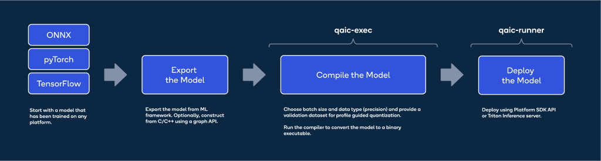
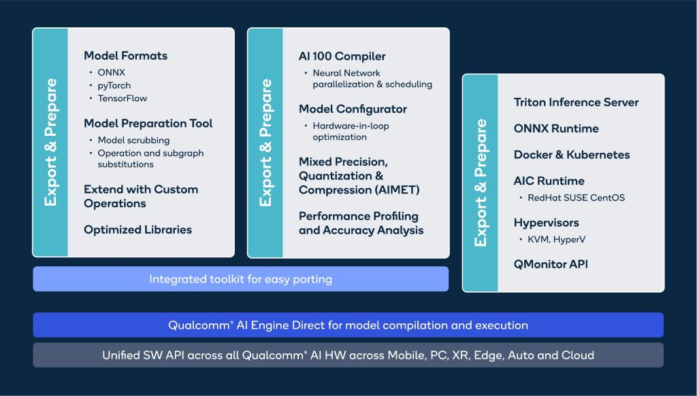

# Train anywhere, Infer on Qualcomm® Cloud AI 100
Posted By Parmeet Kohli

Co-written with Nitin Jain.

In this blog post we will go through the journey of taking a model from any framework, trained on any GPU or AI 
accelerator and deploying it on [DL2q instance](https://aws.amazon.com/ec2/instance-types/dl2q/) that hosts the 
highly efficient [Qualcomm Cloud AI 100](https://www.qualcomm.com/developer/cloud-ai-sdk#overview) accelerator. 
We will provide the background and how Qualcomm Cloud AI Stack can help deploy a trained model for inference in 
three simple steps.

Generative AI has caused a paradigm shift in the overall technology landscape and has reached the end user in a 
way never seen before. In the AI world, traditionally model training and inference was limited to data and large 
organizations who used existing AI HW and SW Tools for research and application development, respectively. With 
the explosion in the number of use cases across myriad domains and the ability to get quick and correct results, 
many more end users are using Generative AI services. As AI becomes increasingly ubiquitous and use cases expand, 
there is a definite need to differentiate the training of large models and their deployment for inference. And 
while inference requirements increase, cost effectiveness and ease of use will become necessary for a mass scale 
out of AI services.

## Training to Inference Workflow
Inference is typically stated as an equivalent of forward pass of the training graph, however there are lots of 
intricacies involved when taking a trained model for production level deployment. Key factors/differences between 
training and inference that impact the accuracy performance tradeoff of the deployed are explained in Figure 1 below.

 

<table style="text-align: center;">
  <tr valign="top" style="text-align: center;">
    <td style="text-align: center; width: 33%">
      
      <h2 style="text-align: center;">Precision</h2>
      Neural networks are typically trained on 32-bit floating point (FP32) to get good training accuracy. 
      However, FP32 is slow and power inefficient as weights need more memory  compared to lower precision 
      formats and proportionately higher DDR bandwidth (BW). Natural Language Processing (NLP) and Large 
      Language Models (LLM) desired accuracy can be achieved with FP16, 16-bit Integer (INT16), INT8 or 
      MXFP6. Qualcomm Cloud AI 100 is the first accelerator that supports OCP MicroScaling formats (MXFP) [6]
    </td>
    <td style="text-align: center; width: 33%">
      
      <h2 style="text-align: center;">Graph Formats</h2>
      Training is usually performed in JIT/Eager compilation mode and thus can easily support Control Flow 
      constructs, Dynamism in tensor shapes and sizes. AoT compiler can produce highly optimized code for 
      getting the last bit of performance which is essential for deployment. Thus deployment-friendly 
      inference solutions need modifications of the original training graphs. 
    </td>
    <td style="text-align: center; width: 33%">
      
      <h2 style="text-align: center;">Performance Tuning</h2>
      Accuracy vs. Performance trade off. Users can pick and choose the performance knobs like 
      precision format, batch size to suit as per their requirements.
    </td>
  </tr>
</table>

*Figure 1: Key Differentiators between Training and Inference*

## Qualcomm Cloud AI 100 SW Packages & Documentation
As shown in Figure 2, Qualcomm Cloud AI 100 accelerator provides a complete Deep Learning SW solution 
through two SW packages which enable the user to compile deep learning models and deploy them on the 
target Cloud platforms. For LLM, the software packages facilitate Model and Data parallel deployments 
which helps the user to optimize the usage of multiple cards attached on single server. A C++ and 
python runtime is included for developing end applications, providing a seamless user experience 
from Training to Inference. Online resources include documentation as well as a public GitHub 
repository with examples of compiling and executing state of art Deep Learning Models.

<table>
  <tr valign="top">
    <td style="text-align: center; width: 25%">
      
      <h2 style="text-align: center;">Apps SDK</h2>
      For development (producer of AI Images)
    </td>
    <td style="text-align: center; width: 25%">
      
      <h2 style="text-align: center;">Platform SDK</h2>
      For development (consumer of AI Images)
    </td>
  </tr>
</table>

*Figure 2: Qualcomm Cloud AI 100 Software Packages*

## Deploying on Qualcomm Cloud AI 100
Qualcomm Cloud AI 100 accelerator is a tailor-made highly sophisticated inference product, and its 
software solution has been built for quickly deploying Trained models.

*Figure 3: Three Easy Steps to Deploy Model*

Figure 4 provides an extensive view of multiple mature tools provided as part of Qualcomm Cloud AI 100 
SW packages. Power users can make use of them to enhance their workflows and extract the desired 
performance for their workloads on Qualcomm Cloud AI 100.

*Figure 4:  Mature SW Tools for Power Users*

## Export and Prepare
Networks are usually trained in PyTorch & TensorFlow framework and are represented in the form of a 
graph, the trained graph may not be optimized for inference and can impact the overall performance 
of the model. The first step is to take a trained graph and export into an inference-friendly format 
like ONNX. In certain use case, where the user may be required to write custom operators which are 
not present as part of the standard operator definitions in a certain framework. The Tool Chain 
provides a user friendly interface to write custom operators and make the graph inference friendly. 
It is neccesary to prepare the inference graph as a first step since it provides an opportunity to 
the user for inspection of the graph and as well as use the source inference graph as a reference.

## Compile and Optimize
Once the inference graph is prepared, the next step is to subject it to the Qualcomm Cloud AI 100 
compiler. The Qualcomm Cloud AI 100 compiler is a parallelizing solution with the ability to take 
a graph and optimally map to the Qualcomm Cloud AI 100 hardware. The compiler flexibly deploys 
workloads to each AI core individually or spread across multiple cores and/or multiple accelerators, 
whichever is required for optimal performance. This capability gives flexibility for the user to 
modulate the deployment for throughput or latency. Memory management, synchronization, tiling, and 
scheduling are all handled by the Qualcomm Cloud AI 100 compiler. For futher improvement in throughput, 
users also get options to quantize the model or run a hardware in loop tool which provides the 
best possible configuration for performance to be used for a specific input graph. Qualcomm Cloud AI 100 
Tool Chain includes performance analysis and profiling tools which provide a direct insight into how 
the graph is being executed on the hardware. Qualcomm Cloud AI 100 Tool Chain supports AI Model 
Efficiency ToolKit (AIMET) supporting model pruning and mixed precision tuning which allows a 
graph to be executed much faster with minimal loss in accuracy. There are several examples and 
documentation which help the user to migrate their models from training frameworks to an optimized 
Inference format.

## Deploy
Once the compiled network satisfies the KPI for the given use case, it can be deployed with the 
help of inference servers like Triton and orchestrated through Kubernetes. Virtualization and 
Docker support is available as part of the Platform SDK shown in Figure 4. A C++ and Python API 
runtime shipped with the Platfrom SDK can be used to create end to end applications for inference 
deployment. Several examples are also available in the 
[online user guide](https://developer.qualcomm.com/quic.github.io/cloud-ai-sdk-pages/) 
explainng how models can be deployed for inference on Qualcomm Cloud AI 100.

Let\'s go over one example LLM, GPT-J, for inference deployment on Qualcomm Cloud AI 100.

## LLMs on Qualcomm Cloud AI 100
Efficient deployment of LLMs on inference accelerators need to address multiple challenges without 
sacrificing performance. For example:

1. Instead of recalculating KV values, maintain a growing cache of KV values (KV$) on the 
accelerator between LLM decoding steps
2. Though the above would naturally lead to variable-sized tensors, generate only fixed-shape 
tensors to enable ahead-of-time (AOT) AI 100 compiler to generate performant code

To address these challenges, example scripts are included for making the changes in a <ins>PyTorch</ins> 
model, exporting it to <ins>ONNX</ins> format, compiling and running it on Qualcomm Cloud AI 100.

For a more detailed deployment of the GPT-J LLM on Qualcomm Cloud AI 100, please refer to the 
documentation available [here](https://github.com/quic/cloud-ai-sdk/tree/1.12/models/language_processing/decoder/GPT-J-6B).

## Conclusion
As the deep learning space continues to expand at a breakneck pace, its necessary to continuously 
evolve the HW, SW and user experience. For any software tool chain to be widely acceptable, 
simplicty in use is paramount along with the ability to compile once and deploy on multiple 
platforms. The simple training to Inference workflow will not only make the life of a developer 
easy but also significantly reduce the time and cost of deploying Large Language Models across 
different verticals and simplifying the process of meeting the required KPI. Stay tuned for 
future blogs that will contain detailed information on the Qualcomm Cloud AI 100 SW solution.

## References
1. DL2q Instance: [https://aws.amazon.com/ec2/instance-types/dl2q/](https://aws.amazon.com/ec2/instance-types/dl2q/)

2. Cloud AI Home: [https://www.qualcomm.com/products/technology/processors/cloud-artificial-intelligence](https://www.qualcomm.com/products/technology/processors/cloud-artificial-intelligence)

3. User Guide: [https://quic.github.io/cloud-ai-sdk-pages/](https://quic.github.io/cloud-ai-sdk-pages/)

4. Cloud AI SDK Download: [https://www.qualcomm.com/products/technology/processors/cloud-artificial-intelligence/cloud-ai-100#Software](https://www.qualcomm.com/products/technology/processors/cloud-artificial-intelligence/cloud-ai-100#Software)

5. Cloud AI 100 API reference: [https://quic.github.io/cloud-ai-sdk-pages/latest/API/](https://quic.github.io/cloud-ai-sdk-pages/latest/API/)

6. OCP Microscaling Formats (MX) Specification - [https://www.opencompute.org/documents/ocp-microscaling-formats-mx-v1-0-spec-final-pdf](https://www.opencompute.org/documents/ocp-microscaling-formats-mx-v1-0-spec-final-pdf)

 

*Snapdragon and Qualcomm branded products are products of Qualcomm Technologies, Inc. and/or its subsidiaries. 
AIMET is a product of Qualcomm Innovation Center, Inc.*

